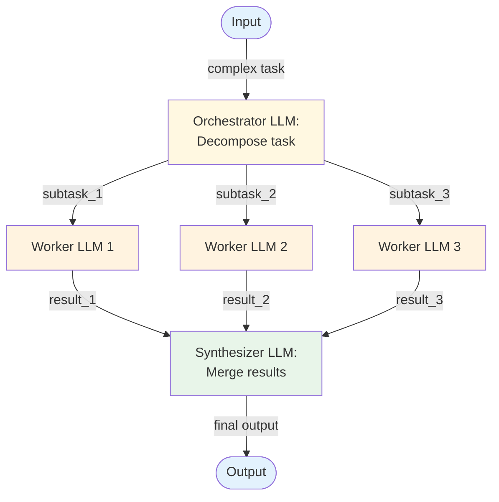

# Orchestrator-Worker — Overview

The orchestrator-worker pattern uses a central LLM to decompose a complex task into subtasks, delegates each subtask to a worker LLM call, then synthesizes the results. Unlike parallel calls, the orchestrator *reasons* about how to split the work.

## Architecture



*Figure: The orchestrator decomposes the task, workers process subtasks in parallel, and a synthesizer merges results. The orchestrator decides both what subtasks to create and how many workers are needed.*

## How It Works

1. **Orchestrate** — The orchestrator LLM receives the full task and produces a decomposition: a list of subtasks with descriptions and any relevant context.
2. **Delegate** — Each subtask is sent to a worker LLM call. Workers can run in parallel if subtasks are independent, or sequentially if there are dependencies.
3. **Execute** — Workers process their subtasks. Each worker gets a focused prompt for its specific subtask plus relevant context from the orchestrator.
4. **Synthesize** — A synthesis step (often an LLM call itself) combines worker results into a coherent final output.

The key difference from [Parallel Calls](../parallel-calls/overview.md) is that the *orchestrator decides the decomposition at runtime* using LLM reasoning, rather than the developer defining it in code.

## Minimal Example

Produce a market analysis report — the orchestrator decides which specialists to call and what to ask each one.

```python
from workflows.orchestrator_worker.code.python.orchestrator_worker import OrchestratorWorker, Worker

system = OrchestratorWorker(
    orchestrator_llm=your_llm,
    workers=[
        Worker(
            name="researcher",
            description="Gathers factual data, statistics, and sources",
            system_prompt="You are a research analyst. Be factual and cite sources.",
        ),
        Worker(
            name="analyst",
            description="Interprets data and identifies trends",
            system_prompt="You are a market analyst. Focus on actionable insights.",
        ),
        Worker(
            name="writer",
            description="Writes clear, structured reports from provided content",
            system_prompt="You are a business writer. Be concise and professional.",
        ),
    ],
)

result = system.run("Produce a market analysis report for enterprise AI tooling in 2025")
# result.sub_tasks      → what the orchestrator decided to delegate (varies per run)
# result.worker_results → each worker's contribution
# result.final_output   → synthesized report
```

> Full implementation: [`code/python/orchestrator_worker.py`](code/python/orchestrator_worker.py)

## Input / Output

- **Input:** A complex task too large or multifaceted for a single LLM call
- **Output:** A synthesized result incorporating all worker outputs
- **Orchestrator output:** A structured list of subtasks (task description, context, dependencies)
- **Worker output:** Individual subtask results

## Key Tradeoffs

| Strength | Limitation |
|----------|-----------|
| Handles tasks that can't be pre-decomposed | At least 3 LLM calls minimum (orchestrate + 1 worker + synthesize) |
| Dynamic decomposition adapts to input complexity | Orchestrator quality is critical — bad decomposition = bad results |
| Workers can be specialized with different prompts | Synthesis can lose nuance from individual worker outputs |
| Naturally parallelizable worker execution | Higher cost than direct parallel calls due to orchestrator overhead |
| Clean separation of concerns | Inter-subtask dependencies complicate parallel execution |

## When to Use

- Complex tasks that require LLM-driven decomposition (the developer can't predict the subtasks)
- Tasks with variable structure — different inputs may need different subtask breakdowns
- When worker subtasks benefit from specialized prompts or different model configurations
- Large content generation requiring multiple specialized sections
- Analysis tasks spanning multiple domains or data sources

## When NOT to Use

- When the decomposition is known in advance — use [Parallel Calls](../parallel-calls/overview.md) or [Prompt Chaining](../prompt-chaining/overview.md)
- When subtasks need iterative refinement — combine with [Evaluator-Optimizer](../evaluator-optimizer/overview.md)
- When workers need to act autonomously with tools — evolve to [Multi-Agent](../../patterns/multi_agent/overview.md)
- When the task is simple enough for a single LLM call — don't over-engineer

## Related Patterns

- **Evolves into:** [Plan & Execute](../../patterns/plan_and_execute/overview.md) (add step tracking, replanning on failure), [Multi-Agent](../../patterns/multi_agent/overview.md) (give workers tools and autonomy)
- **Combines with:** [Evaluator-Optimizer](../evaluator-optimizer/overview.md) (evaluate synthesized output), [Parallel Calls](../parallel-calls/overview.md) (for the worker execution phase)
- **Simpler alternative:** [Parallel Calls](../parallel-calls/overview.md) (when decomposition is code-defined)

## Deeper Dive

- **[Design](./design.md)** — Decomposition strategies, worker specialization, synthesis patterns, dependency handling
- **[Implementation](./implementation.md)** — Pseudocode, orchestrator prompt design, worker management, testing

## When NOT to use this pattern

- The task is simple enough for one LLM call — orchestrator overhead is pure cost.
- The decomposition is fixed and known — use [prompt chaining](../prompt-chaining/overview.md) instead.
- Workers always run sequentially with no real parallelism — orchestration isn't buying you anything.

## Next steps

- Production version: see [Blueprints → Deployments](../../composition/blueprints-to-deployments.md) for the deployment agents that use this pattern.
- Generate a starter project: see [Blueprint → Spec → Scaffold](../../composition/blueprint-to-spec-to-scaffold.md).
- Combine with other patterns: see the [Composition guide](../../composition/README.md).
