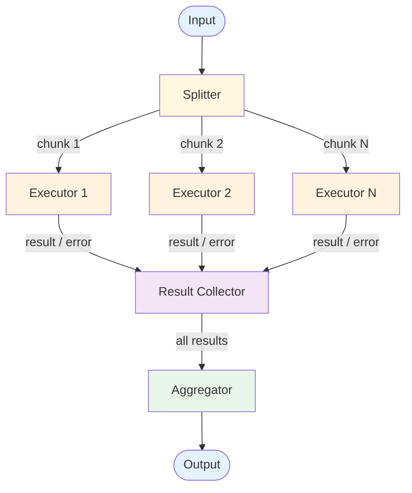

# Parallel Calls — Design

Detailed component breakdown and design decisions for building a fan-out/fan-in workflow.

## Component Breakdown



### Splitter
Divides input into independent work units. Two strategies:

| Strategy | Description | Example |
|----------|------------|---------|
| **Data-parallel** | Same prompt, different data | Analyzing 10 documents identically |
| **Task-parallel** | Different prompts, same data | Extract sentiment, entities, summary from one doc |

The splitter must guarantee **independence** — no chunk depends on another's result.

### Executors
Individual LLM calls, one per chunk. Run concurrently up to a configurable concurrency limit.

### Result Collector
Accumulates results as executors complete. Tracks completion status, handles out-of-order returns.

### Aggregator
Combines results into final output:

| Strategy | Description | Use When |
|----------|------------|----------|
| **Concatenate** | Join in order | Independent text segments |
| **Merge** | Combine structured data | JSON/structured results |
| **Summarize** | LLM synthesizes | Results need narrative coherence |
| **Vote** | Majority vote | Multiple answers to same question |
| **Rank** | Score and select best | Candidate generation |

## Data Flow Specification

```
chunks = splitter(input)
results = []

parallel for chunk in chunks (max_concurrency):
  result = llm(prompt, chunk)
  results.append({chunk_id, result, status})

output = aggregator(results)
```

Between components:
- **Splitter → Executors:** Chunks with metadata (id, position, count)
- **Executors → Collector:** `{chunk_id, status, output, error?, latency_ms}`
- **Collector → Aggregator:** Ordered result list (some may be errors)

## Error Handling Strategy

### Partial Failure Modes

| Mode | Behavior | Use When |
|------|----------|----------|
| **Fail-fast** | Abort on first failure | Every result is essential |
| **Best-effort** | Skip failures, use successes | Partial results are useful |
| **Retry-then-continue** | Retry failed, proceed with whatever works | Balance completeness and resilience |

### Failure Types
- **API errors** — Retry with backoff
- **Timeout** — Mark failed, handle per mode
- **Rate limiting** — Reduce concurrency dynamically
- **Malformed output** — Retry once with explicit prompt

## Scaling Considerations

### Concurrency Management
Never send all chunks simultaneously. Start with 5–10 concurrent calls.

### Cost and Latency
- Cost = N × per-call cost + aggregation cost
- Ideal latency = single call latency (fully parallel)
- Real latency = call latency × ceil(N / concurrency_limit) + aggregation

### At Scale
- **10x:** Increase concurrency (within rate limits), queue inputs
- **100x:** Request pooling, caching, model routing by complexity

## Composition Notes

### With Prompt Chaining
A chain step can internally fan out: Step 1 → Parallel[a, b, c] → Aggregate → Step 2

### With Orchestrator-Worker
Orchestrator-Worker is the upgrade when splitting requires LLM reasoning instead of code logic.

### As Agent Building Block
- [RAG](../../patterns/rag/overview.md) — Parallel retrieval from multiple sources
- [Multi-Agent](../../patterns/multi_agent/overview.md) — Worker agents run in parallel

## Decision Matrix: Splitting Strategy

| Factor | Data-Parallel | Task-Parallel |
|--------|--------------|---------------|
| When to use | Same analysis, many inputs | Different analyses, same input |
| Prompt design | One prompt, reused | Multiple specialized prompts |
| Consistency | High | Variable |
| Scaling | Scales with input volume | Fixed by task count |
| Aggregation | Usually concatenate | Usually synthesize |

## Observability Hooks

- Per-fan-out: chunk count, concurrency utilized, total wall time vs sum of per-call times (ratio measures parallelism efficiency).
- Per-chunk: status (success/error/timeout), latency, tokens.
- Track **straggler distribution** — when P95 chunk latency dominates total fan-out time, the bottleneck is one slow branch, not the model. Consider per-branch timeouts.
- Track **aggregator overhead** — when the aggregator's cost approaches per-branch cost, the fan-out savings shrink. See whether sequential would suffice. See [observability.md](./observability.md).

## Production concerns

Cognitive concerns this repo covers; operational concerns belong in [agent-deployments](https://github.com/jagguvarma15/agent-deployments).

| Concern | This pattern's surface | Where to read |
|---|---|---|
| Prompt injection | each branch is a separate prompt; one poisoned branch can taint aggregation | [foundations/security-and-safety.md](../../foundations/security-and-safety.md) |
| Hallucination & grounding | cross-branch consistency is the structural eval signal | [foundations/hallucination-and-grounding.md](../../foundations/hallucination-and-grounding.md) |
| Cost & model selection | N concurrent branches + 1 aggregation; scales with fan-out width | [foundations/cost-and-model-selection.md](../../foundations/cost-and-model-selection.md) |
| Rate limiting & retries | inherited | [agent-deployments cross-cutting](https://github.com/jagguvarma15/agent-deployments/tree/main/docs/cross-cutting) |
| Idempotency | inherited | [agent-deployments cross-cutting](https://github.com/jagguvarma15/agent-deployments/blob/main/docs/cross-cutting/idempotency.md) |
| Observability hooks | see `observability.md` alongside this file | [foundations](../../foundations/README.md) |
