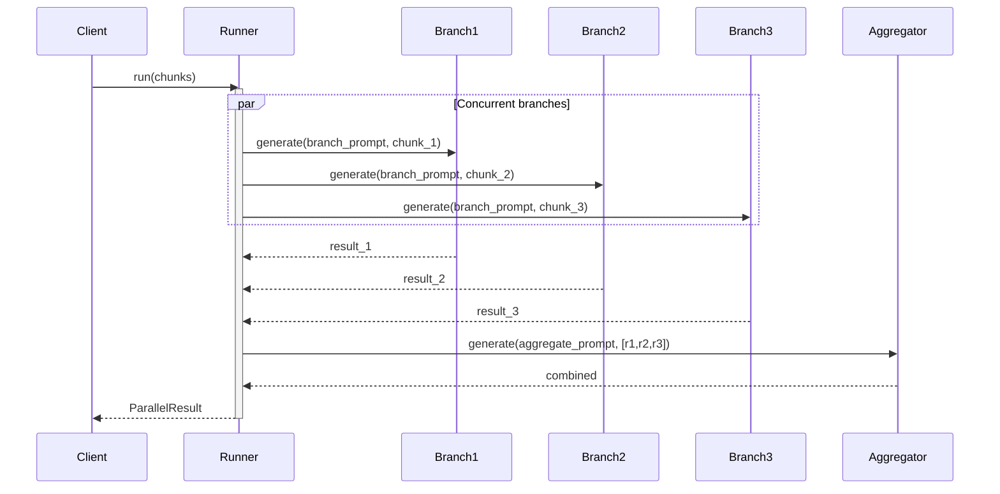

# Observability: Parallel Calls

What to instrument, what to log, and how to diagnose failures when running concurrent LLM calls.

---

## Key Metrics

| Metric | Description | Alert if |
|--------|-------------|----------|
| `parallel.duration_ms` | Wall-clock time (≈ slowest branch) | > 2× p50 |
| `parallel.branch.duration_ms` | Per-branch latency | Any branch > 3× median branch |
| `parallel.branch.fail_count` | Branches that errored | > 0 in any run |
| `parallel.branch.tokens_out` | Output tokens per branch | Branch producing near-zero tokens |
| `parallel.aggregate.duration_ms` | Time spent in aggregation step | > 30% of total run time |

---

## Trace Structure

The root span fans out into N parallel branch spans, all running concurrently, then a single aggregation span.



---

## Span Reference

| Span name | Emitted | Key attributes |
|-----------|---------|----------------|
| `parallel.run` | Once per call | `branch_count`, `success_count`, `error_count`, `duration_ms` |
| `parallel.branch.{index}` | Once per chunk | `branch.index`, `branch.input_len`, `branch.tokens_out`, `branch.duration_ms`, `branch.error` |
| `parallel.aggregate` | Once | `input_branch_count`, `tokens_out`, `duration_ms` |

---

## What to Log per Step

### On fan-out
```
INFO  parallel.start  branch_count=4  max_workers=4
```

### On each branch completion (from worker thread)
```
INFO  parallel.branch.done  index=2  tokens_out=94  latency_ms=580
WARN  parallel.branch.error  index=3  error="RateLimitError"  retrying=true
```

### On aggregation
```
INFO  parallel.aggregate.start  input_branches=4  failed=0
INFO  parallel.aggregate.done  tokens_out=210  latency_ms=720
```

### On run completion
```
INFO  parallel.done  success_branches=4  failed_branches=0  total_ms=1340
```

---

## Common Failure Signatures

### One branch is always the bottleneck
- **Symptom**: `parallel.duration_ms` is much higher than the median branch but only one branch is slow.
- **Log pattern**: All branches complete quickly except `branch.index=N` which always takes 3–5× longer.
- **Diagnosis**: That chunk is significantly longer than others (token count), or that branch hits rate limits consistently.
- **Fix**: Sort chunks by length and distribute evenly; add per-branch timeouts with a fast fallback.

### Partial failure silently degrades output
- **Symptom**: `parallel.done success_branches=3 failed_branches=1` but the run is marked success.
- **Log pattern**: One `parallel.branch.error` event, aggregator runs on 3/4 inputs.
- **Diagnosis**: The aggregation doesn't know a branch was skipped, so the output is incomplete.
- **Fix**: Explicitly include the failure count in the aggregation prompt or change `on_error="raise"` to halt on any failure.

### Aggregation costs more than branches
- **Symptom**: `parallel.aggregate.duration_ms` > sum of branch durations.
- **Log pattern**: Aggregation input is enormous — branches are verbose, not concise.
- **Diagnosis**: Branch prompts are not asking for summaries; they're returning full outputs.
- **Fix**: Tighten branch prompts to constrain output length; consider a two-level aggregation.

### Rate limit cascade (all branches hit rate limit simultaneously)
- **Symptom**: All branches fail with `RateLimitError` at the same timestamp.
- **Log pattern**: All `parallel.branch.error` events within milliseconds of each other.
- **Diagnosis**: Firing N concurrent requests instantly exceeds your API rate limit.
- **Fix**: Implement a semaphore or token bucket to stagger branch dispatch; add jitter to retries.

---

## Recommended Instrumentation Snippet

```python
import time, logging
from concurrent.futures import as_completed

# Log each branch result as futures complete
for future in as_completed(futures):
    result = future.result()
    if result.error:
        logging.warning("parallel.branch.error", extra={
            "index": result.index, "error": result.error,
        })
    else:
        logging.info("parallel.branch.done", extra={
            "index": result.index, "tokens": len(result.output.split()),
        })
```
