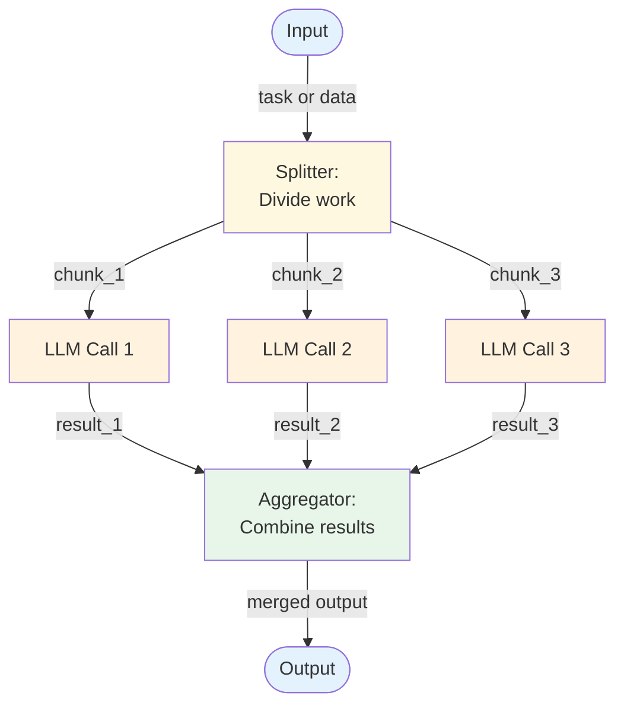

# Parallel Calls (Fan-out / Fan-in) — Overview

Parallel calls execute multiple LLM requests simultaneously on independent inputs, then aggregate the results. This pattern trades sequential simplicity for throughput.

## Architecture



*Figure: Fan-out / fan-in pattern. A splitter divides work into independent chunks, LLM calls process them concurrently, and an aggregator merges the results.*

## How It Works

1. **Split** — Divide the input into independent units of work. This can be data-parallel (same prompt, different data) or task-parallel (different prompts, same data).
2. **Fan-out** — Send all LLM calls concurrently. Since they're independent, order doesn't matter.
3. **Fan-in** — Collect all results. Handle partial failures (some calls may fail while others succeed).
4. **Aggregate** — Combine results into the final output. The aggregation step may itself be an LLM call (summarize, synthesize) or code-based (concatenate, merge, vote).

## Minimal Example

Evaluate four candidate resumes concurrently, then aggregate into a ranked recommendation — all in parallel.

```python
from workflows.parallel_calls.code.python.parallel_calls import ParallelCalls

runner = ParallelCalls(llm=your_llm, max_workers=4)

result = runner.run(
    chunks=resume_texts,          # one string per candidate resume
    branch_prompt=(
        "Score this resume for a senior Python engineer role (0–10) "
        "with a one-paragraph justification:\n\n{input}"
    ),
    aggregate_prompt=(
        "Rank these candidates from best to worst and recommend the top 2:\n\n{input}"
    ),
)

# result.outputs     → individual scores, ordered by input index
# result.aggregated  → final ranked recommendation
# result.errors      → any branches that failed
```

> Full implementation: [`code/python/parallel_calls.py`](code/python/parallel_calls.py)

## Input / Output

- **Input:** Data or task that can be divided into independent parts
- **Output:** Aggregated result combining all parallel outputs
- **Fan-out:** N independent LLM calls (N determined by the splitter)
- **Fan-in:** N results collected, potentially with failures

## Key Tradeoffs

| Strength | Limitation |
|----------|-----------|
| Dramatically lower latency for parallelizable work | Only works for independent subtasks |
| Scales naturally with available concurrency | Aggregation can be complex (especially with partial failures) |
| Each call has a focused prompt | Higher peak token cost (all calls active simultaneously) |
| Partial failure isolation — one call failing doesn't block others | Results may be inconsistent across parallel calls |
| Simple to reason about — no inter-call dependencies | Splitting logic must ensure true independence |

## When to Use

- Processing multiple documents, chunks, or data points with the same analysis
- Extracting different aspects of a single input in parallel (sentiment, entities, summary)
- Generating multiple candidate outputs for downstream selection
- Any task where subtasks don't depend on each other's results
- Voting/consensus patterns where multiple LLM calls vote on an answer

## When NOT to Use

- When subtasks depend on each other — use [Prompt Chaining](../prompt-chaining/overview.md)
- When you need dynamic task breakdown — use [Orchestrator-Worker](../orchestrator-worker/overview.md)
- When the LLM should decide how to split work — use [Plan & Execute](../../patterns/plan_and_execute/overview.md)
- When results must be generated iteratively based on feedback — use [Evaluator-Optimizer](../evaluator-optimizer/overview.md)

## Related Patterns

- **Evolves into:** [RAG](../../patterns/rag/overview.md) (parallel retrieval + context injection), [Routing](../../patterns/routing/overview.md) (add LLM-driven classification before fan-out)
- **Combines with:** [Prompt Chaining](../prompt-chaining/overview.md) (parallelize independent steps within a chain), [Evaluator-Optimizer](../evaluator-optimizer/overview.md) (evaluate parallel outputs)
- **More sophisticated version:** [Orchestrator-Worker](../orchestrator-worker/overview.md) (when splitting requires LLM reasoning)

## Deeper Dive

- **[Design](./design.md)** — Splitting strategies, aggregation patterns, partial failure handling
- **[Implementation](./implementation.md)** — Pseudocode, concurrency management, testing with stubs

## When NOT to use this pattern

- Tasks depend on each other's output — use [prompt chaining](../prompt-chaining/overview.md) or [orchestrator-worker](../orchestrator-worker/overview.md).
- The aggregation step is more expensive than the parallel work — single-pass is usually better.
- You can't actually run branches concurrently (sequential fan-out) — the pattern adds complexity without latency gain.

## Next steps

- Production version: see [Blueprints → Deployments](../../composition/blueprints-to-deployments.md) for the deployment agents that use this pattern.
- Generate a starter project: see [Blueprint → Spec → Scaffold](../../composition/blueprint-to-spec-to-scaffold.md).
- Combine with other patterns: see the [Composition guide](../../composition/README.md).
