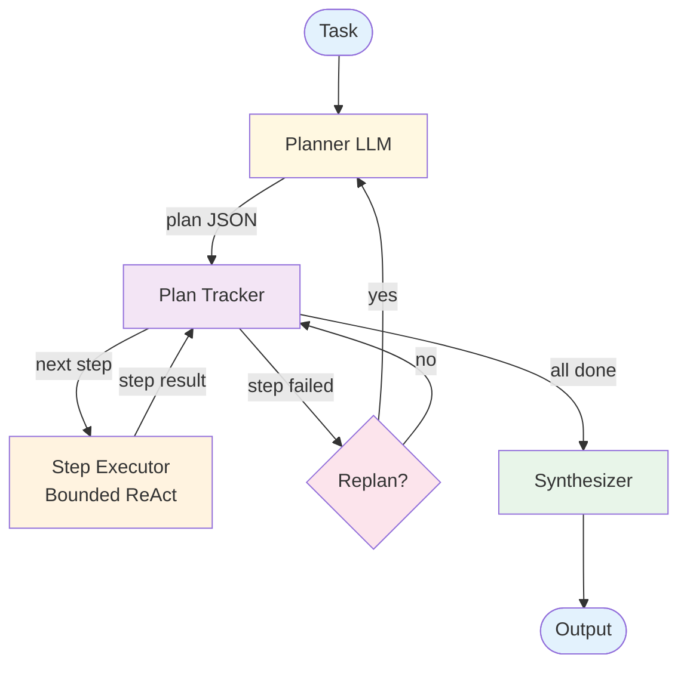

# Plan & Execute — Design

> Canonical Pydantic state schema: [`schemas/state.py`](schemas/state.py) — `PlanExecuteState` is the top-level shape; `Plan`, `Step`, `ExecutionResult` are the auxiliary models. Recipes targeting Plan & Execute reference these names verbatim.
>
> Typed prompts: [`prompts/`](prompts/) — `planner.md`, `executor.md`, `reflector.md`. See [`meta/style-guide.md`](../../meta/style-guide.md#typed-prompts) for the frontmatter contract.

## Component Breakdown



### Planner LLM
Generates a structured plan: an ordered list of steps with descriptions, expected outputs, and dependencies. Replans when called with context about completed steps and failures.

### Plan Tracker
Maintains plan state: which steps are pending, in-progress, completed, or failed. Determines execution order and provides context to the executor.

### Step Executor
A bounded [ReAct](../react/overview.md) loop for each step. Has its own iteration budget (e.g., 5 tool calls max). Receives the step description plus results from prior steps.

### Replanner
Decides whether to replan after a step failure. Factors: how many replans have occurred, how far along the plan is, whether the failure is recoverable.

### Synthesizer
Merges all step results into a coherent final output.

## Data Flow

```
Plan:
  steps: list of {id, description, expected_output, depends_on: list of ids}
  reasoning: string

StepResult:
  step_id: string
  status: "completed" | "failed"
  output: any
  error: string or null

PlanState:
  plan: Plan
  step_results: map of step_id → StepResult
  current_step: integer
  replan_count: integer
```

## Plan Format

Two structural formats, with different scheduling and recovery properties:

| Format | Description | Use When |
|---|---|---|
| **Linear** | Ordered list of steps; each depends on the previous | Sequential task with clear hand-offs |
| **DAG** | Steps with explicit `depends_on` edges; independent steps run in parallel | Steps have natural parallelism; cost / latency matter |

**Default:** Linear. Promote to DAG when ≥ 3 steps can clearly run in parallel — under that, the orchestration overhead outweighs the parallelism gain.

## Plan Validation

A plan generated by an LLM is itself an output that can be wrong. Validate before executing:

- **Schema check.** The plan must parse as the expected JSON shape; reject malformed plans and replan.
- **Step coverage.** Does the plan address the user's request? A model-graded check (small LLM call) is cheap and catches gross misalignment.
- **Dependency cycles.** For DAG plans, detect cycles before scheduling — a cycle means the plan is broken.
- **Action allow-list.** Each step's action must be in the allow-listed action set. A plan that calls `delete_account` when the user asked for a refund needs replanning, not execution.

The cost of validation is one extra small LLM call per plan. The cost of executing a bad plan is N × per-step cost. Validate.

## Replan Strategy

When a step fails, replanning is the recovery mechanism. Decisions:

| Dimension | Choices |
|---|---|
| **When to replan** | Every failure / only on permanent failure / based on % of steps remaining |
| **Scope of replan** | Replace remaining steps / replace failed step only / restart from scratch |
| **Replan budget** | Max number of replans per task (default 2) |

**Default:** Replan on permanent failure; replace remaining steps; budget 2 replans. Restart-from-scratch is wasteful — preserve completed-step results in the replan context.

## Data Flow

```
Plan:
  steps: list of {id, description, expected_output, depends_on: list of ids, action_class}
  reasoning: string                      // why this plan, surfaced for the operator
  estimated_cost: integer                // tokens; surfaced for budget gating

StepResult:
  step_id: string
  status: "completed" | "failed" | "skipped"
  output: any
  error: string or null
  duration_ms: integer
  tokens_used: integer

PlanState:
  plan: Plan
  step_results: map of step_id → StepResult
  current_step: integer
  replan_count: integer
  total_cost: integer                    // running token total for budget enforcement
```

## Failure Modes

| Failure | Response |
|---------|----------|
| Plan generation fails (malformed, schema-invalid) | Fall back to direct ReAct or surface error to user |
| Plan validates but is wrong (model-graded check fails) | Replan with critique as context |
| Step fails, retryable error | Re-run with failure context in the executor's prompt |
| Step fails, permanent error | Trigger replan with `failed_step` and `prior_results` in context |
| Replan budget exhausted | Return best partial results with explicit "incomplete" signal |
| Plan executes but final output is wrong | Add a synthesis-validation check; surface to reviewer |
| Plan-time injection compromises every step | Defense at input boundary; cannot recover at execute time |

## Scaling Considerations

- **Cost shape:** `plan_cost + Σ(step_cost) + (0..K × replan_cost) + synthesis_cost`. Plan and synthesis carry the full context; per-step cost is bounded.
- **Latency:** Sequential by default; partially parallelizable for DAG plans with independent steps.
- **Model selection:** Planner often warrants Opus (the plan is high-leverage); per-step executors often run on Sonnet; synthesis on Sonnet or Opus depending on stakes. See [Cost & Model Selection](../../foundations/cost-and-model-selection.md).
- **Plan caching:** For recurring task shapes, cache plans by task fingerprint. The first-time cost amortizes across reruns.
- **At scale:** Per-task token budget triggers either replan (try a cheaper plan) or escalation to a human.

## Observability Hooks

- Per-task: plan size, replan count, total cost vs estimated cost, completion rate.
- Per-step: success/failure, latency, tokens, did this step contribute to final answer?
- Track **plan-quality signal** — for tasks with ground truth, did following the plan reach the correct output? Plans that consistently fail mid-way indicate planner weakness.
- Track **replan triggers** — which step types fail most? See [observability.md](./observability.md).

## Composition

- **+ [Multi-Agent](../multi_agent/overview.md):** Delegate steps to specialized worker agents instead of a generic executor. Plan owns the *what*; agents own the *how*.
- **+ [Memory](../memory/overview.md):** Store successful plans by task fingerprint for fast retrieval on similar future tasks.
- **+ [Reflection](../reflection/overview.md):** Reflect on plan quality *before execution* — catches bad plans before paying step-by-step cost.
- **+ [Saga](../saga/overview.md):** When steps have irreversible side effects, the plan becomes a saga; each step gets a compensator.
- **+ [Human in the Loop](../human_in_the_loop/overview.md):** Long or expensive plans surface to a human for approval before execution.

## Production concerns

Cognitive concerns this repo covers; operational concerns belong in [agent-deployments](https://github.com/jagguvarma15/agent-deployments).

| Concern | This pattern's surface | Where to read |
|---|---|---|
| Prompt injection | plan-time injection compromises every subsequent step; execute-time injection is contained per step | [foundations/security-and-safety.md](../../foundations/security-and-safety.md) |
| Hallucination & grounding | plan validity is the first eval signal; per-step grounding catches execution drift | [foundations/hallucination-and-grounding.md](../../foundations/hallucination-and-grounding.md) |
| Cost & model selection | 1 plan + N steps + 0–1 replan; plan size determines blast radius | [foundations/cost-and-model-selection.md](../../foundations/cost-and-model-selection.md) |
| Rate limiting & retries | inherited | [agent-deployments cross-cutting](https://github.com/jagguvarma15/agent-deployments/tree/main/docs/cross-cutting) |
| Idempotency | per-step execution should be idempotent for safe replan | [agent-deployments cross-cutting](https://github.com/jagguvarma15/agent-deployments/blob/main/docs/cross-cutting/idempotency.md) |
| Observability hooks | see `observability.md` alongside this file | [foundations](../../foundations/README.md) |
