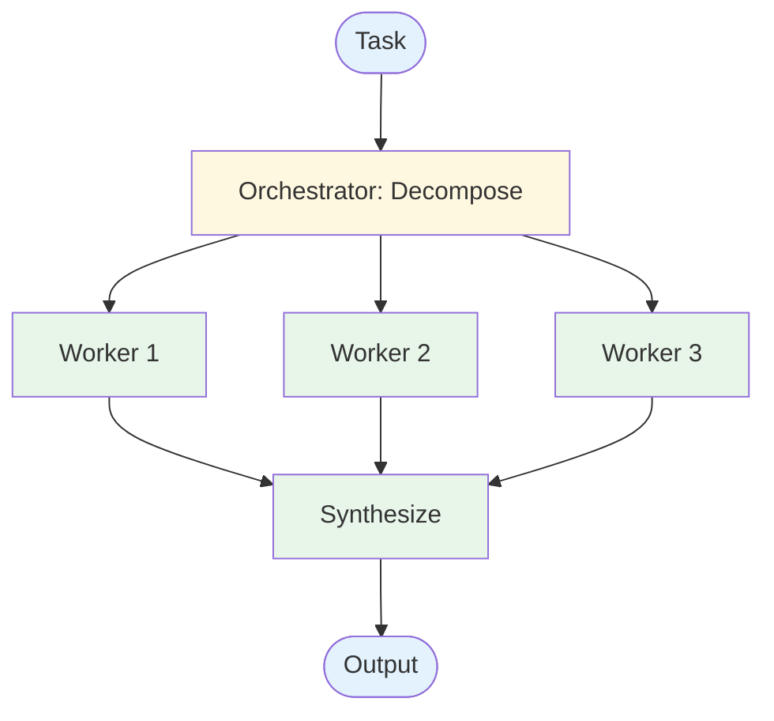
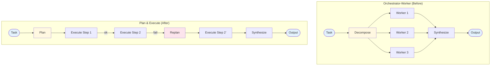

# Evolution: Orchestrator-Worker → Plan & Execute

This document traces how the [Plan & Execute pattern](./overview.md) evolves from the [Orchestrator-Worker workflow](../../workflows/orchestrator-worker/overview.md).

## The Starting Point: Orchestrator-Worker

In the orchestrator-worker workflow, a central LLM decomposes a task into subtasks, delegates to workers, and synthesizes results:



The orchestrator runs once, workers run once, synthesis runs once. One-shot decomposition, one-shot execution.

## The Breaking Point

Orchestrator-worker breaks down when:

- **Subtasks have dependencies.** Worker 2 needs Worker 1's output. The one-shot parallel model can't express ordering.
- **Steps fail and need recovery.** If Worker 2 fails, the whole workflow fails. There's no mechanism to retry, skip, or replan.
- **The decomposition was wrong.** The orchestrator's initial breakdown may miss subtasks that only become apparent during execution. There's no feedback loop.
- **Progress tracking matters.** For long-running tasks, users want to see which steps are done and which remain.

## What Changes

| Aspect | Orchestrator-Worker | Plan & Execute |
|--------|-------------------|----------------|
| Decomposition | One-shot, parallel subtasks | Explicit ordered plan with dependencies |
| Execution | All workers run (roughly) in parallel | Steps execute sequentially with state passing |
| Failure handling | Whole workflow fails | Per-step retry, skip, or replan |
| Adaptation | None — fixed decomposition | Replan when steps fail or new info emerges |
| Progress | No visibility | Step-by-step tracking (pending/running/done/failed) |
| Worker autonomy | Stateless one-shot calls | Each step can run a bounded agent loop |

## The Evolution, Step by Step

### Step 1: Add ordering to the decomposition

Instead of the orchestrator producing a flat list of parallel subtasks, have it produce an *ordered plan* with explicit steps:

```
BEFORE (Orchestrator):
  subtasks = llm("Break this into parallel subtasks: {task}")
  results = parallel_execute(subtasks)

AFTER (Planner):
  plan = llm("Create a step-by-step plan for: {task}")
  // plan = [{step: 1, desc: "..."}, {step: 2, desc: "...", depends_on: 1}, ...]
```

### Step 2: Add a step tracker

Replace parallel execution with sequential step tracking that monitors state:

```
BEFORE:
  results = parallel_execute(subtasks)

AFTER:
  for step in plan.steps:
    step.status = "in_progress"
    result = execute_step(step, previous_results)
    step.status = "completed"  // or "failed"
    step.result = result
```

### Step 3: Give each step an agent loop

Instead of a single LLM call per worker, give each step a bounded ReAct-style loop with tools:

```
BEFORE (Worker):
  result = llm("Do this subtask: {subtask}")

AFTER (Step executor):
  result = react_loop(
    goal: step.description,
    tools: available_tools,
    max_iterations: 5,
    context: previous_step_results
  )
```

### Step 4: Add replanning

When a step fails, instead of failing the whole workflow, return to the planner with updated context:

```
if step.status == "failed":
  updated_plan = llm(
    "The plan failed at step {step.number}: {step.error}.
     Completed so far: {completed_steps}.
     Create a revised plan to complete the task."
  )
  plan = updated_plan
```

## The Result



## When to Make This Transition

**Stay with Orchestrator-Worker when:**
- Subtasks are truly independent and can run in parallel
- Failure of any subtask should fail the whole workflow
- No inter-step dependencies exist
- Tasks are short enough that progress tracking isn't needed

**Evolve to Plan & Execute when:**
- Steps have ordering dependencies
- You need per-step failure recovery
- The initial decomposition may need revision based on results
- Tasks are long-running and need progress visibility
- Each step may require multiple tool calls to complete

## What You Gain and Lose

**Gain:** Ordered execution, failure recovery, replanning, progress tracking, richer per-step execution.

**Lose:** Parallelism (steps run sequentially), simplicity (plan + track + replan is more complex), latency (sequential steps take longer than parallel workers).
