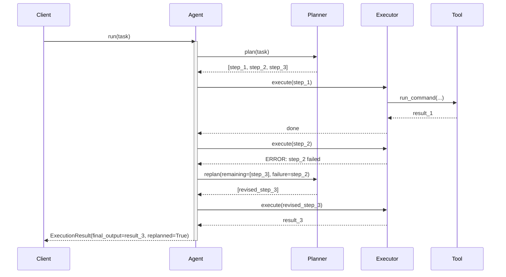

# Observability: Plan & Execute

What to instrument, what to log, and how to diagnose failures when planning and execution are separated.

---

## Key Metrics

| Metric | Description | Alert if |
|--------|-------------|----------|
| `plan_exec.plan.step_count` | Steps in the plan per run | > 10 (may indicate over-planning) |
| `plan_exec.plan.parse_error_rate` | Plans that fail JSON parsing | > 1% |
| `plan_exec.step.fail_rate` | Steps that fail execution | > 5% per step index |
| `plan_exec.replan_rate` | Fraction of runs that trigger replanning | > 20% (plan quality issue) |
| `plan_exec.duration_ms` | Total run time | > 2× p50 |

---

## Trace Structure

A planning span followed by sequential execution spans, with optional replan spans on failure.



---

## Span Reference

| Span name | Emitted | Key attributes |
|-----------|---------|----------------|
| `plan_exec.run` | Once | `step_count`, `replanned`, `final_status`, `duration_ms` |
| `plan_exec.plan` | Once (+ once per replan) | `step_count`, `parse_error`, `duration_ms` |
| `plan_exec.step.{n}` | Once per step | `step.n`, `step.description`, `step.tool`, `status`, `duration_ms` |
| `plan_exec.replan` | Once per replan event | `failed_step`, `reason`, `remaining_before`, `remaining_after` |

---

## What to Log

### On planning
```
INFO  plan_exec.plan.start  task_len=280
INFO  plan_exec.plan.done   steps=4  tools_required=["run_command"]
WARN  plan_exec.plan.parse_error  raw_preview="Let me break this into steps..."
```

### On each step
```
INFO  plan_exec.step.start  step=1  description="Create directory structure"  tool=run_command
INFO  plan_exec.step.done   step=1  status=done  duration_ms=120
WARN  plan_exec.step.failed step=2  description="Install dependencies"
          error="npm: command not found"
```

### On replanning
```
INFO  plan_exec.replan.start  failed_step=2  remaining_before=2
INFO  plan_exec.replan.done   remaining_after=3  added_steps=2
         note="Added step to install Node.js before npm install"
```

### On run completion
```
INFO  plan_exec.done  steps_total=5  steps_done=5  replanned=true  ms=4200
```

---

## Common Failure Signatures

### Plan is too granular (20 steps for a simple task)
- **Symptom**: `plan.step_count` is consistently high (10+) for straightforward tasks.
- **Log pattern**: Steps describe micro-actions like "Open the file", "Read line 1", "Check if empty".
- **Diagnosis**: The planning prompt has no step count constraint.
- **Fix**: Add `"Produce 3–6 high-level steps"` to the planning prompt; log step descriptions to audit quality.

### Replan loop (replanning triggers more failures)
- **Symptom**: `replan_rate` is high; same step index keeps failing even after replanning.
- **Log pattern**: Multiple `plan_exec.replan` events for the same `failed_step`.
- **Diagnosis**: The replan is producing a plan that has the same root issue (e.g., missing tool, wrong environment assumption).
- **Fix**: Log the full replan input (failed step + error + remaining steps); add a `max_replan_attempts` guard; surface environment facts to the planner.

### Steps depend on outputs that aren't passed as context
- **Symptom**: Later steps fail because they reference results from earlier steps that they can't see.
- **Log pattern**: Step 3 error mentions "file not found" — but step 1 created it; `step.context` wasn't threaded properly.
- **Diagnosis**: The context accumulation between steps is missing or truncated.
- **Fix**: Log the full `context` string passed to each step; ensure step outputs are appended before the next step executes.

### Execution step silently produces wrong output
- **Symptom**: All steps report `status=done`, but the final output is wrong.
- **Log pattern**: `step.done` with `output_len=0` or `output_len=5` (nearly empty).
- **Diagnosis**: Steps are completing without raising exceptions but producing empty/trivial output.
- **Fix**: Add a post-execution validation: if `output_len < MIN_EXPECTED`, log a warning and mark the step as suspect.
