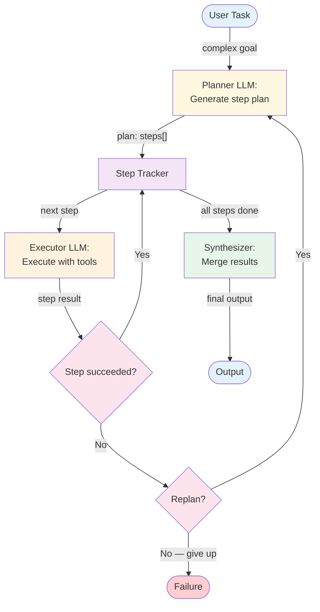

# Plan & Execute — Overview

Plan & Execute separates work into two distinct phases: first, the LLM generates an explicit plan (a sequence of steps); then, it executes each step using tools, with the option to replan if a step fails or new information changes the strategy.

**Evolves from:** [Orchestrator-Worker](../../workflows/orchestrator-worker/overview.md) — adds LLM-generated plans, step tracking, and replanning on failure.

## Architecture



*Figure: The planner generates a step sequence, the executor processes each step with tools, and a tracker monitors progress. Failed steps trigger replanning.*

## How It Works

1. **Plan** — The planner LLM receives the task and generates a structured plan: an ordered list of steps, each with a description and expected outcome.
2. **Track** — A step tracker maintains plan state: which steps are pending, in-progress, completed, or failed.
3. **Execute** — For each step, the executor LLM runs a bounded ReAct-style loop with tools. Each step has its own iteration budget.
4. **Evaluate** — After each step, check whether it succeeded. If not, decide whether to retry, skip, or replan.
5. **Replan** — If a step fails or reveals that the plan is wrong, return to the planner with updated context. The planner generates a revised plan.
6. **Synthesize** — Once all steps are complete, merge the results into a final output.

## Minimal Example

Scaffold a new Python project — the plan is fixed upfront, then each step executes in order.

```python
from patterns.plan_and_execute.code.python.plan_and_execute import PlanAndExecute

agent = PlanAndExecute(
    planner=your_llm,
    executor=your_llm,
    tools={"run_command": lambda cmd: subprocess.check_output(cmd, shell=True, text=True)},
    replan_on_failure=True,    # revise remaining steps if one fails
)

result = agent.run(
    "Set up a Python REST API project: "
    "create directory structure, install dependencies, write a Dockerfile, and generate a README"
)
# result.plan           → the full ordered plan created before any execution started
# result.plan[i].status → "done" | "failed" for each step
# result.replanned      → True if a failure triggered replanning of remaining steps
# result.final_output   → output of the last completed step
```

*The plan created upfront might look like:*
```
Step 1: Create project directory structure (tool: run_command)
Step 2: Initialize a virtual environment and install FastAPI, uvicorn (tool: run_command)
Step 3: Write a minimal main.py with a health-check endpoint
Step 4: Write a Dockerfile for the project
Step 5: Generate a README.md documenting setup and usage
```

### Code variants

| Implementation | Language | Path |
|----------------|----------|------|
| Framework-agnostic planner + executor (MockLLM) | Python | [`code/python/plan_and_execute.py`](code/python/plan_and_execute.py) |
| Vercel AI SDK (`generateObject` planner, `generateText` executor) | TypeScript | [`code/typescript/vercel-ai-sdk/plan-and-execute.ts`](code/typescript/vercel-ai-sdk/plan-and-execute.ts) |
| Mastra (`Agent.generate({ output })` planner + executor agents) | TypeScript | [`code/typescript/mastra/plan-and-execute.ts`](code/typescript/mastra/plan-and-execute.ts) |

Both TS variants run the same three-step plan against the same enterprise-LLM-adoption report task as the Python sibling, so they're diff-friendly across stacks. The Mastra variant uses two `Agent` instances (planner + executor) over a plain TS execution loop; reach for `Workflow` instead when steps need branching, parallel fan-out, or durable resumption.

## Examples

- [Release checklist](examples/release-checklist.md) — concrete domain overlay for a release-orchestrator agent. Worked schemas for `ReleasePlan` / `ReleasePlanStep` / `ReleaseStepResult` / `ReplanDecision`, mock CI / smoke / deploy / verify adapters, role prompts for planner / executor / replanner, and an end-to-end walkthrough covering the three terminal paths (happy, smoke-failure-then-fix, verify-failure-aborts) with offline tests in [`examples/release_checklist/`](examples/release_checklist/).

## Input / Output

- **Input:** A complex task that benefits from upfront strategic planning
- **Output:** A synthesized result after executing all plan steps
- **Plan:** Structured list of steps with descriptions and expected outputs
- **Step result:** Individual output from each executed step

## Key Tradeoffs

| Strength | Limitation |
|----------|-----------|
| Strategic — plans before acting | Planning overhead for simple tasks |
| Tracks progress explicitly | Plan quality determines execution quality |
| Can recover from failures via replanning | Replanning is expensive (resets context) |
| Bounded execution per step | Rigid step boundaries may not suit fluid tasks |
| Clear audit trail of plan + execution | Two-phase latency (plan + execute) |

## When to Use

- Complex, multi-step tasks where order matters
- Tasks where you want an explicit, inspectable strategy before execution
- When failure recovery and replanning are important
- Long-running tasks that benefit from progress tracking
- Tasks where the user wants to review or approve the plan before execution

## When NOT to Use

- Simple tasks with fewer than 3 steps — use [ReAct](../react/overview.md)
- When steps are known at design time — use [Orchestrator-Worker](../../workflows/orchestrator-worker/overview.md)
- When the task is exploratory with no clear end goal — use [ReAct](../react/overview.md)
- When each step needs deep specialization — use [Multi-Agent](../multi_agent/overview.md)

## Related Patterns

- **Evolves from:** [Orchestrator-Worker](../../workflows/orchestrator-worker/overview.md) — see [evolution.md](./evolution.md)
- **Uses internally:** [ReAct](../react/overview.md) (each plan step runs a bounded ReAct loop), [Tool Use](../tool_use/overview.md)
- **Extends into:** [Multi-Agent](../multi_agent/overview.md) (delegate steps to specialized agents)

## Deeper Dive

- **[Design](./design.md)** — Plan schema, step tracking, replanning strategies, executor design
- **[Implementation](./implementation.md)** — Pseudocode, planner prompts, state management, testing
- **[Evolution](./evolution.md)** — How Plan & Execute evolves from orchestrator-worker

## When NOT to use this pattern

- The task has fewer than 3 steps — planning overhead exceeds the value.
- Steps depend on what each one discovers (true exploratory work) — [ReAct](../react/overview.md) is more flexible.
- You can't validate the plan before execution — a bad plan executed in full is expensive.

## Next steps

- Production version: see [Blueprints → Deployments](../../composition/blueprints-to-deployments.md) for the deployment agents that use this pattern.
- Generate a starter project: see [Blueprint → Spec → Scaffold](../../composition/blueprint-to-spec-to-scaffold.md).
- Combine with other patterns: see the [Composition guide](../../composition/README.md).
