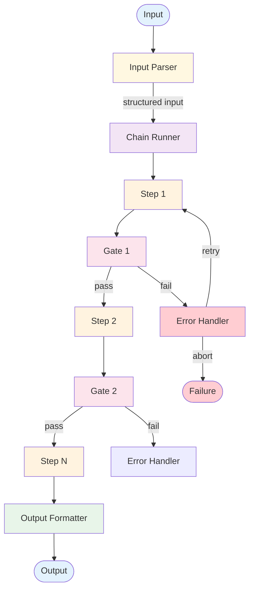

# Prompt Chaining — Design

Detailed component breakdown and design decisions for building a prompt chain.

## Component Breakdown



### Input Parser
Validates and structures the raw input before entering the chain. Ensures the chain receives consistently formatted data regardless of input variation.

### Chain Runner
The orchestration layer that drives steps sequentially. Maintains an accumulator passing each step's output as the next step's input. Responsible for error handling policy (retry, skip, abort).

### Steps
Each step is an LLM call with:
- **Prompt template** — A focused instruction for this specific subtask, with placeholders for the previous step's output.
- **Model configuration** — Temperature, max tokens, model selection. Different steps may warrant different settings.
- **Output parser** — Extracts structured data from the LLM response if needed.

### Gates
Validation checkpoints between steps. A gate receives the step's output and returns pass/fail plus an error message. Gate types:

| Gate Type | How It Works | Use When |
|-----------|-------------|----------|
| **Format gate** | Checks structure (valid JSON, required fields) | Output must conform to a schema |
| **Content gate** | Checks semantics (length, keywords, language) | Quality has measurable proxies |
| **LLM gate** | An LLM evaluates output against criteria | Assessment requires reasoning |
| **Rule gate** | Custom code logic (regex, thresholds) | Deterministic validation is possible |

### Error Handler
Decides what to do when a gate fails:
- **Retry** — Re-run the step, optionally appending the failure reason to the prompt
- **Retry with backoff** — Retry with different model or temperature
- **Skip** — Proceed with default or partial output
- **Abort** — Terminate the chain and return an error

## Data Flow Specification

Data flows as an **accumulator** — each step receives the previous output:

```
step_1_input  = input_parser(raw_input)
step_1_output = llm(step_1_prompt, step_1_input)
gate_1_result = gate_1(step_1_output)

step_2_input  = step_1_output
step_2_output = llm(step_2_prompt, step_2_input)
...

final_output  = output_formatter(step_n_output)
```

### Context Accumulation Strategies

| Strategy | Description | Tradeoff |
|----------|------------|----------|
| **Last-output-only** | Each step sees only previous output | Simple, but loses early context |
| **Full accumulation** | Each step sees all prior outputs | Preserves context, grows linearly |
| **Selective** | Each step declares which prior outputs it needs | Balanced, requires design |
| **Summary** | Periodically summarize accumulated context | Manages tokens, loses detail |

## Error Handling Strategy

### Step Failures
- **API errors** — Retry with exponential backoff
- **Malformed output** — Retry with a more explicit prompt
- **Low-quality output** — Retry with the gate's failure reason appended
- **Context overflow** — Summarize or truncate earlier context

### Retry Policy
Configure per-step: max retry count (1–3), whether to modify prompt on retry, timeout per step.

### Chain-Level Failure
- **Fail fast** — Return error immediately
- **Best effort** — Continue with partial data
- **Fallback** — Switch to a simpler chain or direct LLM call

## Scaling Considerations

### Throughput
Chain executions are independent — scale by running chains in parallel across inputs. Within a single chain, steps are sequential.

### Token Cost
Cost = sum of (input_tokens + output_tokens) across all steps. Accumulated context grows input tokens for later steps.

### Latency
Latency = sum of step latencies. Can't parallelize within a chain. Optimize by minimizing step count and using faster models for simpler steps.

### At Scale
- **10x:** Parallelize chain executions, add rate limiting
- **100x:** Batch similar inputs, use model routing (cheaper models for easy steps), circuit breakers for API failures

## Composition Notes

### With Parallel Calls
If some steps are independent, split into parallel fan-out within the chain. See [Parallel Calls](../parallel-calls/overview.md).

### With Evaluator-Optimizer
Wrap the chain or individual steps in an evaluation loop. See [Evaluator-Optimizer](../evaluator-optimizer/overview.md).

### As Agent Building Block
- [ReAct](../../patterns/react/overview.md) — each agent iteration is a mini-chain
- [Plan & Execute](../../patterns/plan_and_execute/overview.md) — each plan step can be a chain

## Decision Matrix: Step Granularity

| Factor | Fewer, Larger Steps | More, Smaller Steps |
|--------|-------------------|-------------------|
| Token cost | Lower | Higher |
| Debuggability | Harder | Easier |
| Prompt complexity | Higher | Lower |
| Gate precision | Lower | Higher |
| Latency | Lower | Higher |

**Guideline:** Start with smaller steps for debuggability. Merge steps only when cost or latency is a bottleneck.

## Production concerns

Cognitive concerns this repo covers; operational concerns belong in [agent-deployments](https://github.com/jagguvarma15/agent-deployments).

| Concern | This pattern's surface | Where to read |
|---|---|---|
| Prompt injection | user input flows through every step; sanitize at entry, re-tag at each gate | [foundations/security-and-safety.md](../../foundations/security-and-safety.md) |
| Hallucination & grounding | per-step schema validation catches structural drift; hallucination compounds across long chains | [foundations/hallucination-and-grounding.md](../../foundations/hallucination-and-grounding.md) |
| Cost & model selection | linear in step count; each step accumulates context unless explicitly trimmed | [foundations/cost-and-model-selection.md](../../foundations/cost-and-model-selection.md) |
| Rate limiting & retries | inherited | [agent-deployments cross-cutting](https://github.com/jagguvarma15/agent-deployments/tree/main/docs/cross-cutting) |
| Idempotency | inherited (gates are deterministic given inputs) | [agent-deployments cross-cutting](https://github.com/jagguvarma15/agent-deployments/blob/main/docs/cross-cutting/idempotency.md) |
| Observability hooks | see `observability.md` alongside this file | [foundations](../../foundations/README.md) |
