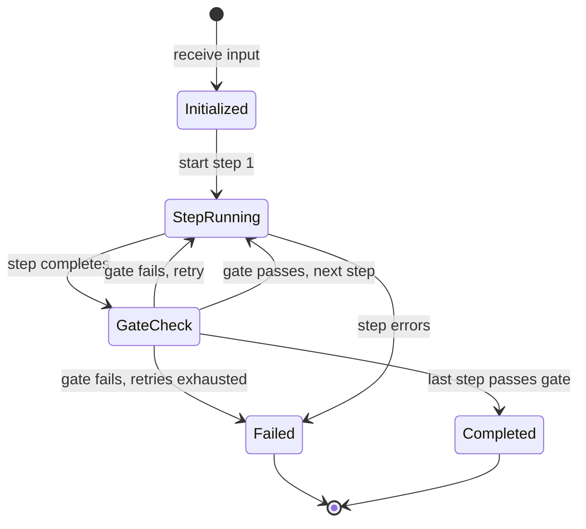

# Prompt Chaining — Implementation

Pseudocode, interfaces, state management, and testing strategy for building a prompt chain.

## Core Interfaces

### Step Definition

```
StepDefinition:
  name: string                           // Human-readable step name
  prompt_template: string                // Template with {input} placeholder
  model_config:                          // LLM configuration for this step
    temperature: float                   // 0.0–1.0
    max_tokens: integer
    model: string                        // Optional per-step model override
  gate: Gate or null                     // Validation after this step
  max_retries: integer                   // Default: 2
  output_parser: function(text) → any    // Optional structured output extraction
```

### Gate Definition

```
Gate:
  validate: function(output) → GateResult

GateResult:
  passed: boolean
  error_message: string or null          // Why it failed (fed back on retry)
```

### Chain Configuration

```
ChainConfig:
  steps: list of StepDefinition
  accumulation: "last_only" | "full" | "selective"
  on_failure: "abort" | "best_effort" | "fallback"
  fallback: function(input) → output     // Used when on_failure = "fallback"
```

## Core Pseudocode

### run_chain

```
function run_chain(input, config):
  accumulator = {
    original_input: input,
    step_outputs: [],
    current: input
  }

  for step in config.steps:
    result = execute_step(step, accumulator, config.accumulation)

    if result.status == "success":
      accumulator.step_outputs.append(result.output)
      accumulator.current = result.output
    else if config.on_failure == "abort":
      return {status: "failed", step: step.name, error: result.error}
    else if config.on_failure == "best_effort":
      accumulator.step_outputs.append(null)
      // Continue with previous output as current
    else if config.on_failure == "fallback":
      return config.fallback(input)

  return {status: "success", output: accumulator.current}
```

### execute_step

```
function execute_step(step, accumulator, accumulation_mode):
  prompt_input = build_step_input(accumulator, accumulation_mode)
  prompt = step.prompt_template.replace("{input}", prompt_input)

  for attempt in 1..(step.max_retries + 1):
    response = call_llm(
      prompt: prompt,
      temperature: step.model_config.temperature,
      max_tokens: step.model_config.max_tokens,
      model: step.model_config.model
    )

    output = response.text
    if step.output_parser:
      output = step.output_parser(output)

    // Gate check
    if step.gate == null:
      return {status: "success", output: output}

    gate_result = step.gate.validate(output)
    if gate_result.passed:
      return {status: "success", output: output}

    // Gate failed — modify prompt for retry
    prompt = prompt + "\n\nPrevious attempt failed: " + gate_result.error_message
    prompt = prompt + "\nPlease fix the issue and try again."

  return {status: "failed", error: "Exhausted retries for step: " + step.name}
```

### build_step_input

```
function build_step_input(accumulator, mode):
  if mode == "last_only":
    return accumulator.current

  if mode == "full":
    parts = ["Original input: " + accumulator.original_input]
    for i, output in enumerate(accumulator.step_outputs):
      parts.append("Step " + (i+1) + " output: " + output)
    return join(parts, "\n\n")

  if mode == "selective":
    // Each step declares which prior steps it needs
    // Implementation depends on step configuration
    return gather_selected_outputs(accumulator)
```

## State Management

### What State Is Held

```
ChainState:
  original_input: any                    // The raw input
  step_outputs: list                     // Output from each completed step
  current: any                           // The most recent step's output
  metadata:
    step_count: integer                  // Total steps in chain
    completed_steps: integer             // Steps completed so far
    total_tokens: integer                // Running token count
    total_latency_ms: integer            // Running latency
```

### State Transitions



## Prompt Engineering Notes

### Step Prompt Structure
Each step's prompt should follow this structure:

```
System: You are performing step N of a multi-step process.
Your specific task: [focused instruction for this step]
Output format: [expected format — JSON, plain text, markdown, etc.]

User: [input from previous step or accumulator]
```

### Key Principles
- **One job per step.** Don't ask a step to extract AND analyze AND format.
- **Explicit output format.** Tell the LLM exactly what structure you expect.
- **Context framing.** If using accumulated context, label each prior output clearly so the LLM can distinguish them.
- **Gate feedback on retry.** When retrying, include the specific failure reason — not just "try again."

### Example Step Prompts

**Extraction step:**
```
System: Extract all named entities (people, organizations, locations) from the text.
Return as JSON: {"people": [...], "organizations": [...], "locations": [...]}

User: {input}
```

**Analysis step:**
```
System: Analyze the relationships between the entities provided.
For each pair of entities that interact, describe their relationship in one sentence.
Return as a list of relationship descriptions.

User: {input}
```

## Prompt Templates

These are production-ready templates. Copy and adapt — replace `{placeholders}` with your specifics.

### Step system prompt (focused single-task step)

```
You are performing one step of a multi-step pipeline.

Your task: {one_sentence_description_of_this_step_only}

Rules:
- Do exactly this task and nothing else.
- Do not add commentary, preamble, or sign-off.
- If the input is empty or clearly invalid, respond with exactly: ERROR: {reason}

Output format: {exact_format — e.g. "a JSON object with keys X, Y, Z" or "plain text, under 150 words"}
```

### Step user message

```
{output_of_previous_step}
```

### Validation gate prompt (when using an LLM gate instead of code)

```
Does the following text satisfy these criteria?

Criteria:
{criterion_1}
{criterion_2}

Text to check:
{step_output}

Respond with exactly one word: PASS or FAIL.
If FAIL, add a second line beginning with "REASON:" and explain the specific failure.
```

### Retry injection (appended to step prompt when gate fails)

```
Your previous response failed validation.
Reason: {gate_failure_reason}

Please try again, addressing the specific issue above.
```

### Customization guide

| Placeholder | What to put here |
|---|---|
| `{one_sentence_description}` | The single, specific job this step does — "Extract all named entities", "Translate to formal register", "Summarize in under 100 words" |
| `{exact_format}` | Be explicit: "JSON object", "numbered list", "a single integer", "markdown table with columns X, Y, Z" |
| `{criterion_N}` | Binary, checkable criteria: "Contains at least one example", "Under 200 words", "Valid JSON" |
| `{gate_failure_reason}` | Pass the literal reason string from the gate — do not paraphrase |

## Testing Strategy

### Unit Tests

**Test each step independently:**
- Stub the LLM to return a known output
- Verify the step's output parser extracts correctly
- Verify the step formats its prompt correctly

**Test each gate independently:**
- Pass known-good output → verify gate passes
- Pass known-bad output → verify gate fails with correct error message

### Integration Tests

**Test the full chain:**
- Stub all LLM calls with predetermined responses
- Verify the chain runs to completion in the correct order
- Verify the accumulator passes data correctly between steps

**Test error paths:**
- Stub a step to fail → verify retry behavior
- Stub a gate to fail → verify retry with feedback
- Exhaust retries → verify abort/fallback behavior

### Evaluation Tests

**Test chain output quality:**
- Run the chain with real LLM calls on a set of evaluation inputs
- Compare outputs against expected results or quality criteria
- Track quality metrics over time to catch regressions

## Common Pitfalls

### Information Loss Between Steps
**Problem:** Each step only sees the previous step's output, losing context from earlier steps.
**Fix:** Use full or selective accumulation. Or explicitly instruct intermediate steps to preserve key information in their output.

### Overly Strict Gates
**Problem:** Gates reject output that is adequate but doesn't match exact format expectations.
**Fix:** Start with lenient gates. Tighten only for criteria that genuinely matter. Use format gates for structure, not content quality.

### Prompt Drift
**Problem:** As accumulated context grows, later steps receive very long inputs and the LLM loses focus on the actual task.
**Fix:** Use summary accumulation or selective accumulation. Keep step prompts focused with clear instructions about what to attend to.

### Silent Failures
**Problem:** A step produces subtly wrong output that passes the gate, corrupting downstream steps.
**Fix:** Design gates to check semantic content, not just format. Consider LLM gates for critical steps.

### Retry Storms
**Problem:** A consistently failing step burns through retries and API budget.
**Fix:** Set low max_retries (1–2). Escalate to fallback rather than retrying endlessly. Log failures for investigation.

## Migration Path

### From a Single LLM Call
If you have a complex prompt doing multiple things, split it:
1. Identify the distinct subtasks in your prompt
2. Create a step for each subtask
3. Add format gates between steps
4. Run the chain — verify output quality matches or exceeds the monolithic prompt

### To a ReAct Agent
When your chain's conditional logic grows unwieldy:
1. Identify steps that vary based on input (candidates for tool calls)
2. Replace those steps with tools in a tool registry
3. Wrap in an agent loop that lets the LLM choose which tool to call
4. See [ReAct evolution](../../patterns/react/evolution.md) for the detailed bridge
