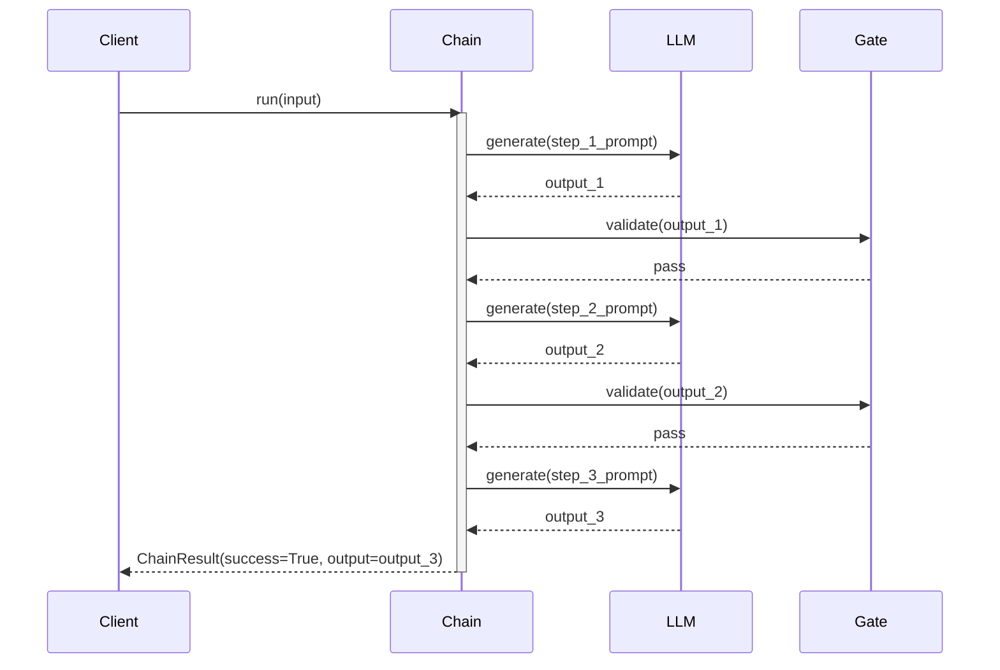

# Observability: Prompt Chaining

What to instrument, what to log, and how to diagnose failures in a prompt chain.

---

## Key Metrics

| Metric | Description | Alert if |
|--------|-------------|----------|
| `chain.duration_ms` | Total wall-clock time for the full chain | > 2× p50 baseline |
| `chain.step.tokens_in` | Input tokens per step | Spike > 2× normal for that step |
| `chain.step.tokens_out` | Output tokens per step | Drops to near-zero (truncation) |
| `chain.gate.fail_rate` | Fraction of runs where a gate rejects | > 5% on any single gate |
| `chain.steps_completed` | How many steps ran before success or failure | Consistently < total steps |

---

## Trace Structure

Each run produces a root span with one child span per step and one per gate.



---

## Span Reference

| Span name | Emitted | Key attributes |
|-----------|---------|----------------|
| `chain.run` | Once per call | `chain.step_count`, `chain.success`, `chain.failed_at` |
| `chain.step.{name}` | Once per step | `step.name`, `step.tokens_in`, `step.tokens_out`, `step.duration_ms` |
| `chain.gate.{name}` | Once per gate | `gate.name`, `gate.passed` (bool) |
| `llm.generate` | Once per LLM call | `model`, `tokens_in`, `tokens_out`, `latency_ms` |

---

## What to Log per Step

### On each step start
```
INFO  chain.step.start  step=extract  input_len=1240
```

### On each LLM call return
```
INFO  chain.step.complete  step=extract  tokens_in=312  tokens_out=87  latency_ms=430
```

### On gate evaluation
```
INFO  chain.gate.result  gate=extract  passed=true  output_preview="Key requirements: ..."
# or
WARN  chain.gate.result  gate=extract  passed=false  output_preview="[empty]"
```

### On chain completion
```
INFO  chain.done  success=true  steps=3  total_ms=1340  total_tokens=876
# or
WARN  chain.done  success=false  failed_at=extract  steps_completed=1
```

---

## Common Failure Signatures

### Gate rejection loop (gate keeps failing on retries)
- **Symptom**: `chain.gate.fail_rate` spikes; runs consistently fail at the same step.
- **Log pattern**: Multiple consecutive `gate.passed=false` entries for the same gate name.
- **Diagnosis**: Log the full `output` that failed the gate. Usually a prompt issue — the step is producing a different format than the gate expects.
- **Fix**: Loosen the gate predicate, tighten the step prompt with an explicit output format instruction, or add a retry before failing.

### Token explosion on a middle step
- **Symptom**: `step.tokens_in` for step N is 10× larger than normal.
- **Log pattern**: `tokens_out` of step N-1 is abnormally large; it's flowing straight in as context.
- **Diagnosis**: The upstream step is not summarizing — it's passing the full input through.
- **Fix**: Strengthen the prompt on the upstream step to constrain output length, or add a truncation gate.

### Stale or off-topic output
- **Symptom**: Output looks syntactically correct but semantically wrong; gate passes but final quality is poor.
- **Log pattern**: All steps complete successfully, gate all pass — but evaluation downstream flags the result.
- **Diagnosis**: No gate is checking semantic correctness. Gates only check structural validity.
- **Fix**: Add a semantic validation step (another LLM call that checks relevance) or use an evaluator step.

### LLM timeout / rate limit mid-chain
- **Symptom**: `chain.step.complete` never fires; chain hangs or errors at a specific step.
- **Log pattern**: `llm.generate` span starts but never closes; next log is a timeout error.
- **Diagnosis**: Add explicit timeout and retry logic around `llm.generate`.
- **Fix**: Wrap each step in retry-with-backoff; set a per-step timeout; emit a `chain.step.error` span with the exception type.

---

## Recommended Instrumentation Snippet

```python
import time

class InstrumentedChain(PromptChain):
    def run(self, input: str) -> ChainResult:
        start = time.monotonic()
        result = super().run(input)
        duration = (time.monotonic() - start) * 1000

        logger.info("chain.done",
            success=result.success,
            steps_completed=len(result.step_outputs),
            failed_at=result.failed_at,
            duration_ms=round(duration),
        )
        return result
```
