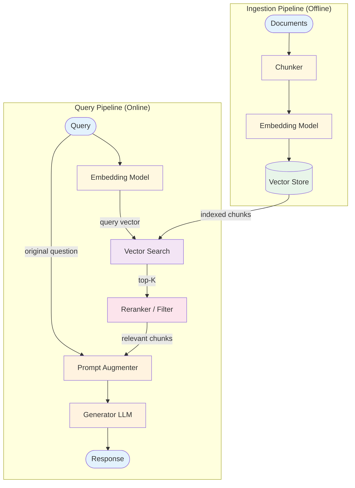

# RAG — Design

> Canonical Pydantic state schema: [`schemas/state.py`](schemas/state.py) — `RagState` is the top-level shape; `Query`, `RetrievedDoc`, `Answer` are the auxiliary models. Recipes targeting RAG reference these names verbatim.
>
> Typed prompts: [`prompts/`](prompts/) — `qa.md` (the synthesis step). See [`meta/style-guide.md`](../../meta/style-guide.md#typed-prompts) for the frontmatter contract.

## Component Breakdown

### Chunker
Splits documents into retrieval-sized pieces. Strategies:
- **Fixed-size:** Split every N tokens with overlap
- **Semantic:** Split at paragraph/section boundaries
- **Recursive:** Split hierarchically (document → section → paragraph → sentence)

Key parameters: chunk_size (200–1000 tokens), chunk_overlap (10–20% of size).

### Embedding Model
Converts text to vector representations. Same model must be used for both ingestion and query to ensure compatible vector spaces.

### Vector Store
Stores and indexes embedding vectors for similarity search. Supports approximate nearest neighbor (ANN) algorithms for fast retrieval at scale.

### Reranker / Relevance Filter
Refines retrieval results:
- **Similarity threshold:** Drop chunks below a cosine similarity score
- **Cross-encoder reranker:** A model scores (query, chunk) pairs more accurately than embedding similarity alone
- **Metadata filter:** Filter by document source, date, category

### Prompt Augmenter
Assembles the final prompt: question + retrieved context + instructions for grounded generation.

## Data Flow

**Ingestion:** documents → chunks → embeddings → stored in vector index

**Query:** question → embedding → vector search (top-K) → filter/rerank → augment prompt → LLM → grounded response

## Error Handling
- **No relevant results:** Return "I don't have information on this topic" rather than hallucinating
- **Low-quality retrieval:** Reranker filters out irrelevant chunks
- **Context overflow:** Limit chunks to fit within context budget (reserve tokens for generation)
- **Embedding failure:** Retry; fall back to keyword search if persistent

## Retrieval Quality Strategies

Retrieval is the ceiling on RAG quality. Three strategies that compound:

- **Hybrid search.** Combine dense (embedding) and sparse (BM25/keyword) retrieval. Catches different failure modes — dense for semantic similarity, sparse for exact-match terms (product codes, names, jargon).
- **Query rewriting.** Reformulate the user's question before retrieval. Useful for short queries that under-specify intent; can be implemented as a small LLM call.
- **Multi-query.** Generate K paraphrases of the query, retrieve for each, union and deduplicate results. Improves recall at the cost of K× retrieval calls.

For high-stakes RAG (medical, legal, financial), all three combined plus a cross-encoder reranker is the standard production stack.

## Scaling
- **Ingestion:** Batch process documents; parallelize chunking and embedding.
- **Query latency:** Embedding (~50ms) + vector search (~10ms for ANN) + LLM call.
- **At scale:** Use approximate search (HNSW, IVF); cache frequent queries; shard vector store; pre-compute embeddings for high-frequency queries.
- **Cost balance:** Cheap retrieval but generation cost scales with retrieved-context size — tighter top-K + reranking often wins over loose top-K.

## Observability Hooks

- Per-query: retrieved-chunk IDs, similarity scores, reranker scores, final-context size in tokens.
- Per-corpus: hit-rate distribution (zero-hit queries are a leading indicator of corpus gaps).
- Track **citation usage** — did the generator's output reference the retrieved sources? Generated answers that ignore retrieval defeat the pattern.
- Track **retrieval-vs-final correlation** — when retrieval scored low, did the answer fail? If not, retrieval may be over-weighted. See [observability.md](./observability.md).

## Decision Matrix: Chunk Size

| Size | Retrieval Precision | Context per Chunk | Chunks Needed |
|------|-------------------|-------------------|---------------|
| Small (200 tokens) | High | Low | More chunks needed |
| Medium (500 tokens) | Balanced | Balanced | Moderate |
| Large (1000 tokens) | Lower | High | Fewer chunks |

**Guideline:** Start with 500 tokens, 50-token overlap. Adjust based on retrieval quality.

## Composition
- **+ ReAct:** Agent decides when and what to retrieve (Agentic RAG)
- **+ Memory:** Same vector store for documents and conversation history
- **+ Reflection:** Evaluate answer quality against retrieved sources

## Production concerns

Cognitive concerns this repo covers; operational concerns belong in [agent-deployments](https://github.com/jagguvarma15/agent-deployments).

| Concern | This pattern's surface | Where to read |
|---|---|---|
| Prompt injection | retrieved content is the headline indirect-injection surface; sandbox retrieved text with explicit tags | [foundations/security-and-safety.md](../../foundations/security-and-safety.md) |
| Hallucination & grounding | cite-or-refuse enforced via output schema; retrieval recall is the ceiling on grounding quality | [foundations/hallucination-and-grounding.md](../../foundations/hallucination-and-grounding.md) |
| Cost & model selection | retrieval (cheap) + generation (medium); generation cost scales with retrieved context size | [foundations/cost-and-model-selection.md](../../foundations/cost-and-model-selection.md) |
| Rate limiting & retries | inherited | [agent-deployments cross-cutting](https://github.com/jagguvarma15/agent-deployments/tree/main/docs/cross-cutting) |
| Idempotency | inherited (retrieval is read-only; writes to the index belong in ingestion pipelines) | [agent-deployments cross-cutting](https://github.com/jagguvarma15/agent-deployments/blob/main/docs/cross-cutting/idempotency.md) |
| Observability hooks | see `observability.md` alongside this file | [foundations](../../foundations/README.md) |
