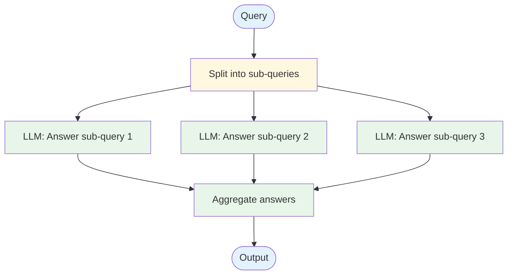

# Evolution: Parallel Calls → RAG

This document traces how the [RAG pattern](./overview.md) evolves from the [Parallel Calls workflow](../../workflows/parallel-calls/overview.md).

## The Starting Point: Parallel Calls

In a parallel calls workflow, you process multiple inputs concurrently and aggregate results:



Each LLM call relies entirely on its own training data to answer — there's no external knowledge injection.

## The Breaking Point

Parallel calls without retrieval break down when:

- **The LLM doesn't know the answer.** For domain-specific, private, or recent information, the LLM's training data is insufficient.
- **Hallucination is unacceptable.** Without source material, the LLM may generate plausible but incorrect answers.
- **Source attribution is required.** You need to cite where the answer came from — impossible with pure generation.
- **Knowledge changes frequently.** Retraining or fine-tuning for every knowledge update is impractical.

## What Changes

| Aspect | Parallel Calls | RAG |
|--------|---------------|-----|
| Knowledge source | LLM training data only | External document store |
| Before generation | Nothing | Retrieve relevant documents |
| Prompt content | Just the question | Question + retrieved context |
| Factual accuracy | Depends on training data | Grounded in source documents |
| Source attribution | Not possible | Can cite retrieved chunks |
| Knowledge updates | Requires retraining | Update document store |

## The Evolution, Step by Step

### Step 1: Add a document store

Index your knowledge base into a searchable store. Documents are chunked and embedded:

```
// Ingestion (offline):
for document in knowledge_base:
  chunks = split_into_chunks(document, size: 500)
  for chunk in chunks:
    embedding = embed(chunk.text)
    vector_store.insert(embedding, chunk)
```

### Step 2: Replace direct answering with retrieve-then-generate

Before asking the LLM to answer, retrieve relevant context:

```
BEFORE:
  answer = llm("Answer this question: {query}")

AFTER:
  query_embedding = embed(query)
  chunks = vector_store.search(query_embedding, top_k: 5)
  context = format_chunks(chunks)
  answer = llm("Based on the following context:\n{context}\n\nAnswer: {query}")
```

### Step 3: Add relevance filtering

Not all retrieved chunks are useful. Filter by similarity threshold:

```
chunks = vector_store.search(query_embedding, top_k: 10)
relevant = [c for c in chunks if c.similarity > 0.7]
// Use only relevant chunks in the prompt
```

### Step 4: Combine with the parallel pattern

The parallel call structure can still be useful — fan out across multiple retrieval sources or multiple query reformulations:

```
// Parallel retrieval from multiple sources:
chunks_1 = vector_store_A.search(query_embedding, top_k: 5)
chunks_2 = vector_store_B.search(query_embedding, top_k: 5)
// Or parallel query reformulation:
queries = [original_query, reformulated_query_1, reformulated_query_2]
all_chunks = parallel_search(queries)
// Deduplicate and rank
```

## When to Make This Transition

**Stay with Parallel Calls when:**
- The LLM's training data is sufficient for the task
- You don't have a knowledge base to retrieve from
- The task is creative or reasoning-based (no external facts needed)

**Evolve to RAG when:**
- The LLM needs domain-specific or private knowledge
- Factual accuracy and source attribution matter
- Knowledge changes faster than you can retrain
- Users ask questions about specific documents or datasets

## What You Gain and Lose

**Gain:** Factual grounding, reduced hallucination, source attribution, updateable knowledge, works with any LLM.

**Lose:** Requires building and maintaining a document index, retrieval quality limits answer quality, added latency for embedding + search, context window consumed by retrieved chunks.
