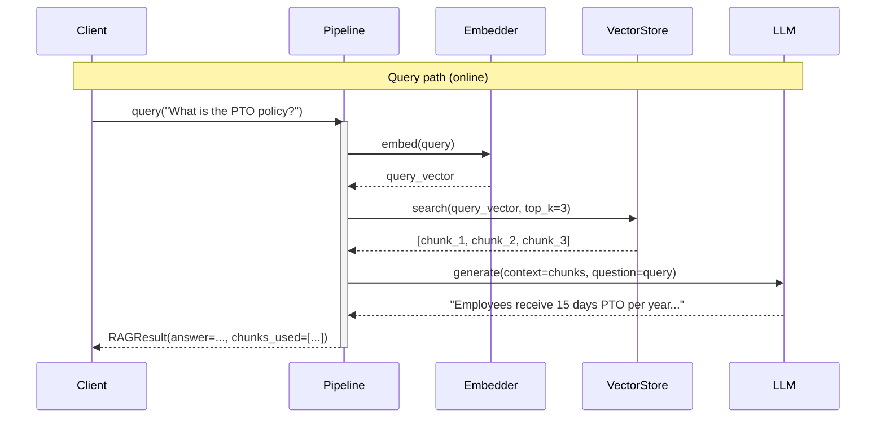

# Observability: RAG

What to instrument, what to log, and how to diagnose failures in retrieval-augmented generation.

---

## Key Metrics

| Metric | Description | Alert if |
|--------|-------------|----------|
| `rag.retrieve.chunk_count` | Chunks retrieved per query | 0 (no relevant context found) |
| `rag.retrieve.top_score` | Highest similarity score returned | < 0.5 (poor relevance) |
| `rag.embed.latency_ms` | Query embedding time | > 100ms |
| `rag.retrieve.latency_ms` | Vector search time | > 300ms |
| `rag.generate.tokens_in` | Input tokens to generation (context + query) | > 80% of model context limit |
| `rag.ingest.chunk_count` | Chunks added per ingest run | Drop to 0 (ingestion may be failing) |

---

## Trace Structure

Two independent flows: an offline ingestion pipeline and an online query pipeline.



---

## Span Reference

| Span name | Emitted | Key attributes |
|-----------|---------|----------------|
| `rag.query` | Once per query | `top_k`, `chunks_retrieved`, `top_score`, `duration_ms` |
| `rag.embed.query` | Once per query | `query_len`, `vector_dim`, `duration_ms` |
| `rag.retrieve` | Once per query | `results_count`, `top_score`, `min_score`, `duration_ms` |
| `rag.generate` | Once per query | `context_chunks`, `tokens_in`, `tokens_out`, `duration_ms` |
| `rag.ingest` | Once per ingest call | `doc_count`, `chunk_count`, `duration_ms`, `error_count` |
| `rag.embed.chunk` | Once per chunk (ingest) | `chunk_index`, `chunk_len`, `duration_ms` |

---

## What to Log

### On query
```
INFO  rag.query.start  question="What is the PTO policy?"  top_k=3
INFO  rag.embed.done   query_len=32  ms=18
INFO  rag.retrieve.done  chunks=3  top_score=0.87  min_score=0.71  ms=24
INFO  rag.generate.start  context_tokens=820  question_tokens=12
INFO  rag.generate.done  answer_len=210  ms=640
INFO  rag.query.done  total_ms=688
```

### On poor retrieval
```
WARN  rag.retrieve.low_score  top_score=0.31  question="What is the CEO's phone number?"
           note="No relevant chunks found — answer will be based on LLM training data only"
WARN  rag.retrieve.empty  chunks=0  top_k=3
           note="Vector store may be empty or embedder model mismatch"
```

### On ingest
```
INFO  rag.ingest.start  doc_count=47
INFO  rag.ingest.done   chunks=312  failed=0  duration_ms=8400
WARN  rag.ingest.chunk_error  doc_index=3  error="unicode decode error"
```

---

## Common Failure Signatures

### Retrieval always returns low-score chunks (hallucinated answers)
- **Symptom**: `rag.retrieve.top_score` is always < 0.5; answers don't reference the actual documents.
- **Log pattern**: Retrieved chunks are about an unrelated topic to the query.
- **Diagnosis**: Embedding model mismatch between ingestion and query time (e.g., different model versions). Or the knowledge base doesn't contain the answer.
- **Fix**: Log the embedding model name at both ingest and query time; re-ingest if the model changed. Add a score threshold: if `top_score < MIN_SCORE`, respond with "I don't have information on that."

### Context window overflow
- **Symptom**: `rag.generate.tokens_in` frequently exceeds the model's context limit; API errors.
- **Log pattern**: `tokens_in > 7000` for a model with an 8k context window.
- **Diagnosis**: Chunks are too large, or `top_k` is too high, or the query itself is very long.
- **Fix**: Log `context_tokens` and `question_tokens` separately; reduce chunk size or `top_k`; add a reranker to keep only the best chunks.

### Stale knowledge base (answers reflect old document version)
- **Symptom**: Users report outdated answers even though documents were updated.
- **Log pattern**: Retrieved chunk metadata shows an old document version timestamp.
- **Diagnosis**: Documents were updated but not re-ingested; old chunks coexist with new ones.
- **Fix**: Log `metadata.source` and `metadata.updated_at` for every retrieved chunk; implement document versioning: delete old chunks before re-ingesting updated documents. Alert on `ingest.chunk_count=0` runs.

### Retrieval is correct but generation ignores context
- **Symptom**: Retrieved chunks clearly contain the answer, but the LLM responds with "I don't know."
- **Log pattern**: `retrieve.top_score=0.92` but `answer` contains "I don't have information on that."
- **Diagnosis**: The context is passed in the prompt but the generation prompt is instructing the LLM too strongly to say "I don't know."
- **Fix**: Log the full generation prompt during debugging; check that the context is placed before the question; soften the "if context doesn't contain the answer" instruction.
