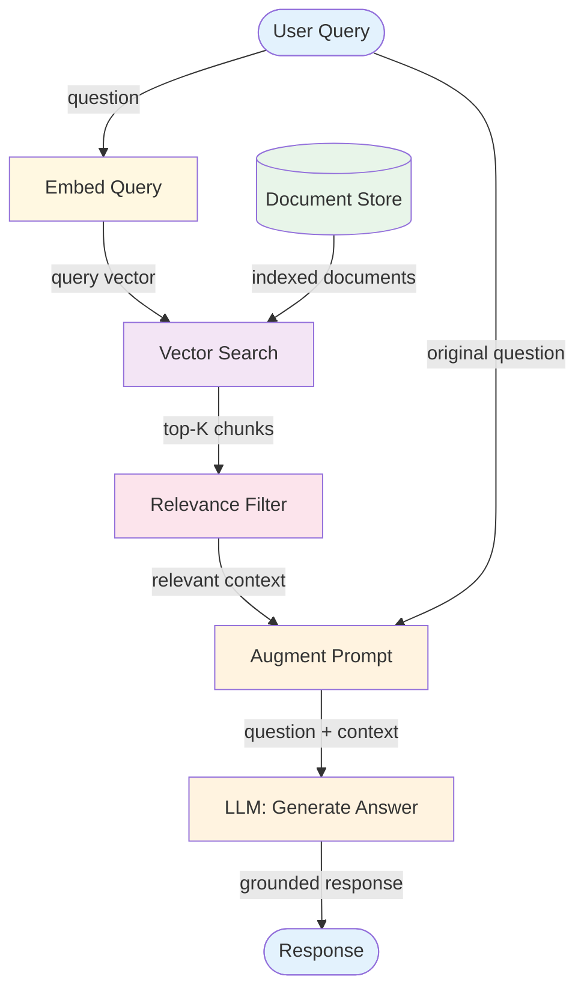

# RAG (Retrieval-Augmented Generation) — Overview

RAG grounds LLM responses in external knowledge by retrieving relevant documents before generating a response. Instead of relying solely on the LLM's training data, the system searches a knowledge base and injects the most relevant content into the prompt.

**Evolves from:** [Parallel Calls](../../workflows/parallel-calls/overview.md) — adds a retrieval step, context injection, and relevance filtering.

## Architecture



*Figure: The query is embedded and used to search a document store. Retrieved chunks are filtered for relevance, injected into the prompt, and the LLM generates a grounded response.*

## How It Works

**Ingestion (offline):**
1. **Load** documents from your knowledge source
2. **Chunk** documents into retrieval-sized pieces (typically 200–1000 tokens)
3. **Embed** each chunk into a vector representation
4. **Store** vectors in a searchable index (vector database)

**Query (online):**
1. **Embed** the user's query using the same embedding model
2. **Search** the vector store for the most similar chunks (top-K)
3. **Filter** results for relevance (similarity threshold, metadata filters)
4. **Augment** the LLM prompt with the retrieved context
5. **Generate** a response grounded in the retrieved documents

## Minimal Example

Answer HR policy questions from a company handbook — retrieval ensures answers are grounded in actual policy, not LLM training data.

```python
from patterns.rag.code.python.rag import RAGPipeline

pipeline = RAGPipeline(
    llm=your_llm,
    embedder=your_embedder,
    top_k=3,
    chunk_size=500,
)

# Ingestion — run once when documents are added or updated
n_chunks = pipeline.ingest(
    documents=company_handbook_pages,
    metadata=[{"source": "handbook", "section": s} for s in section_names],
)
print(f"Indexed {n_chunks} chunks")

# Query — at request time
result = pipeline.query("What is the process for requesting parental leave?")
# result.answer       → answer grounded in retrieved context
# result.chunks_used  → the specific handbook sections retrieved
# result.query        → original question (for logging / evaluation)
```

*Without RAG*, the LLM would answer from training data — which may be outdated or simply wrong for your company's specific policy. *With RAG*, the answer is always sourced from your current documents.

### Code variants

| Implementation | Language | Path |
|----------------|----------|------|
| Framework-agnostic pipeline (MockLLM + MockEmbedder) | Python | [`code/python/rag.py`](code/python/rag.py) |
| Pydantic AI (`Agent` with typed `RAGAnswer` result + retrieval-as-tool) | Python | [`code/python/pydantic-ai/rag.py`](code/python/pydantic-ai/rag.py) |
| LangGraph (`StateGraph`: retrieve node → generate node) | Python | [`code/python/langgraph/rag.py`](code/python/langgraph/rag.py) |
| Vercel AI SDK (retrieve outside `generateText`, inline context) | TypeScript | [`code/typescript/vercel-ai-sdk/rag.ts`](code/typescript/vercel-ai-sdk/rag.ts) |

The framework-specific files share an identical task (ingest three short documents about ReAct / RAG / Plan-and-Execute; query for RAG) so they're diff-friendly across stacks. Both use a deterministic hash-based mock embedder so the chunk scores are reproducible offline; swap in a real embedding provider (OpenAI, Voyage, Cohere) to ship.

## Input / Output

- **Input:** User query + document store (pre-indexed)
- **Output:** LLM response grounded in retrieved document content
- **Retrieved context:** Top-K document chunks most relevant to the query
- **Ingestion input:** Raw documents (text, PDF, HTML, etc.)

## Key Tradeoffs

| Strength | Limitation |
|----------|-----------|
| Grounds responses in factual sources | Retrieval quality limits response quality |
| Reduces hallucination for knowledge-heavy tasks | Requires maintaining and indexing a document store |
| Knowledge can be updated without retraining | Chunking strategy significantly affects results |
| Works with any LLM — no fine-tuning needed | Retrieved context consumes context window tokens |
| Provides source attribution | Embedding quality affects search accuracy |

## When to Use

- Question-answering over a specific knowledge base (docs, policies, code)
- When the LLM needs information not in its training data
- When responses must be grounded in specific source documents
- When you need source attribution ("answer based on document X, section Y")
- When knowledge changes frequently and fine-tuning isn't practical

## When NOT to Use

- When all needed information fits in the system prompt — just include it directly
- When the task doesn't require external knowledge (creative writing, reasoning)
- When real-time data is needed — RAG over a static index will be stale
- When exact database queries would be more appropriate — use [Tool Use](../tool_use/overview.md) with a DB query tool

## Related Patterns

- **Evolves from:** [Parallel Calls](../../workflows/parallel-calls/overview.md) — see [evolution.md](./evolution.md)
- **Combines with:** [ReAct](../react/overview.md) (agent decides when to retrieve), [Memory](../memory/overview.md) (shared vector store for both documents and interaction history)
- **Advanced form:** Agentic RAG — the agent decides when, what, and how to retrieve, potentially reformulating queries or searching multiple sources

## Deeper Dive

- **[Design](./design.md)** — Chunking strategies, embedding selection, retrieval tuning, relevance filtering, re-ranking
- **[Implementation](./implementation.md)** — Pseudocode, ingestion pipeline, query pipeline, testing with fixtures
- **[Evolution](./evolution.md)** — How RAG evolves from parallel calls

## When NOT to use this pattern

- All needed knowledge fits in the context window — context-stuffing is simpler.
- Retrieval recall is unmeasured — you'll ship hallucinations grounded in irrelevant chunks.
- The corpus is small and changes rarely — a flat document in the system prompt may suffice.

## Next steps

- Production version: see [Blueprints → Deployments](../../composition/blueprints-to-deployments.md) for the deployment agents that use this pattern.
- Generate a starter project: see [Blueprint → Spec → Scaffold](../../composition/blueprint-to-spec-to-scaffold.md).
- Combine with other patterns: see the [Composition guide](../../composition/README.md).
