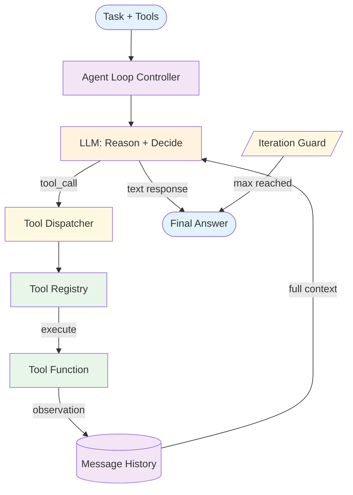

# ReAct — Design

> Canonical Pydantic state schema: [`schemas/state.py`](schemas/state.py) — `ReActState` is the top-level shape; `ReActStep`, `ToolCall`, `Observation` are the auxiliary models. Recipes targeting ReAct reference these names verbatim.
>
> Typed prompts: [`prompts/`](prompts/) — one file per LLM role with JSON-Schema I/O. See [`meta/style-guide.md`](../../meta/style-guide.md#typed-prompts) for the frontmatter contract.

## Component Breakdown

### Agent Loop Controller
Drives the think-act-observe cycle. On each iteration: send messages to the LLM, check if the response is a tool call or final answer, dispatch tool calls, append observations, check guards.

### LLM (Reasoning Engine)
Receives the system prompt, tool schemas, and full message history. Produces either a tool call request or a text response. The system prompt instructs the LLM to reason before acting.

### Tool Registry
Maps tool names to implementations. Each entry contains the tool schema (for the LLM) and the handler function (for execution). Tools are registered at initialization.

### Tool Dispatcher
Routes tool call requests to the correct handler. Validates arguments against the schema. Handles execution errors gracefully.

### Message History
The growing list of messages: user input, assistant reasoning, tool calls, and observations. This is the agent's "working memory" for the current task.

### Iteration Guard
Enforces max iterations. When reached, forces the agent to return its best answer so far rather than continuing.

## Data Flow Specification

Each iteration cycle:
1. **Messages → LLM:** Full message history + system prompt + tool schemas
2. **LLM → Dispatcher:** Tool call with name and arguments (or text response)
3. **Dispatcher → Tool:** Validated arguments
4. **Tool → History:** Observation result appended as tool response message
5. **History → LLM:** Updated history for next iteration

### Message History Growth
The history grows by ~2 messages per iteration (assistant tool_call + tool result). For a 10-iteration task, that's ~20 messages plus the original user message. This can consume significant context window.

**Management strategies:**
- **Truncation:** Drop oldest messages when approaching context limit
- **Summarization:** Periodically summarize older messages into a condensed form
- **Sliding window:** Keep last N messages plus a summary of earlier ones

## Error Handling Strategy

### Tool Call Errors
- **Invalid tool name:** Return error observation: "Tool X not found. Available tools: [...]"
- **Invalid arguments:** Return error observation with schema hint
- **Execution failure:** Return error observation. The LLM should adapt its approach.
- **Timeout:** Return timeout observation. The LLM can retry or try a different tool.

### Agent Loop Errors
- **Infinite loop:** The iteration guard prevents this. When hit, return whatever context has been gathered.
- **Repeated failures:** If the agent calls the same tool with the same args 3+ times, inject a hint to try a different approach.
- **Context overflow:** Summarize or truncate history.

## Termination Strategies

A ReAct loop without a clear termination policy is a budget bug. Combine layers:

- **Iteration cap (mandatory).** Hard limit on agent loop steps. Default 10–15 for general agents; tighter for specialized ones.
- **Token budget.** Cap total tokens across all iterations. Catches long-context blow-ups.
- **Repeat detection.** Same tool + same args twice in a row → inject a hint ("you've tried this; try something different") before iterating further. Three repeats → terminate.
- **Explicit done-tool.** Provide a `finalize_answer` tool. Force the agent to call it rather than guess when to stop returning text. Often the cleanest termination.
- **Confidence threshold.** When the agent claims confidence above a calibrated bar, stop. Below it after K iterations, escalate.

## Scaling Considerations

- **Cost:** Unpredictable — depends on iteration count. Set cost budgets alongside iteration limits; track P50/P95 iteration count in production.
- **Latency:** Variable. Each iteration = 1 LLM call + tool execution time. Tools that block (sequential web fetches) dominate.
- **Throughput:** Each agent run is independent. Scale by running multiple agents in parallel.
- **Model selection:** A ReAct loop's reasoning steps benefit from Sonnet or Opus; simple tool-formatting steps can use Haiku. Many production ReAct agents mix tiers within one loop.
- **At 100×:** Cache deterministic tool results (web fetch with stable URL, DB lookup with stable key). Use cheaper models for simple-tool-use tasks. Pool agent instances.

## Observability Hooks

The minimum trace surface for a ReAct agent:

- Per-task: iteration count, total tokens, total tool calls, success/failure, time-to-first-token, time-to-final-answer.
- Per-iteration: thought (reasoning) length, action (tool call) name, observation length, time per step.
- Per-tool: invocation count, success rate, latency, retry rate.
- Track **iteration-count distribution** — bimodal distributions (cluster at 1 and at max) usually indicate two distinct task types that should be routed differently. See [observability.md](./observability.md).

## Composition Notes

- **+ RAG:** Add retrieval tools to the tool registry. The agent decides when to search.
- **+ Memory:** Load relevant memories into the system prompt. Store important findings after the run.
- **+ Reflection:** After the agent produces a final answer, run a reflection pass. If quality is low, re-run.
- **+ Plan & Execute:** Use ReAct as the step executor within a plan. Each plan step gets a bounded ReAct loop.

## Production concerns

Cognitive concerns this repo covers; operational concerns belong in [agent-deployments](https://github.com/jagguvarma15/agent-deployments).

| Concern | This pattern's surface | Where to read |
|---|---|---|
| Prompt injection | tool outputs and fetched content land in the agent's context — indirect injection is the headline risk | [foundations/security-and-safety.md](../../foundations/security-and-safety.md) |
| Hallucination & grounding | hallucinated tool calls are common; schema-bound tools catch invented function names | [foundations/hallucination-and-grounding.md](../../foundations/hallucination-and-grounding.md) |
| Cost & model selection | variable per step; unbounded without iteration cap (`max_steps` is mandatory) | [foundations/cost-and-model-selection.md](../../foundations/cost-and-model-selection.md) |
| Rate limiting & retries | inherited | [agent-deployments cross-cutting](https://github.com/jagguvarma15/agent-deployments/tree/main/docs/cross-cutting) |
| Idempotency | required at the tool layer — agent may retry | [agent-deployments cross-cutting](https://github.com/jagguvarma15/agent-deployments/blob/main/docs/cross-cutting/idempotency.md) |
| Observability hooks | see `observability.md` alongside this file | [foundations](../../foundations/README.md) |
