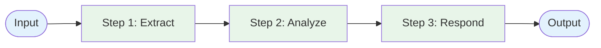
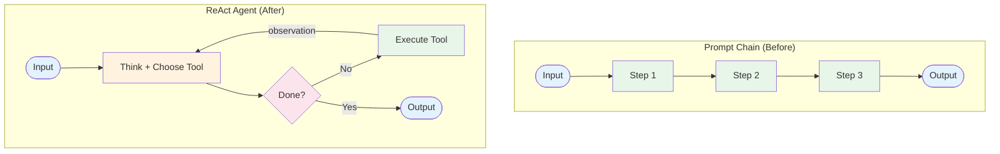

# Evolution: Prompt Chaining → ReAct

This document traces how the [ReAct pattern](./overview.md) evolves from the [Prompt Chaining workflow](../../workflows/prompt-chaining/overview.md). Understanding this bridge helps you decide when to make the transition and how to do it incrementally.

## The Starting Point: Prompt Chaining

In a prompt chain, you define a fixed sequence of LLM calls. Each step has a specific job, and the output flows from one step to the next:



The developer decides: there are exactly 3 steps, in this order, every time.

## The Breaking Point

Prompt chains break down when:

- **Different inputs need different steps.** A question about weather needs a search tool; a math question needs a calculator. The chain can't know which steps to run in advance.
- **The number of steps varies.** Some questions need 1 tool call, others need 5. A fixed chain either wastes calls or runs out of steps.
- **Later steps depend on earlier observations.** The right action at step 3 depends on what step 2's tool returned — and you can't write that logic as a static chain.

When you find yourself writing `if/else` branches to handle these cases, you're fighting the workflow model. It's time to evolve.

## What Changes

| Aspect | Prompt Chaining | ReAct |
|--------|----------------|-------|
| Step count | Fixed at design time | Dynamic — LLM decides when to stop |
| Step selection | Developer codes each step | LLM chooses which tool to use |
| Control flow | Code-driven sequential pipeline | LLM-driven reasoning loop |
| Tool calls | At predetermined positions | Whenever the LLM decides |
| Termination | After last step completes | When LLM produces a final answer |
| Error handling | Gate checks between steps | LLM observes errors and adapts |

## The Evolution, Step by Step

### Step 1: Add tool schemas to the LLM call

Instead of hard-coding which function to call at each step, describe your available tools as schemas and let the LLM choose:

```
BEFORE (Prompt Chain):
  step_1_output = llm("Extract entities from: {input}")
  step_2_output = llm("Search for: {step_1_output}")
  step_3_output = llm("Summarize: {step_2_output}")

AFTER (Tool-aware):
  response = llm(
    message: "{input}",
    tools: [extract_schema, search_schema, summarize_schema]
  )
```

### Step 2: Replace the fixed pipeline with a loop

Instead of a linear sequence, wrap the LLM call in a loop that continues until the LLM returns a text response (no tool call):

```
BEFORE (Pipeline):
  for step in [step_1, step_2, step_3]:
    output = step(previous_output)

AFTER (Agent loop):
  while not done:
    response = llm(messages, tools)
    if response.has_tool_call:
      result = execute(response.tool_call)
      messages.append(result)
    else:
      done = true
```

### Step 3: Add reasoning prompts

Instruct the LLM to explain its thinking before acting. This makes the agent's decisions inspectable and improves tool selection accuracy:

```
System prompt addition:
  "Before calling a tool, explain your reasoning:
   what you know, what you need, and why this tool helps."
```

### Step 4: Add guardrails

Set a maximum iteration count to prevent runaway loops — something a prompt chain never needed because it had a fixed step count:

```
max_iterations = 10
iteration = 0
while not done and iteration < max_iterations:
  iteration += 1
  ...
```

## The Result



## When to Make This Transition

**Stay with Prompt Chaining when:**
- Your steps are predictable and fixed
- Each step always uses the same tool
- You rarely need to add `if/else` for different inputs

**Evolve to ReAct when:**
- You're writing more branching logic than processing logic
- Different inputs need different tools or step counts
- Tool selection depends on intermediate results
- You want the system to adapt to novel inputs

## What You Gain and Lose

**Gain:** Flexibility, adaptability, ability to handle novel inputs, simpler code (no branching logic).

**Lose:** Predictability (the LLM may take different paths), cost certainty (variable number of calls), ease of testing (non-deterministic behavior).

The tradeoff is worth it when the complexity of your branching logic exceeds the complexity of managing an agent loop.
