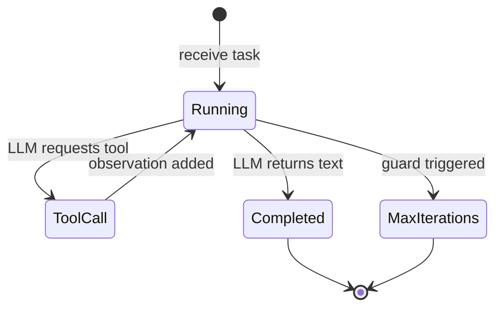

# ReAct — Implementation

## Core Interfaces

```
ToolSchema:
  name: string
  description: string
  parameters: JSONSchema object

ToolEntry:
  schema: ToolSchema
  handler: function(args) → string

AgentConfig:
  system_prompt: string
  tools: list of ToolEntry
  max_iterations: integer              // Default: 10
  model: string
  temperature: float                   // Default: 0.0
```

## Core Pseudocode

### agent_loop

```
function agent_loop(task, config):
  // Build tool schemas for the LLM
  tool_schemas = [entry.schema for entry in config.tools]

  // Initialize message history
  messages = [
    {role: "user", content: task}
  ]

  // Build tool registry
  registry = {}
  for entry in config.tools:
    registry[entry.schema.name] = entry.handler

  // Main loop
  for iteration in 1..config.max_iterations:
    // Call LLM with full context
    response = call_llm(
      system: config.system_prompt,
      messages: messages,
      tools: tool_schemas,
      temperature: config.temperature,
      model: config.model
    )

    // Check if LLM wants to call a tool
    if response.has_tool_calls:
      for tool_call in response.tool_calls:
        // Dispatch tool call
        observation = dispatch_tool(tool_call, registry)

        // Append to history
        messages.append({role: "assistant", tool_calls: [tool_call]})
        messages.append({
          role: "tool",
          tool_call_id: tool_call.id,
          content: observation
        })

    else:
      // LLM produced a final text answer
      return {
        status: "completed",
        answer: response.text,
        iterations: iteration,
        messages: messages
      }

  // Max iterations reached
  return {
    status: "max_iterations",
    answer: "I was unable to fully complete the task within the iteration limit. " +
            "Here is what I found so far: " + summarize_findings(messages),
    iterations: config.max_iterations,
    messages: messages
  }
```

### dispatch_tool

```
function dispatch_tool(tool_call, registry):
  name = tool_call.name
  args = tool_call.arguments

  // Check if tool exists
  if name not in registry:
    return "Error: Tool '" + name + "' not found. Available: " + join(registry.keys(), ", ")

  // Execute tool
  try:
    result = registry[name](args)
    return to_string(result)
  catch error:
    return "Error executing " + name + ": " + error.message
```

## State Management

```
AgentState:
  messages: list of Message
  iteration: integer
  status: "running" | "completed" | "max_iterations" | "error"
  tool_call_count: integer
  total_tokens: integer
```



## Prompt Engineering Notes

### System Prompt

```
System:
You are a helpful assistant that solves tasks step by step.

For each step:
1. Think about what you know and what you still need to find out
2. Choose the most appropriate tool to make progress
3. Observe the result and decide your next action

When you have enough information to fully answer the question, respond directly without calling any more tools.

Be efficient — avoid calling the same tool with the same arguments twice.
If a tool returns an error, try a different approach rather than retrying the same call.
```

### Key Design Decisions
- **Explicit reasoning instruction** improves tool selection accuracy
- **Efficiency reminder** reduces unnecessary iterations
- **Error recovery instruction** prevents infinite retry loops

## Prompt Templates

These are production-ready templates. Copy and adapt — replace `{placeholders}` with your specifics.

### System prompt

```
You are an agent that solves tasks by reasoning and using tools.

Available tools:
{tool_name_1}: {tool_description_1}
{tool_name_2}: {tool_description_2}
{tool_name_N}: {tool_description_N}

For each step, respond in this exact format:

Thought: {your reasoning about what to do next and why}
Action: {tool_name — must be one of the tools listed above}
Action Input: {the exact input for the tool, as a plain string or JSON}

When you have enough information to answer completely, respond in this exact format:

Thought: I now have enough information to answer.
Final Answer: {your complete response to the original task}

Rules:
- Never call the same tool with the same input twice.
- If a tool returns an error, try a different approach rather than retrying the same call.
- If you are stuck after {max_steps} steps, summarize what you found and stop.
```

### User message

```
{task — the user's question or goal}
```

### Observation injection (appended after each tool call)

```
Observation: {tool_output}
```

### Loop-break injection (appended when loop is detected)

```
Observation: You have already called {tool_name} with this input. The result was: {prior_result}
Please use a different approach to make progress on the task.
```

### Customization guide

| Placeholder | What to put here |
|---|---|
| `{tool_name}: {tool_description}` | List only the tools available for this specific agent instance |
| `{max_steps}` | Keep this low (5-8 for most tasks). Include it in the prompt AND enforce it in code |
| `{task}` | The user's verbatim request — do not summarize or reframe it |
| `{tool_output}` | The raw tool output — truncate long results to the most relevant portion before injection |

## Testing Strategy

### Unit Tests
- **Tool dispatch:** Register mock tools, verify correct routing and argument passing
- **Error handling:** Call nonexistent tool → verify error message. Call with bad args → verify schema error.

### Agent Loop Tests (with LLM stubs)
- **Happy path:** Stub LLM to return tool_call → observation → final answer. Verify 2-iteration completion.
- **Direct answer:** Stub LLM to return text immediately. Verify 1-iteration completion.
- **Max iterations:** Stub LLM to always return tool calls. Verify guard triggers.
- **Tool error recovery:** Stub first tool call to fail, second to succeed. Verify agent adapts.

### Evaluation Tests
- Run on benchmark tasks with real LLM. Measure: accuracy, iteration count, cost.

## Common Pitfalls

### Growing Message History
**Problem:** After many iterations, the message history exceeds the context window.
**Fix:** Implement sliding window with summary. After N messages, summarize older ones.

### Tool Call Loops
**Problem:** Agent repeatedly calls the same tool with the same arguments.
**Fix:** Track recent tool calls. After 2 identical calls, inject: "You've already tried this. Try a different approach."

### Missing Final Answer
**Problem:** Agent keeps calling tools and never produces a final text response.
**Fix:** The iteration guard handles this. Also: include "When you have enough information, respond directly" in the system prompt.

### Reasoning Quality Degradation
**Problem:** As history grows, the LLM's reasoning quality decreases.
**Fix:** Keep system prompt concise. Use summarization for old context. Consider resetting with a summary after N iterations.

## Migration Paths

### From Prompt Chaining
See [evolution.md](./evolution.md) for the detailed step-by-step bridge.

### To Plan & Execute
When tasks benefit from upfront planning:
1. Add a planning phase before the ReAct loop
2. Run a bounded ReAct loop per plan step
3. See [Plan & Execute](../plan_and_execute/overview.md)
