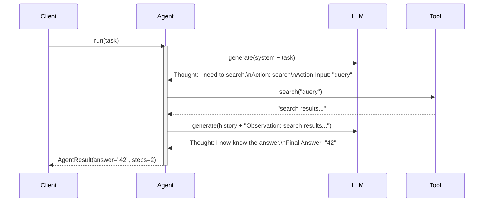

# Observability: ReAct Agent

What to instrument, what to log, and how to diagnose failures in the Reason + Act loop.

---

## Key Metrics

| Metric | Description | Alert if |
|--------|-------------|----------|
| `react.steps_taken` | Steps used per run | Consistently near `max_steps` |
| `react.tool.{name}.call_count` | How many times each tool is called | Any tool called > 3× in one run |
| `react.tool.{name}.error_rate` | Fraction of calls that error | > 5% for any tool |
| `react.stopped_by_guard_rate` | Fraction of runs hitting max_steps | > 10% |
| `react.loop_detected` | Same tool called with identical args in same run | Any occurrence |

---

## Trace Structure

A root span containing N step spans, each with an optional tool span.



---

## Span Reference

| Span name | Emitted | Key attributes |
|-----------|---------|----------------|
| `react.run` | Once per call | `steps_taken`, `final_answer_len`, `stopped_by_guard`, `duration_ms` |
| `react.step.{n}` | Once per loop iteration | `step.n`, `thought_len`, `action`, `action_input` |
| `react.tool.{name}` | Once per tool call | `tool.name`, `input`, `output_len`, `duration_ms`, `error` |
| `react.parse` | Once per LLM response | `parsed_action`, `parsed_final_answer`, `parse_failed` |

---

## What to Log

### On each step
```
INFO  react.step.start  step=1
INFO  react.think.done  step=1  thought="I need to look up the current rate"
INFO  react.action      step=1  tool=search  input="federal funds rate 2024"
INFO  react.tool.done   step=1  tool=search  output_len=180  ms=340
INFO  react.observe     step=1  observation_preview="The rate is 5.25%..."
```

### On parse failure
```
WARN  react.parse.failed  step=2  response_preview="I think the answer is..."
           expected="Thought:/Action: or Final Answer:"
```

### On final answer
```
INFO  react.done  steps=3  answer_len=140  total_ms=2100  stopped_by_guard=false
```

### On max steps hit
```
WARN  react.guard.triggered  steps_taken=10  task="Find the population of all G20 countries"
```

---

## Common Failure Signatures

### Agent loops on the same tool call
- **Symptom**: `react.loop_detected` fires; `react.tool.{name}.call_count` = 5+ with identical inputs.
- **Log pattern**: Repeated identical `react.action tool=X input=Y` entries in the same run.
- **Diagnosis**: The tool returned an unhelpful observation (empty, error), and the agent didn't adapt.
- **Fix**: Detect identical tool+input pairs in the loop and inject an explicit observation: `"This tool call returned the same result as before. Try a different approach."` Add this check to the agent.

### Format breakdown mid-run
- **Symptom**: `react.parse.failed` fires once or twice per run; agent recovers inconsistently.
- **Log pattern**: `response_preview` shows the LLM mixing its `Thought/Action` format with prose.
- **Diagnosis**: Long conversation histories cause the model to drift from the format.
- **Fix**: Include the format reminder at the end of the system prompt AND in the observation injection: `"Remember to respond in Thought/Action format."`. Truncate old history rather than letting it grow unbounded.

### Tool error cascades
- **Symptom**: `react.tool.error_rate` > 20% for one tool; agent fails to complete the task.
- **Log pattern**: Repeated `react.tool.done error=<exception>` for the same tool.
- **Diagnosis**: The tool itself is failing (network error, auth issue) — not the agent logic.
- **Fix**: Log full exception type and message on every tool error; return a structured error string instead of raising so the agent can reason about it: `"Error: <tool> is unavailable. Try a different approach."`.

### Stopped by guard with partial answer
- **Symptom**: `react.stopped_by_guard_rate` > 10%; agents return "Reached maximum steps" frequently.
- **Log pattern**: `stopped_by_guard=true`; last thought before guard shows the agent was still gathering info.
- **Diagnosis**: Task complexity exceeds `max_steps`; or agent is inefficient (calling tools redundantly).
- **Fix**: Increase `max_steps` for complex tasks; add a loop detector; log the task alongside guard events to identify which task types are too hard.
