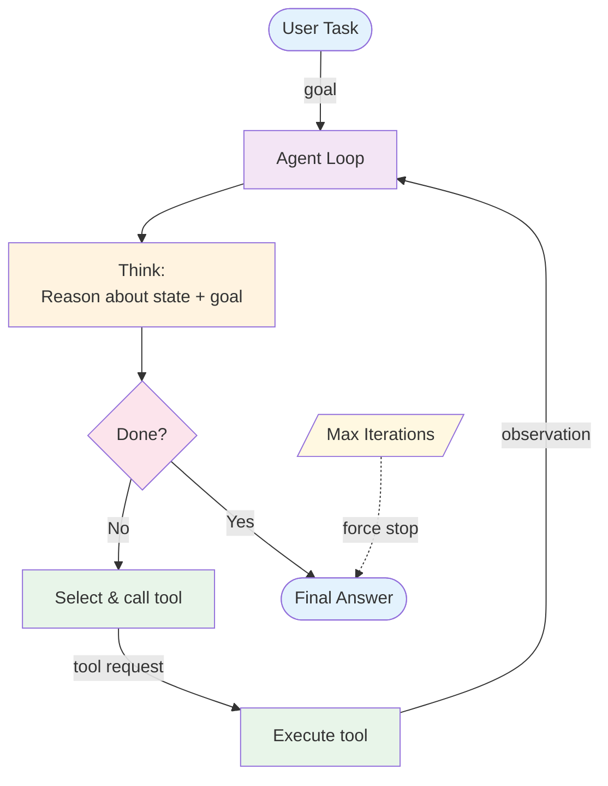

# ReAct (Reason + Act) — Overview

ReAct is the foundational agent pattern: a loop where the LLM *reasons* about what to do, *acts* by calling a tool, *observes* the result, and repeats until the task is complete. The LLM controls when to act and when to stop.

**Evolves from:** [Prompt Chaining](../prompt-chaining/overview.md) — adds dynamic tool selection and LLM-controlled looping.

## Architecture



*Figure: The ReAct loop. The LLM thinks, decides whether to act or respond, executes a tool if needed, and observes the result. A max iteration guard prevents infinite loops.*

## How It Works

1. The LLM receives the task and the available tool schemas
2. It generates a reasoning step ("I need to search for X because...")
3. It selects a tool and provides arguments
4. Your code executes the tool and returns the observation
5. The LLM reasons about the observation and decides the next action
6. Repeat until the LLM produces a final answer or hits the iteration limit

The key insight: the LLM interleaves *thinking* with *acting*. It doesn't just plan all steps upfront — it adapts based on what it discovers.

## Minimal Example

Answer a compound question using search and a calculator — the agent decides which tools to call and when to stop.

```python
from patterns.react.code.python.react_agent import ReActAgent, Tool

agent = ReActAgent(
    llm=your_llm,
    tools=[
        Tool("search",     "Search the web for current information", lambda q: search_api(q)),
        Tool("calculator", "Evaluate a math expression",             lambda expr: str(eval(expr))),
    ],
    max_steps=8,
)

result = agent.run(
    "What is the compound interest on $5,000 at the current US federal funds rate for 10 years?"
)
# result.answer            → final answer once the agent calls "Final Answer:"
# result.steps             → full Thought / Action / Observation trace
# result.stopped_by_guard  → True if max_steps was hit before a final answer
```

*Example trace:*
```
Thought: I need the current federal funds rate first.
Action: search | Input: "current US federal funds rate 2024"
Observation: The federal funds rate is 5.25–5.50% as of late 2024.

Thought: Now I'll calculate compound interest.
Action: calculator | Input: 5000 * (1 + 0.0525) ** 10
Observation: 8292.87

Thought: I now know the final answer.
Final Answer: At 5.25%, $5,000 grows to approximately $8,293 over 10 years.
```

### Implementations

| Variant | Language | File |
|---------|----------|------|
| Reference (MockLLM, framework-agnostic) | Python | [`code/_reference.py`](code/_reference.py) |
| Pydantic AI | Python | [`code/python/pydantic-ai/react.py`](code/python/pydantic-ai/react.py) |
| LangGraph (`create_react_agent`) | Python | [`code/python/langgraph/react.py`](code/python/langgraph/react.py) |
| LangChain (`create_tool_calling_agent` + `AgentExecutor`) | Python | [`code/python/langchain/react.py`](code/python/langchain/react.py) |
| Vercel AI SDK (`generateText` + `tools`) | TypeScript | [`code/typescript/vercel-ai-sdk/react.ts`](code/typescript/vercel-ai-sdk/react.ts) |

The reference file is the canonical control-flow doc — read it with `design.md`. The framework-specific files share an identical task (look up a word's definition via a single tool) so they're diff-friendly across stacks. The per-framework layout convention is documented in [`meta/style-guide.md`](../../meta/style-guide.md#code-layout).

## Input / Output

- **Input:** A user task/question + a set of available tools (with schemas)
- **Output:** A final answer after zero or more tool calls
- **State:** Message history accumulating reasoning steps and observations

## Key Tradeoffs

| Strength | Limitation |
|----------|-----------|
| Handles open-ended, exploratory tasks | Unpredictable number of steps and cost |
| Adapts strategy based on observations | Can get stuck in loops or repeat failed actions |
| Simple to implement — one loop, one LLM | No upfront planning — may take inefficient paths |
| General-purpose — works for many task types | Reasoning quality degrades with long histories |
| Easy to add new tools without structural changes | Hard to test deterministically |

## When to Use

- Open-ended tasks where the steps aren't known in advance
- Tasks requiring tool use with adaptive behavior
- Question-answering that may need multiple information sources
- When you want the simplest possible agent architecture
- As the starting point before deciding you need a more complex pattern

## When NOT to Use

- When steps are known in advance — use [Prompt Chaining](../prompt-chaining/overview.md)
- When the task needs upfront strategic planning — use [Plan & Execute](../plan_and_execute/overview.md)
- When quality needs iterative self-improvement — use [Reflection](../reflection/overview.md)
- When multiple specialized capabilities are needed — use [Multi-Agent](../multi_agent/overview.md)

## Related Patterns

- **Evolves from:** [Prompt Chaining](../prompt-chaining/overview.md) — see [evolution.md](./evolution.md)
- **Builds on:** [Tool Use](../../primitives/tool_use/overview.md) — ReAct requires tool use as a component
- **Extends into:** [Plan & Execute](../plan_and_execute/overview.md) (add planning), [Reflection](../reflection/overview.md) (add self-critique), [RAG](../rag/overview.md) (add retrieval), [Memory](../../primitives/memory/overview.md) (add persistence)

## Deeper Dive

- **[Design](./design.md)** — Loop mechanics, message history management, tool dispatch, termination strategies
- **[Implementation](./implementation.md)** — Pseudocode, interfaces, prompt templates, testing approach
- **[Evolution](./evolution.md)** — How ReAct emerges from prompt chaining

## When NOT to use this pattern

- Steps are predictable in advance — use a workflow ([prompt chaining](../prompt-chaining/overview.md) or [orchestrator-worker](../orchestrator-worker/overview.md)).
- Latency budget is tight — ReAct loops are unbounded by default and unpredictable.
- You can't enforce a tool allow-list — ReAct's freedom amplifies the blast radius of any unsafe tool.

## Next steps

- Production version: see [Blueprints → Deployments](../../composition/blueprints-to-deployments.md) for the deployment agents that use this pattern.
- Generate a starter project: see [Blueprint → Spec → Scaffold](../../composition/blueprint-to-spec-to-scaffold.md).
- Combine with other patterns: see the [Composition guide](../../composition/README.md).
