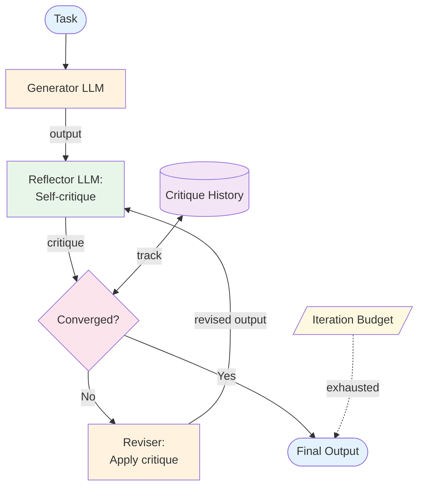

# Reflection — Design

> Canonical Pydantic state schema: [`schemas/state.py`](schemas/state.py) — `ReflectionState` is the top-level shape; `Draft`, `Critique` are the auxiliary models. Recipes targeting Reflection reference these names verbatim.
>
> Typed prompts: [`prompts/`](prompts/) — `drafter.md`, `critic.md`. See [`meta/style-guide.md`](../../meta/style-guide.md#typed-prompts) for the frontmatter contract.

## Component Breakdown



### Generator
Produces the initial output. The same LLM and prompt used for generation can also be the reflector — or they can be separate.

### Reflector
Self-critiques the output. Produces structured feedback: strengths, weaknesses, specific issues, and suggestions. Richer than a numeric score.

### Reviser
Takes the output + critique and produces an improved version. Must be instructed to *address specific issues*, not start over.

### Convergence Detector
Analyzes critique history to determine if improvements are plateauing. Checks for: no major issues found, critique is substantially similar to previous iteration, or score isn't improving.

## Data Flow

```
Critique:
  strengths: list of string
  weaknesses: list of string
  issues: list of {description, severity, suggestion}
  overall_assessment: string
  should_continue: boolean
```

## Critique Prompt Design

The critique prompt determines whether reflection adds value or noise. Three principles:

- **Adversarial framing.** Ask the critic to *find* problems, not to *agree*. *"List 3 ways this answer could be wrong"* beats *"Evaluate this answer."*
- **Concrete criteria over global judgment.** *"Does the answer cite at least one source? Does each claim follow from a citation? Are any tool calls hallucinated?"* — beats *"Is this good?"*
- **Severity scoring.** Force the critic to label each issue as `blocker`, `major`, or `nit`. Revisers should fix blockers, address majors, and ignore nits.

## Critic Design Choices

| Dimension | Choices | Tradeoff |
|---|---|---|
| **Same model or different** | Generator and critic share a model vs critic uses a stronger model | Different (stronger critic): better catches but higher cost; same: cheaper but risks self-rubber-stamping |
| **Has access to source material** | Critic sees only the output vs critic sees output + grounding context | With grounding: faithfulness check possible; without: only style/coherence checks |
| **Single-shot or multi-shot** | One critique per iteration vs multiple critics with different roles | Multi-shot: better coverage; higher cost |

**Default:** Different (stronger) critic with access to source material. The cost premium pays for catches the cheaper homogeneous critic misses.

## Termination Strategies

Reflection without a hard termination is a budget bug. Combine all three:

1. **Iteration cap.** Hard limit (default 3). Once hit, return current output.
2. **Convergence.** Same critique across two iterations → stop. The next revision will be a no-op or oscillation.
3. **Severity threshold.** No `blocker` or `major` issues found → stop. Don't iterate to fix nits.

## Data Flow

```
Critique:
  strengths: list of string
  weaknesses: list of string
  issues: list of {description, severity, suggestion, addressed_by_prior_revision}
  overall_assessment: string
  should_continue: boolean              // critic's recommendation

ReflectionState:
  iteration: integer
  generator_output_history: list of string
  critique_history: list of Critique
  converged: boolean
```

## Failure Modes

| Failure | Response |
|---------|----------|
| Self-congratulatory critique (output declared perfect at iter 1) | Adversarial prompt; require at least one finding even if `nit` |
| Oscillating revisions (fix issue A → break issue B → fix B → break A) | Track which issues were addressed across iterations; refuse to undo a fix |
| Over-polishing (minor edits that don't improve quality) | Convergence detection; severity threshold |
| Critic itself hallucinates issues that aren't there | Grounding the critic (give it the source material); track critic accuracy via eval suite |
| Critic rubber-stamps (matches generator's style) | Use a stronger or differently-trained critic model |
| Reviser fails to address criticism | Track per-issue resolution; halt and report if reviser is consistently ignoring blockers |

## Scaling Considerations

- **Cost shape:** `initial_generation + N × (critique + revision)`. With N=3, that's 7 LLM calls vs 1 for the no-reflection baseline.
- **Latency:** Sequential by construction; can't parallelize iterations.
- **Iteration cap is the primary lever.** A default of 3 covers most useful cases; raise only with measured evidence that further iterations add quality.
- **Model selection:** Generator and critic often warrant different tiers. Critic should be at least as capable as generator.

## Observability Hooks

- Per-task: iteration count, time-to-converge, cost per task vs baseline.
- Per-iteration: critic's severity distribution, revision delta size (small revisions = converging; large = oscillating).
- Per-issue category: which issue types the critic flags vs which actually impact downstream quality.
- Track **net improvement** — for tasks with ground truth, did the final output score higher than the initial? If not, reflection is paying cost without value. See [observability.md](./observability.md).

## Composition

- **+ [ReAct](../react/overview.md):** Reflect on the agent's final output before returning. Adds a quality layer to open-ended tool-using tasks.
- **+ [Plan & Execute](../plan_and_execute/overview.md):** Reflect on plan quality *before execution* — catches bad plans before spending step-by-step LLM cost.
- **+ [RAG](../rag/overview.md):** Reflect against retrieved sources — faithfulness check is the most valuable critique target.
- **+ [Multi-Agent](../multi_agent/overview.md):** A critic worker reviews other workers' outputs; the supervisor decides whether to accept or revise.
- **+ Any generator:** Reflection wraps any generation pattern as a quality layer — but check that the cost premium translates to measurable quality gain.

## Production concerns

Cognitive concerns this repo covers; operational concerns belong in [agent-deployments](https://github.com/jagguvarma15/agent-deployments).

| Concern | This pattern's surface | Where to read |
|---|---|---|
| Prompt injection | a poisoned critic can rubber-stamp bad generation or reject good generation | [foundations/security-and-safety.md](../../foundations/security-and-safety.md) |
| Hallucination & grounding | the pattern itself is a grounding mechanism; the critic needs its own grounding | [foundations/hallucination-and-grounding.md](../../foundations/hallucination-and-grounding.md) |
| Cost & model selection | 2–N× per iteration; iteration cap is the lever | [foundations/cost-and-model-selection.md](../../foundations/cost-and-model-selection.md) |
| Rate limiting & retries | inherited | [agent-deployments cross-cutting](https://github.com/jagguvarma15/agent-deployments/tree/main/docs/cross-cutting) |
| Idempotency | inherited | [agent-deployments cross-cutting](https://github.com/jagguvarma15/agent-deployments/blob/main/docs/cross-cutting/idempotency.md) |
| Observability hooks | see `observability.md` alongside this file | [foundations](../../foundations/README.md) |
