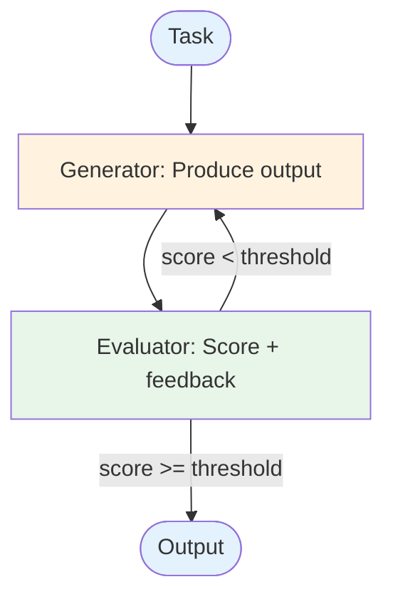

# Evolution: Evaluator-Optimizer → Reflection

This document traces how the [Reflection pattern](./overview.md) evolves from the [Evaluator-Optimizer workflow](../../workflows/evaluator-optimizer/overview.md).

## The Starting Point: Evaluator-Optimizer

In the evaluator-optimizer workflow, a generator produces output and a separate evaluator scores it with feedback:



The evaluator operates on predefined criteria and produces a numeric score plus structured feedback. The generator uses the feedback to try again.

## The Breaking Point

External evaluation breaks down when:

- **Criteria are nuanced.** A rubric-based scorer can check format and coverage, but can't assess whether the argument is compelling or the explanation is clear.
- **The best critic is the author.** The LLM that generated the content understands its own reasoning and can identify logical gaps that an external evaluator misses.
- **Feedback needs to be rich.** A score + bullet points is less useful than a detailed self-analysis: "I assumed X, but that may be wrong because Y. I should also consider Z."
- **The generator needs awareness of its own process.** Not just "this is wrong" but "this is wrong *because of how I approached it*."

## What Changes

| Aspect | Evaluator-Optimizer | Reflection |
|--------|-------------------|------------|
| Who evaluates | Separate evaluator (could be different model) | The agent evaluates its own output |
| Feedback style | Score + structured checklist | Rich self-critique with reasoning |
| Self-awareness | None — generator and evaluator are decoupled | Agent reasons about its own process |
| Critique depth | "Output misses point X" | "I focused too much on Y, which caused me to miss X" |
| Revision guidance | "Fix these items" | "I should approach this differently by..." |
| Criteria flexibility | Fixed rubric | Adaptive — agent identifies new issues |

## The Evolution, Step by Step

### Step 1: Merge generator and evaluator into one agent

Instead of separate generation and evaluation prompts, give the agent a single prompt that includes self-evaluation:

```
BEFORE (Two separate calls):
  output = llm_generate("Write an analysis of: {topic}")
  evaluation = llm_evaluate("Score this output: {output}", rubric)

AFTER (Self-reflection):
  output = llm("Write an analysis of: {topic}")
  critique = llm(
    "Review your own output. What are its strengths? Weaknesses?
     What did you miss? What assumptions did you make?
     Output: {output}"
  )
```

### Step 2: Make critique actionable

Structure the self-critique to produce specific revision instructions:

```
critique = llm(
  "Critique this output:
   1. What is correct and should be kept?
   2. What is wrong or misleading?
   3. What is missing?
   4. Specific instructions for revision:

   Output: {output}"
)
```

### Step 3: Use critique to guide revision

The revision step receives both the original output and the self-critique:

```
revised = llm(
  "Revise this output based on your self-critique.

   Original: {output}
   Self-critique: {critique}

   Address each issue identified. Keep what works."
)
```

### Step 4: Add convergence detection

Instead of a fixed score threshold, detect when the critique stops finding meaningful issues:

```
BEFORE:
  if score >= 0.8: done = true

AFTER:
  if critique.no_major_issues and critique.changes_are_minor:
    done = true
  // Or: if this critique is substantially similar to the last one
```

## When to Make This Transition

**Stay with Evaluator-Optimizer when:**
- You have clear, measurable criteria (format checks, keyword presence, length)
- A simpler model can evaluate reliably
- You want cost-efficient evaluation with a cheaper model

**Evolve to Reflection when:**
- Quality criteria are nuanced or subjective
- The best feedback comes from understanding the generation process
- You want the agent to identify issues the rubric didn't anticipate
- Rich, contextual feedback improves revision quality more than scores

## What You Gain and Lose

**Gain:** Richer self-analysis, ability to catch unanticipated issues, deeper understanding of output weaknesses, adaptive criteria.

**Lose:** No external validation (the agent may have blind spots), more expensive per iteration (richer critique = more tokens), risk of overconfidence in self-assessment.
