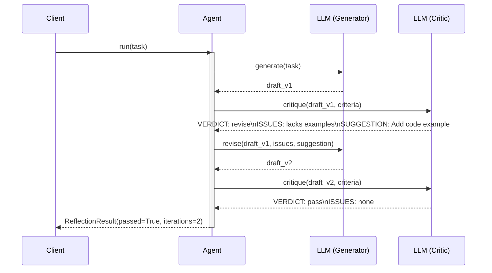

# Observability: Reflection

What to instrument, what to log, and how to diagnose failures in the self-critique loop.

---

## Key Metrics

| Metric | Description | Alert if |
|--------|-------------|----------|
| `reflection.iterations_used` | Iterations before pass or exhaustion | Consistently equals `max_iterations` |
| `reflection.pass_rate` | Fraction of runs that pass before max iterations | < 60% |
| `reflection.score_delta` | Score improvement between iterations | ≤ 0 (not improving) |
| `reflection.critique.parse_error_rate` | Critiques that fail format parsing | > 2% |
| `reflection.total_tokens` | Total tokens across all iterations | > 4× single-pass baseline |

---

## Trace Structure

A root span with paired generate → critique spans per iteration, plus optional revise spans.



---

## Span Reference

| Span name | Emitted | Key attributes |
|-----------|---------|----------------|
| `reflection.run` | Once per call | `passed`, `iterations_used`, `duration_ms` |
| `reflection.generate.{n}` | Once per iteration | `iteration`, `tokens_in`, `tokens_out`, `duration_ms` |
| `reflection.critique.{n}` | Once per iteration | `iteration`, `verdict`, `issues`, `parse_error` |
| `reflection.revise.{n}` | When verdict is "revise" | `iteration`, `issues_len`, `suggestion_len`, `duration_ms` |

---

## What to Log

### On each iteration
```
INFO  reflection.generate.done  iter=1  tokens_out=248  ms=580
INFO  reflection.critique.done  iter=1  verdict=revise  issues="lacks examples, too abstract"
INFO  reflection.revise.done    iter=1  suggestion="Add a concrete Python code example"  ms=510
INFO  reflection.generate.done  iter=2  tokens_out=320  ms=640
INFO  reflection.critique.done  iter=2  verdict=pass  issues=none
```

### On parse failure
```
WARN  reflection.critique.parse_error  iter=2  raw="The draft looks great overall and I think..."
          expected="VERDICT: / ISSUES: / SUGGESTION:"
```

### On exhaustion
```
WARN  reflection.done  passed=false  iterations=3  last_verdict=revise
          last_issues="still missing examples"  total_ms=5200
```

---

## Common Failure Signatures

### Critique never returns "pass"
- **Symptom**: Every iteration returns `verdict=revise`; `pass_rate` is near 0%.
- **Log pattern**: Repeated `verdict=revise` for 3+ iterations; issues change but don't disappear.
- **Diagnosis**: The criteria are too strict (the model cannot satisfy them all simultaneously), or the critic is applying criteria inconsistently.
- **Fix**: Log the full criteria string sent to the critic. Reduce to 2–3 criteria; make criteria concrete and measurable. Test the critic in isolation: can it ever return `VERDICT: pass` for a good input?

### Critique format degrades mid-run
- **Symptom**: `reflection.critique.parse_error_rate` spikes on iteration 2+.
- **Log pattern**: First critique parses fine; subsequent ones contain prose not matching `VERDICT: / ISSUES: / SUGGESTION:`.
- **Diagnosis**: The critic prompt is stateless, but earlier drafts + critiques are leaking into the conversation history via the generate call, causing format drift.
- **Fix**: Run critique as a fresh, isolated call (no prior conversation history); include a strict format example at the end of the critique prompt.

### Revision overcorrects (new issues introduced)
- **Symptom**: Iteration 2 introduces new problems not in iteration 1.
- **Log pattern**: `issues` in iteration 2 are different from iteration 1 — not a subset.
- **Diagnosis**: The revision prompt asks to "improve the output" broadly, so the LLM rewrites too aggressively.
- **Fix**: Change the revision prompt to: "Fix only the issues listed below. Do not change anything else." Log `issues_len` and `suggestion_len` — very short suggestions lead to broader rewrites.

### Token cost scales poorly with max_iterations
- **Symptom**: 3-iteration runs cost 4× more than expected.
- **Log pattern**: `tokens_in` grows with each generate call (full draft is in context every time).
- **Diagnosis**: The revise prompt includes the full previous draft, doubling context each time.
- **Fix**: Pass only the improvement instruction to the revise prompt, not the full previous draft. The LLM will produce a fresh draft guided by the instruction.
