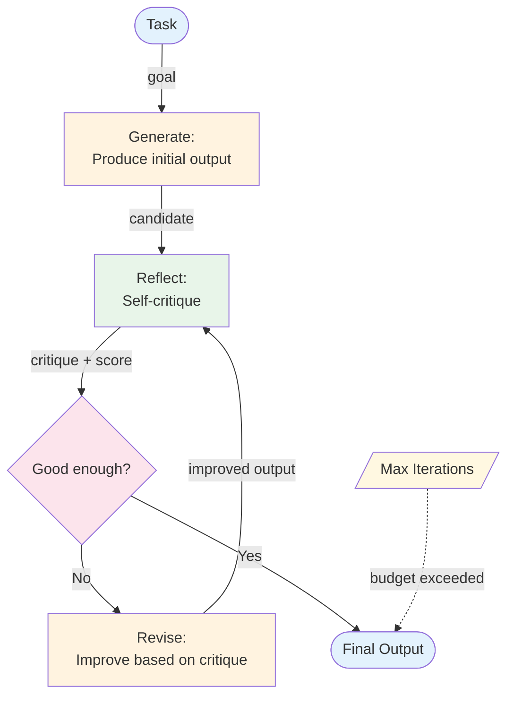

# Reflection (Self-Critique) — Overview

Reflection enables an agent to evaluate and improve its own output by generating self-critique, then revising based on that critique. Unlike the [Evaluator-Optimizer](../../workflows/evaluator-optimizer/overview.md) workflow where evaluation is external, reflection is *self-directed* — the agent identifies its own weaknesses.

**Evolves from:** [Evaluator-Optimizer](../../workflows/evaluator-optimizer/overview.md) — adds self-generated critique, richer self-awareness, and adaptive refinement strategies.

## Architecture



*Figure: The agent generates output, reflects on its quality, and revises until the critique is satisfactory or the iteration budget is exhausted.*

## How It Works

1. **Generate** — The LLM produces an initial output based on the task.
2. **Reflect** — The same (or different) LLM critiques the output against quality criteria. The critique is specific: what's wrong, what's missing, what could be better.
3. **Decide** — If the critique indicates the output is acceptable, return it. If not, continue.
4. **Revise** — The LLM revises its output using the critique as guidance. The revision prompt includes both the original output and the specific critique.
5. **Repeat** — The revised output goes through reflection again. This continues until quality is satisfactory or the iteration limit is reached.

The key difference from Evaluator-Optimizer: in reflection, the critique is *self-generated* and often richer — the LLM reasons about its own output's strengths and weaknesses, rather than just producing a score.

## Minimal Example

Write a beginner-friendly technical explanation, then self-critique and revise until all criteria are met.

```python
from patterns.reflection.code.python.reflection import ReflectionAgent

agent = ReflectionAgent(
    llm=your_llm,
    criteria="""
    - Technically accurate — no invented APIs or incorrect statements
    - Includes a concrete, runnable code example
    - No unexplained jargon
    - Under 250 words
    """,
    max_iterations=3,
)

result = agent.run("Write a beginner-friendly explanation of database indexing")
# result.passed              → True if all criteria were met before max_iterations
# result.iterations[i].draft    → the generated draft at iteration i
# result.iterations[i].critique → self-generated critique (issues + suggestion)
# result.iterations[i].passed   → whether the critic approved this version
# result.final_output        → the self-improved final version
```

*Why use Reflection instead of a single prompt?* A single prompt asks the LLM to simultaneously write and judge its output — two conflicting objectives. Separating generation from critique with distinct prompts consistently produces higher-quality results.

### Code variants

| Implementation | Language | Path |
|----------------|----------|------|
| Framework-agnostic loop (MockLLM, hand-parsed VERDICT) | Python | [`code/python/reflection.py`](code/python/reflection.py) |
| Vercel AI SDK (`generateObject` typed Critique schema) | TypeScript | [`code/typescript/vercel-ai-sdk/reflection.ts`](code/typescript/vercel-ai-sdk/reflection.ts) |

Both variants run the same draft → critique → revise loop with `max_iterations=3` and the same technical-writer task. The TypeScript variant uses the SDK's structured-output mode for the critique step, so the VERDICT / ISSUES / SUGGESTION fields come back typed instead of as free-text the caller would have to parse.

## Input / Output

- **Input:** A task requiring high-quality output
- **Output:** Refined output that has survived self-critique
- **Critique:** Specific feedback identifying strengths, weaknesses, and improvement suggestions
- **Revision:** Updated output addressing the critique

## Key Tradeoffs

| Strength | Limitation |
|----------|-----------|
| Self-improving — catches its own mistakes | 2+ LLM calls per iteration (expensive) |
| Richer feedback than numeric scoring | LLMs have blind spots — may not catch all errors |
| No external evaluator needed | Can over-optimize, losing the original intent |
| Builds a chain of reasoning about quality | Diminishing returns after 2–3 iterations |
| Works for any generation task | Self-critique can be overconfident or miss systematic biases |

## When to Use

- High-stakes content generation (reports, code, analysis) where quality matters
- When you can define clear quality criteria for the LLM to evaluate against
- When external evaluation is unavailable or impractical
- Tasks where iterative refinement naturally improves quality (writing, code review)
- When you want an audit trail of improvements (critique chain)

## When NOT to Use

- When first-pass quality is sufficient — reflection doubles the cost at minimum
- When latency is critical — each iteration adds a full round-trip
- When you have a reliable external evaluator — use [Evaluator-Optimizer](../../workflows/evaluator-optimizer/overview.md) instead
- For factual retrieval tasks — reflection can't fix missing knowledge; use [RAG](../rag/overview.md)

## Related Patterns

- **Evolves from:** [Evaluator-Optimizer](../../workflows/evaluator-optimizer/overview.md) — see [evolution.md](./evolution.md)
- **Combines with:** [ReAct](../react/overview.md) (reflect on tool call results), [Plan & Execute](../plan_and_execute/overview.md) (reflect on plan quality before execution)
- **Simpler alternative:** [Evaluator-Optimizer](../../workflows/evaluator-optimizer/overview.md) (when a score + feedback loop is sufficient)

## Deeper Dive

- **[Design](./design.md)** — Critique prompt design, revision strategies, convergence detection, quality criteria
- **[Implementation](./implementation.md)** — Pseudocode, reflection prompts, iteration management, testing
- **[Evolution](./evolution.md)** — How reflection evolves from evaluator-optimizer

## When NOT to use this pattern

- Latency is more important than incremental quality — reflection at least doubles latency.
- The critic is the same model as the generator and you don't have a stronger grader — risk of self-rubber-stamping.
- You haven't measured the quality lift on real eval data — the cost premium may not translate to value.

## Next steps

- Production version: see [Blueprints → Deployments](../../composition/blueprints-to-deployments.md) for the deployment agents that use this pattern.
- Generate a starter project: see [Blueprint → Spec → Scaffold](../../composition/blueprint-to-spec-to-scaffold.md).
- Combine with other patterns: see the [Composition guide](../../composition/README.md).
