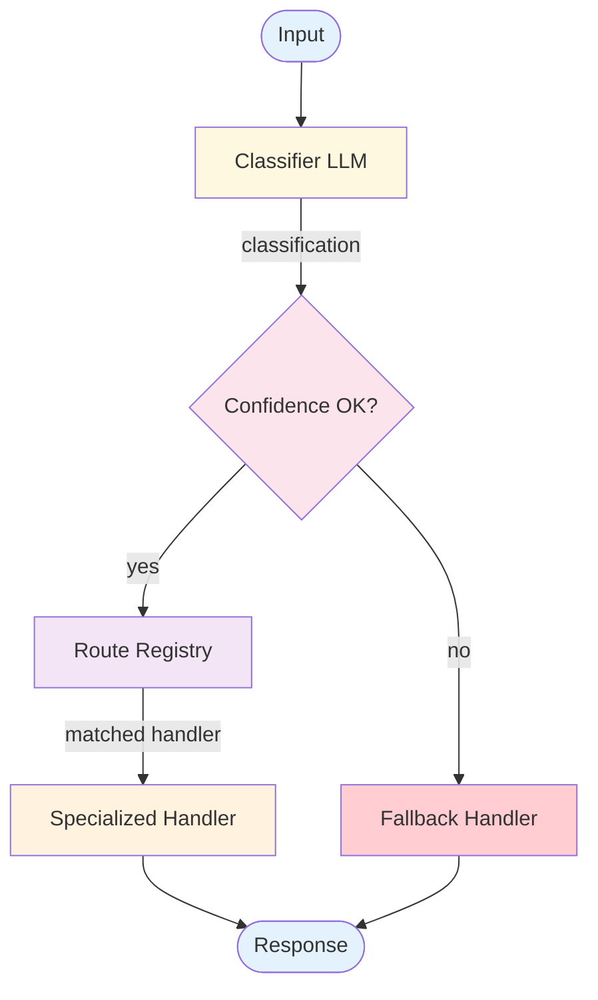

# Routing — Design

> Canonical Pydantic state schema: [`schemas/state.py`](schemas/state.py) — `RoutingState` is the top-level shape; `Route`, `RouteDecision` are the auxiliary models. Recipes targeting Routing reference these names verbatim.
>
> Typed prompts: [`prompts/`](prompts/) — `router.md` (classification) + `specialist.md` (generic per-route handler). See [`meta/style-guide.md`](../../meta/style-guide.md#typed-prompts) for the frontmatter contract.

## Component Breakdown



### Classifier LLM
Analyzes input and produces a structured classification: route name, confidence score, and extracted entities. Can use a cheaper/faster model since classification is simpler than generation.

### Confidence Thresholder
Checks if the classification confidence meets the minimum threshold. Below threshold → fallback handler. This prevents misrouting on ambiguous inputs.

### Route Registry
Maps route names to handler configurations: system prompt, tools, model, and handler logic. Supports dynamic registration of new routes.

### Specialized Handlers
Purpose-built processing for each route. Each handler can be a workflow, an agent, or a simple LLM call with a specialized prompt and toolset.

### Fallback Handler
Handles unclassified or low-confidence inputs. Typically a general-purpose handler that provides a safe, if less specialized, response.

## Data Flow

```
Classification:
  route: string
  confidence: float
  entities: map of string → any         // Optional extracted data

RouteConfig:
  name: string
  description: string
  handler: function(input, entities) → response
  system_prompt: string
  tools: list of ToolSchema
  model: string                         // Optional per-route model
```

## Routing Topology

Three topologies, used for different classification surfaces:

| Topology | Description | Use When |
|---|---|---|
| **Flat (multi-class)** | One classifier picks one of N routes | Routes are mutually exclusive; N ≤ ~10 |
| **Hierarchical** | Coarse classifier → fine classifier per branch | Many sub-routes; coarse split is structural (billing vs technical) |
| **Multi-label** | One classifier can pick multiple routes | Routes can overlap (a message might need both billing and technical handlers) |

**Default:** Flat. Promote to hierarchical when N exceeds what one classifier can handle cleanly (low confidence rate climbing). Multi-label is rare and harder to test — use only when the requirement is clearly overlapping.

## Classifier Design

The classifier is doing a constrained task — picking from an enumeration. Three choices:

- **LLM classifier.** Most flexible; can use entities and reasoning. Use a smaller model (Haiku-class) — classification doesn't need Opus.
- **Embedding similarity.** Match input embedding against each route's description embedding. Cheaper and faster than an LLM call; less accurate for nuanced classifications.
- **Hybrid.** Embedding similarity as a first pass; LLM as a confidence-check or tiebreaker.

For high-throughput, low-latency routing (chat triage, support inbox), the hybrid approach is usually the right point on the cost/quality curve.

## Confidence Calibration

A confidence score from an LLM classifier is not reliable out of the box. Calibrate it:

- **Self-reported confidence is noisy.** "Confidence: 0.92" from the LLM means little. Pair with structural signals.
- **Use eval-derived thresholds.** Run the classifier against the golden dataset, plot accuracy at each threshold, pick the threshold that maximizes precision at acceptable recall.
- **Different thresholds per route.** A billing misclassification is cheaper than a security-escalation misclassification. Set per-route thresholds.
- **Drift detection.** Periodically rerun the calibration. Distribution shift moves the optimal threshold.

## Data Flow

```
Classification:
  route: string                          // from allow-listed enumeration
  confidence: float                      // calibrated, not raw
  entities: map of string → any          // extracted data
  alternative_routes: list of {route, score}  // for ambiguous cases

RouteConfig:
  name: string
  description: string                    // read by classifier
  handler: function(input, entities) → response
  system_prompt: string
  tools: list of ToolSchema
  model: string                          // per-route model
  min_confidence: float                  // per-route threshold
```

## Failure Modes

| Failure | Response |
|---------|----------|
| Confidence below threshold | Fallback handler (general-purpose) or explicit "I'm not sure — could you clarify?" |
| Classifier hallucinates a route name not in the enumeration | Strict allow-list enforcement at dispatch; return `unknown` and route to fallback |
| Handler for the selected route fails | Retry once, then fall back to general handler |
| Two routes tie at top score | Defer to the human — ask clarifying question or default to safer route |
| Classifier consistently wrong on a category | Adversarial test cases land in golden dataset; tune classifier prompt or add examples |
| Adversarial input bypasses classifier | Input sanitization at the entry; refuse-list for known-bad patterns |

## Scaling Considerations

- **Classifier is cheap and fast** — smaller model + tight prompt. Often runs on every request.
- **Handlers vary by route** — use appropriate model per route. A complex RAG route may use Opus; a simple FAQ lookup may use Haiku.
- **Adding routes is mostly safe** — new route doesn't affect existing handlers, but it does change the classifier's decision boundary. Test classifier accuracy on the existing set after adding a route.
- **At scale:** Cache classification for identical inputs; route-specific rate limits to prevent one runaway handler from starving others.

## Observability Hooks

- Per-classification: input, route chosen, confidence, alternative routes considered.
- Per-route: traffic share, handler success rate, average latency.
- Track `unknown` / `escalate` / fallback rate — too low suggests over-confident classifier; too high suggests under-trained classifier or genuinely ambiguous inputs.
- Track route distribution over time — drift is a leading indicator of distribution shift in production. See [observability.md](./observability.md).

## Composition

- **+ [Multi-Agent](../multi_agent/overview.md):** Route to specialized agents instead of handlers; classifier becomes the supervisor's first decision.
- **+ [RAG](../rag/overview.md):** One route handler uses RAG; classifier triages knowledge-grounded vs non-grounded queries.
- **+ [Memory](../../primitives/memory/overview.md):** Per-route or shared memory for continuity. Per-route is safer (no cross-route context bleed).
- **+ [Human in the Loop](../../modifiers/human_in_the_loop/overview.md):** Low-confidence classifications escalate to a human queue rather than risking a wrong handler.
- **+ [Reflection](../reflection/overview.md):** Reflect on the handler's output before returning — useful for high-stakes routes where the classifier's confidence isn't enough.

## Production concerns

Cognitive concerns this repo covers; operational concerns belong in [agent-deployments](https://github.com/jagguvarma15/agent-deployments).

| Concern | This pattern's surface | Where to read |
|---|---|---|
| Prompt injection | crafted input can spoof intent — enforce allow-listed enumeration of routes | [foundations/security-and-safety.md](../../foundations/security-and-safety.md) |
| Hallucination & grounding | classifier hallucinates outside the enumeration; explicit `unknown`/`escalate` class catches this | [foundations/hallucination-and-grounding.md](../../foundations/hallucination-and-grounding.md) |
| Cost & model selection | 1 classifier call (cheap) + downstream pattern cost | [foundations/cost-and-model-selection.md](../../foundations/cost-and-model-selection.md) |
| Rate limiting & retries | inherited | [agent-deployments cross-cutting](https://github.com/jagguvarma15/agent-deployments/tree/main/docs/cross-cutting) |
| Idempotency | inherited | [agent-deployments cross-cutting](https://github.com/jagguvarma15/agent-deployments/blob/main/docs/cross-cutting/idempotency.md) |
| Observability hooks | see `observability.md` alongside this file | [foundations](../../foundations/README.md) |
