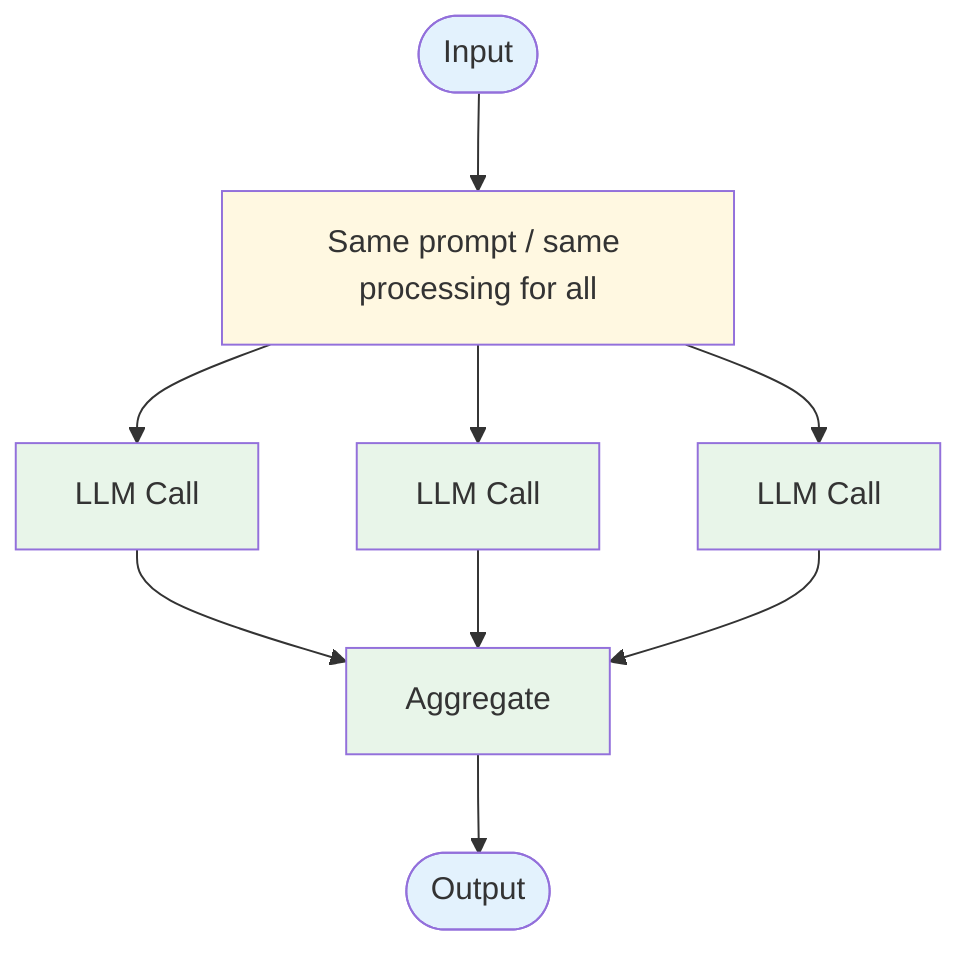

# Evolution: Parallel Calls → Routing

This document traces how the [Routing pattern](./overview.md) evolves from the [Parallel Calls workflow](../../workflows/parallel-calls/overview.md).

## The Starting Point: Parallel Calls

In a parallel calls workflow, all inputs go through the same processing path, potentially fanned out across the same type of worker:



Every input follows the same path. There's no differentiation based on input type.

## The Breaking Point

One-path-fits-all breaks down when:

- **Different inputs need different processing.** A billing question needs different tools, prompts, and context than a technical question.
- **One prompt can't do everything well.** A general-purpose prompt is mediocre at everything vs. specialized prompts that are excellent at one thing.
- **Cost optimization matters.** Simple questions should use cheaper/faster models; complex questions need more capable ones.
- **You're adding if/else chains to the prompt.** "If the user asks about billing, do X. If they ask about technical issues, do Y." That's routing hiding in a prompt.

## What Changes

| Aspect | Parallel Calls | Routing |
|--------|---------------|---------|
| Path selection | All inputs → same path | LLM classifies → routes to specialized path |
| Prompts | One general-purpose prompt | Specialized prompt per route |
| Tools | Same tools for all | Different tools per route |
| Model choice | Same model for all | Can use different models per route |
| Processing | Homogeneous | Heterogeneous based on input type |

## The Evolution, Step by Step

### Step 1: Identify input categories

Recognize that your inputs fall into distinct categories requiring different handling:

```
// You notice in your logs:
// - 40% billing questions → need billing API tools
// - 35% technical questions → need docs search tools
// - 15% account questions → need account API tools
// - 10% general questions → need no tools
```

### Step 2: Add an LLM classifier

Instead of processing all inputs the same way, first classify the intent:

```
BEFORE:
  result = llm("Handle this request: {input}", tools: all_tools)

AFTER:
  classification = llm(
    "Classify this request into one of: billing, technical, account, general.
     Return JSON: {route: string, confidence: float}
     Input: {input}"
  )
```

### Step 3: Build specialized handlers

Create purpose-built handlers for each route:

```
handlers = {
  "billing": {prompt: billing_system_prompt, tools: billing_tools, model: "fast"},
  "technical": {prompt: tech_system_prompt, tools: docs_tools, model: "capable"},
  "account": {prompt: account_system_prompt, tools: account_tools, model: "fast"},
  "general": {prompt: general_system_prompt, tools: [], model: "fast"}
}

handler = handlers[classification.route]
result = llm(handler.prompt, input, tools: handler.tools, model: handler.model)
```

### Step 4: Add fallback handling

Handle uncertain classifications gracefully:

```
if classification.confidence < 0.7:
  result = fallback_handler(input)  // General-purpose, safe response
else:
  result = handlers[classification.route].process(input)
```

## When to Make This Transition

**Stay with Parallel Calls when:**
- All inputs genuinely need the same processing
- There's no meaningful categorization of inputs
- The system is simple enough that one prompt handles everything well

**Evolve to Routing when:**
- You identify distinct categories of inputs with different needs
- Specialized handling would improve quality for each category
- You want different cost/latency profiles for different input types
- Your general-purpose prompt is getting unwieldy with conditionals

## What You Gain and Lose

**Gain:** Specialized, higher-quality handling per category; cost optimization per route; cleaner, focused prompts; easy addition of new routes.

**Lose:** Classification overhead (one extra LLM call); risk of misrouting; need to maintain multiple handlers; more complex system architecture.
