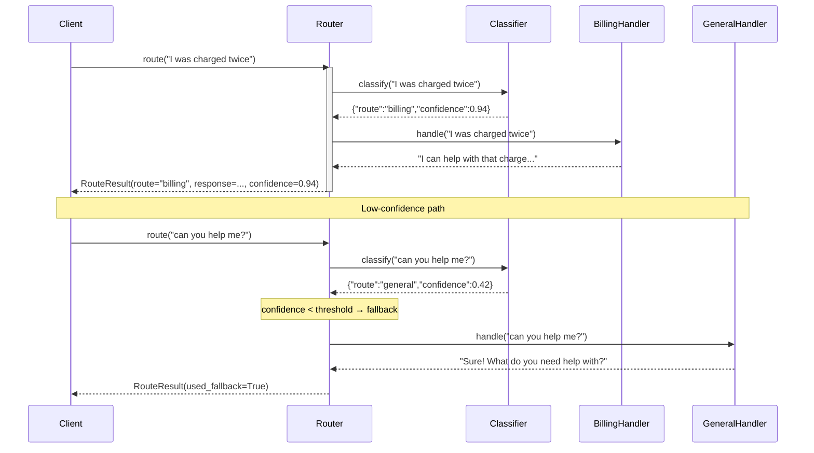

# Observability: Routing

What to instrument, what to log, and how to diagnose failures in intent classification and dispatch.

---

## Key Metrics

| Metric | Description | Alert if |
|--------|-------------|----------|
| `routing.classify.confidence` | Confidence score for each classification | Median < 0.7 (ambiguous inputs) |
| `routing.fallback_rate` | Fraction of requests hitting the fallback route | > 15% (coverage gap) |
| `routing.unknown_route_rate` | LLM classified to a non-existent route | > 0% |
| `routing.classify.latency_ms` | Time to classify intent | > 500ms (adds to user-visible latency) |
| `routing.handler.{name}.latency_ms` | Handler response time | P99 > 5s for any handler |
| `routing.handler.{name}.error_rate` | Handler errors | > 1% for any handler |

---

## Trace Structure

A classifier span followed by a handler span. Two spans total per request.



---

## Span Reference

| Span name | Emitted | Key attributes |
|-----------|---------|----------------|
| `routing.route` | Once per request | `route_name`, `confidence`, `used_fallback`, `duration_ms` |
| `routing.classify` | Once per request | `input_len`, `route_selected`, `confidence`, `parse_error`, `duration_ms` |
| `routing.handle.{name}` | Once per request | `route_name`, `input_len`, `response_len`, `duration_ms`, `error` |

---

## What to Log

### On classification
```
INFO  routing.classify.start  input_len=42
INFO  routing.classify.done   route=billing  confidence=0.94  ms=280
WARN  routing.classify.low_confidence  route=general  confidence=0.41  input_preview="can you help"
WARN  routing.classify.unknown_route  route=payments  registered=["billing","technical","general"]
WARN  routing.classify.parse_error  raw='billing questions are handled by...'
```

### On handler dispatch
```
INFO  routing.handle.start  route=billing  input_len=42
INFO  routing.handle.done   route=billing  response_len=180  ms=620
WARN  routing.handle.error  route=billing  error="upstream_timeout"
```

### On run completion
```
INFO  routing.done  route=billing  confidence=0.94  used_fallback=false  total_ms=900
```

---

## Common Failure Signatures

### Fallback rate is high (> 15%)
- **Symptom**: Many requests end up at the general/fallback handler; specialized handlers underutilized.
- **Log pattern**: High frequency of `routing.classify.low_confidence` or `routing.route used_fallback=true`.
- **Diagnosis**: Route descriptions are vague; the classifier can't distinguish between them. Or confidence threshold is too high.
- **Fix**: Log the full route description list sent to the classifier; make descriptions mutually exclusive and concrete. Lower the threshold or add route examples to the classifier prompt.

### One route captures everything (over-routing)
- **Symptom**: One route gets 80%+ of traffic; others are rarely used.
- **Log pattern**: `route_name` distribution is heavily skewed toward one value.
- **Diagnosis**: That route's description is too broad ("general questions and everything else"), or its name matches common words in user inputs.
- **Fix**: Make that route's description narrower; add a `"This route is NOT for: X, Y, Z"` exclusion line to its description.

### Classifier returns unregistered route names
- **Symptom**: `routing.classify.unknown_route` events; requests fall through to fallback.
- **Log pattern**: `route=payments` when registered routes are `["billing","technical"]`.
- **Diagnosis**: The LLM is generating plausible-sounding route names rather than selecting from the list.
- **Fix**: Strengthen the prompt: `"Select ONLY from this list: {routes}. Do not invent new route names."` Add post-classification validation with fuzzy matching as a fallback.

### Handler latency spikes degrade user experience
- **Symptom**: `routing.handle.{name}.latency_p99` spikes for one route (e.g., technical support).
- **Log pattern**: `routing.handle.start` logged; minutes pass before `routing.handle.done`.
- **Diagnosis**: That handler's LLM call has a very long context or is doing multi-step processing.
- **Fix**: Add per-handler timeouts; log `tokens_in` for handler calls; implement streaming response where applicable.
