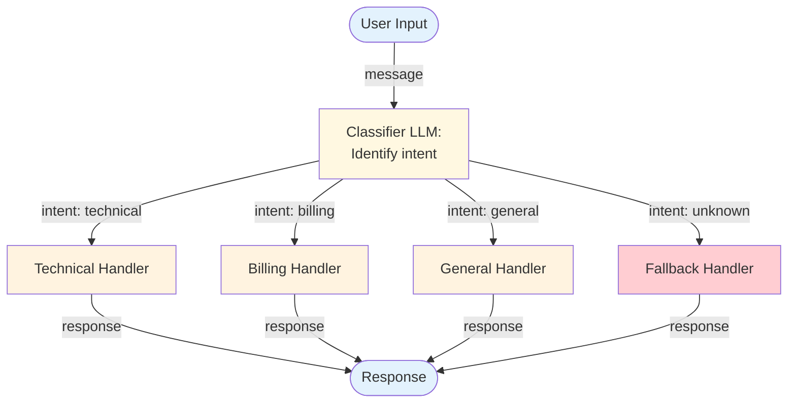

# Routing (Intent Classification + Dispatch) — Overview

Routing uses an LLM to classify incoming requests and direct them to specialized handlers. Instead of one general-purpose processor, routing creates a system where different input types are handled by purpose-built paths — each optimized for its specific task.

**Evolves from:** [Parallel Calls](../parallel-calls/overview.md) — adds an LLM-driven classifier, route definitions, and fallback handling.

## Architecture



*Figure: An LLM classifier identifies the intent of the input and routes it to a specialized handler. Unknown intents go to a fallback handler.*

## How It Works

1. **Classify** — An LLM (or a fine-tuned classifier) analyzes the input and produces a structured intent classification: a route name, confidence score, and optionally extracted entities.
2. **Route** — The system matches the classification to a registered handler. Each handler is a specialized pipeline — it could be a workflow, an agent, or even another routing layer.
3. **Handle** — The selected handler processes the input with its domain-specific prompt, tools, and logic.
4. **Fallback** — If the classification is uncertain (below confidence threshold) or unrecognized, a fallback handler provides a safe default response.

Routing can be hierarchical: a top-level router directs to category-level routers, which direct to specific handlers. This creates a tree of increasingly specialized processing.

## Minimal Example

A customer support bot that classifies incoming messages and routes each to the right specialist.

```python
from patterns.routing.code.python.routing import Router, Route

router = Router(
    classifier=your_llm,
    fallback_route="general",
    confidence_threshold=0.6,
)

router.add_route(Route(
    name="billing",
    description="Invoice, payment, subscription, and pricing questions",
    system_prompt="You are a billing specialist. Be precise about charges and refunds.",
))
router.add_route(Route(
    name="technical",
    description="Bug reports, API errors, and technical troubleshooting",
    system_prompt="You are a support engineer. Ask for logs and reproduction steps.",
))
router.add_route(Route(
    name="general",
    description="Product questions, onboarding, and everything else",
    system_prompt="You are a friendly support agent. Be clear and helpful.",
))

result = router.route("I was charged twice on my invoice this month")
# result.route_name    → "billing"
# result.confidence    → 0.94
# result.response      → billing specialist's response
# result.used_fallback → False
```

### Code variants

| Implementation | Language | Path |
|----------------|----------|------|
| Framework-agnostic router (MockLLM) | Python | [`code/python/routing.py`](code/python/routing.py) |
| Vercel AI SDK (`generateObject` classifier + `generateText` handler) | TypeScript | [`code/typescript/vercel-ai-sdk/routing.ts`](code/typescript/vercel-ai-sdk/routing.ts) |

Both variants run the same three routes (billing / technical / general) against the same three seed messages so they're diff-friendly across stacks.

## Input / Output

- **Input:** User message or request
- **Output:** Response from the selected handler
- **Classification:** `{route: string, confidence: float, entities?: object}`
- **Route registry:** Mapping from route names to handler functions/agents

## Key Tradeoffs

| Strength | Limitation |
|----------|-----------|
| Each handler is optimized for its domain | Classification errors send input to the wrong handler |
| Easy to add new routes without changing existing ones | Requires maintaining separate handlers for each route |
| Reduces prompt complexity — each handler has a focused prompt | Classification adds one LLM call of latency overhead |
| Natural fit for systems with distinct input categories | Ambiguous inputs may be hard to classify reliably |
| Enables different cost/latency profiles per route | Route coverage must be maintained as the system evolves |

## When to Use

- Systems that handle distinct categories of requests
- When different input types need different tools, prompts, or processing logic
- When you want to optimize cost by using lighter models for simpler routes
- Multi-tenant systems where different users need different handling
- As the entry point for a larger multi-agent or multi-workflow system

## When NOT to Use

- When all inputs follow the same processing path — routing adds unnecessary overhead
- When there are only 2 routes — a simple conditional may be clearer
- When classification accuracy isn't reliable enough for the use case
- When the distinction between routes is unclear or frequently changes

## Related Patterns

- **Evolves from:** [Parallel Calls](../parallel-calls/overview.md) — see [evolution.md](./evolution.md)
- **Extends into:** [Multi-Agent](../multi_agent/overview.md) (route to specialized agents instead of workflows)
- **Combines with:** Any pattern as a handler — [ReAct](../react/overview.md), [RAG](../rag/overview.md), [Prompt Chaining](../prompt-chaining/overview.md), etc.

## Deeper Dive

- **[Design](./design.md)** — Classifier design, route registry, confidence thresholds, hierarchical routing
- **[Implementation](./implementation.md)** — Pseudocode, classification prompts, handler registration, testing
- **[Evolution](./evolution.md)** — How routing evolves from parallel calls

## When NOT to use this pattern

- All inputs follow the same process — routing is pure overhead.
- Routes overlap significantly (multi-label is the natural shape) — flat routing forces incorrect exclusivity.
- The classifier's accuracy is unmeasured and untuned — misrouting silently produces wrong handler outputs.

## Next steps

- Production version: see [Blueprints → Deployments](../../composition/blueprints-to-deployments.md) for the deployment agents that use this pattern.
- Generate a starter project: see [Blueprint → Spec → Scaffold](../../composition/blueprint-to-spec-to-scaffold.md).
- Combine with other patterns: see the [Composition guide](../../composition/README.md).
