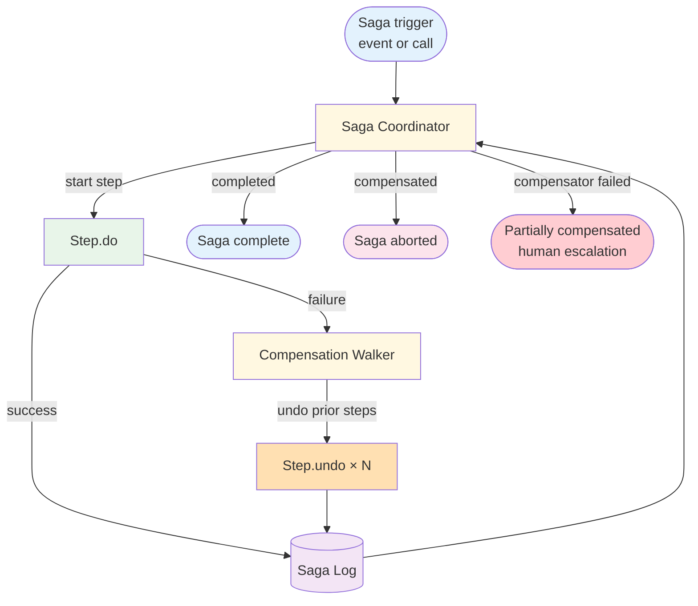

# Saga — Design

> Canonical Pydantic state schema: [`schemas/state.py`](schemas/state.py) — `SagaState` is the top-level shape; `SagaStep`, `Compensation` are the auxiliary models. Recipes targeting Saga reference these names verbatim.
>
> Typed prompts: [`prompts/`](prompts/) — `coordinator.md` (state-machine driver) + `compensator.md` (rollback planner). See [`meta/style-guide.md`](../../meta/style-guide.md#typed-prompts) for the frontmatter contract.

## Component Breakdown



### Saga Coordinator

Owns the step list and the saga log. In **orchestration** style this is a single process / state machine (LangGraph, AWS Step Functions, durable function). In **choreography** it's the implicit consensus of multiple consumers reacting to step-completed events.

### Step

A `(id, do, undo)` triple. `do(ctx) -> output` advances the world; `undo(ctx, prior_output)` reverses it. Both must be idempotent (compensators rerun under retry).

### Saga Log

Append-only durable store of every transition. Postgres table, Redis Stream, or event-store. Schema below.

### Compensation Walker

When a step fails, the walker iterates the completed-step list in reverse and invokes each `undo`. State transitions go back into the saga log.

## Orchestration vs Choreography

Two structural choices. Pick one per saga based on coupling tolerance and operational maturity.

| Aspect | Orchestration | Choreography |
|--------|---------------|--------------|
| Coordinator | Single process owns the step list and log | No central coordinator; each step is an independent consumer reacting to events |
| Coupling | Steps know only the coordinator's contract | Steps know the event schema; no direct knowledge of siblings |
| Failure visibility | One place to look — the coordinator's state | Distributed across consumers; requires correlation by saga_id |
| Adding a new step | Edit the coordinator's step list | Add a new consumer; risk of forgotten compensators |
| Testability | Coordinator is unit-testable end-to-end with mocks | Each consumer is testable in isolation; end-to-end needs event-bus harness |
| Best fit | Tightly defined workflows where the step set is known and stable | Loosely coupled domains where each step lives in a different team or service |

**Guideline:** Start with orchestration. It's easier to debug, easier to test, and the step list is the spec. Move to choreography only when team boundaries (or scale) make a single coordinator the bottleneck.

For the [rebooking recipe](../event_driven/overview.md) — three reservation platforms, one notification service, one search service — orchestration is the right starting point. All steps are owned by the same team and the step list is stable.

## Compensation Semantics

Three classes of compensation behaviour. Be explicit about which each step uses.

### Backward recovery (default)

`undo` cancels or reverses the side effect of `do`. Examples:

- `do = reserve_slot` → `undo = cancel_reservation`
- `do = lock_inventory` → `undo = release_inventory`
- `do = write_outbox_row` → `undo = mark_outbox_row_cancelled`

Backward recovery is what most people mean by "saga compensation." It restores the world to its pre-saga state as closely as possible.

### Forward recovery (when backward isn't possible)

Some side effects can't be reversed: an SMS was sent, a card was charged, a webhook was delivered. The compensator has to issue a **new** side effect that mitigates the failure rather than reversing it.

- `do = send_confirmation_sms` → `undo = send_cancellation_sms`
- `do = charge_card` → `undo = issue_refund`
- `do = publish_event` → `undo = publish_cancellation_event`

Forward recovery is more expensive and more user-visible. Where possible, **reorder the saga** so irreversible steps run last — then a forward step never has to be undone.

### Partial / business compensation

Some compensators only partially restore state. A refunded charge still appears on the customer's statement. A cancellation SMS doesn't unsend the confirmation SMS — both are visible.

This isn't a failure mode; it's a business decision. Document each step's compensation behaviour explicitly:

```yaml
steps:
  - id: charge_fee
    compensation_type: forward_recovery
    compensation_summary: "Issues a refund; original charge remains on the customer's statement"
    irreversibility: "high"
```

This metadata is what feeds Human-in-the-Loop (planned: `patterns/human_in_the_loop/`) approval gates when the saga is about to commit an expensive irreversible step.

## Saga Log Shape

Persist every transition. Schema:

```sql
CREATE TABLE saga_log (
    saga_id           UUID NOT NULL,
    seq               BIGINT NOT NULL,             -- monotonic per saga
    timestamp         TIMESTAMPTZ NOT NULL DEFAULT now(),
    step_id           TEXT NOT NULL,
    event             TEXT NOT NULL,               -- enum: started | completed | failed |
                                                   --       compensation_started | compensation_done |
                                                   --       compensation_failed | saga_completed |
                                                   --       saga_aborted | saga_stuck
    payload_in        JSONB,                       -- step input snapshot
    output            JSONB,                       -- step output (for compensator reference)
    error_class       TEXT,                        -- when event = failed / compensation_failed
    error_message     TEXT,
    PRIMARY KEY (saga_id, seq)
);
CREATE INDEX saga_log_state_idx ON saga_log (saga_id, timestamp DESC);
```

Rules:

- **Append-only.** Never UPDATE a row; events are immutable.
- **Per-saga seq is monotonic.** Lets the coordinator detect concurrent writers (last writer wins is wrong here).
- **`output` is the contract** between `do` and `undo`. The compensator MUST work from `output` alone — never from the live world state at compensation time, because the world may have moved on.
- **Retention.** Keep completed sagas for 30 days hot, archive to cold storage for audit. `partially_compensated` sagas stay hot until resolved.
- **Replay capability.** A saga that crashed mid-flight can be resumed by reading its log: walk forward to find the last `completed` step, then either continue the next step (forward recovery from crash) or compensate everything completed so far (declare it a permanent failure).

## Failure Modes

| Failure | Coordinator response |
|---------|---------------------|
| Step `do` raises retryable error | Backoff + retry; same step; log `failed` once threshold exceeded |
| Step `do` raises permanent error | Mark step `failed`; trigger compensation walker on prior completed steps |
| Compensator `undo` raises retryable error | Backoff + retry the compensator; do NOT proceed to the next compensator yet |
| Compensator `undo` raises permanent error | Log `compensation_failed`; mark saga `partially_compensated`; **page** — manual recovery required |
| Coordinator crashes mid-saga | On restart, load saga log; if last event is `completed`, continue next step; if last is `started`, retry the started step (idempotent) |
| Two coordinators acquire the same saga (split-brain) | Use a coordinator lease (see `agent-deployments/docs/cross-cutting/distributed-locking.md`) so only one coordinator runs a given saga at a time |

The **partially_compensated** state is the one that absolutely demands operator attention — silent inconsistency in the customer-visible world. Page on every transition into it.

## Distinction from ACID Transactions

| | ACID transaction | Saga |
|-|------------------|------|
| Atomicity | All-or-nothing on commit | All-forward-or-all-compensated (no atomic "vanish") |
| Consistency | Strong, immediate | Eventual; intermediate states are observable |
| Isolation | Reads don't see other in-flight txns | Concurrent readers may see partial saga state |
| Durability | After commit, the change persists | After each completed step, that step's change persists |
| Failure recovery | Rollback restores pre-txn state | Compensators issue new side effects; world doesn't actually vanish |
| Scope | One database (or coordinated by 2PC) | Multiple services, multiple databases, external APIs |
| Cost | Cheap (single-DB) to expensive (2PC) | Steady overhead per step + amplified cost on compensation |

If your steps all live in one DB and the DB supports transactions, **use a transaction**. Saga is the answer when the steps cross service / DB / API boundaries that don't share a transaction context — which is most real distributed systems.

## Composition

- **+ [Event-Driven](../event_driven/overview.md)** — The saga is hosted as a consumer of an inbound trigger event; each step `do` may publish a step-completed event downstream consumers react to.
- **+ Human-in-the-Loop** (planned: `patterns/human_in_the_loop/`) — Compensators that fail escalate to a human queue. High-irreversibility steps can require approval before `do` runs.
- **+ [Multi-Agent (Flat)](../multi_agent/overview.md)** — Individual steps can delegate to specialized agents; the coordinator stays simple.
- **+ Idempotency** (cross-cutting `agent-deployments/docs/cross-cutting/idempotency.md`) — every `do` and every `undo` must be idempotent so retries are safe.

## Production concerns

Cognitive concerns this repo covers; operational concerns belong in [agent-deployments](https://github.com/jagguvarma15/agent-deployments).

| Concern | This pattern's surface | Where to read |
|---|---|---|
| Prompt injection | compromise of any step can trigger spurious compensations; validate state before each step | [foundations/security-and-safety.md](../../foundations/security-and-safety.md) |
| Hallucination & grounding | saga log carries provenance; compensation triggered by validated state, not LLM judgment alone | [foundations/hallucination-and-grounding.md](../../foundations/hallucination-and-grounding.md) |
| Cost & model selection | steps + potential compensations; compensations amplify cost on failure | [foundations/cost-and-model-selection.md](../../foundations/cost-and-model-selection.md) |
| Rate limiting & retries | inherited | [agent-deployments cross-cutting](https://github.com/jagguvarma15/agent-deployments/tree/main/docs/cross-cutting) |
| Idempotency | required (both forward steps and compensations); foundational | [agent-deployments cross-cutting](https://github.com/jagguvarma15/agent-deployments/blob/main/docs/cross-cutting/idempotency.md) |
| Observability hooks | see `observability.md` alongside this file | [foundations](../../foundations/README.md) |
