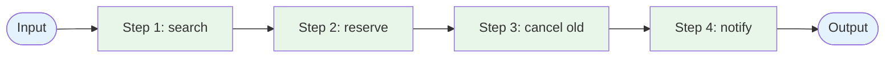

# Evolution: Prompt Chaining + Tool Use → Saga

This document traces how the [Saga pattern](./overview.md) evolves from sequential [Prompt Chaining](../../workflows/prompt-chaining/overview.md) augmented with [Tool Use](../tool_use/overview.md).

## The Starting Point: Sequential Tool Use

A prompt chain calls tools in order. Each step takes the previous step's output, calls a tool (or LLM), produces the next input. There's no concept of "what to undo if step 3 fails":



If step 4 (`notify`) fails, the user has lost their original reservation (step 3 ran) and has a new one they don't know about (step 2 ran). The agent has no language for "unwind." On retry, step 1 and step 2 re-run from scratch, creating duplicate reservations.

## The Breaking Point

Sequential tool use breaks down when:

- **Mid-sequence failures leave the system in a broken intermediate state.** The user has a new reservation but the old one is also cancelled and they were never told.
- **Steps cross service boundaries.** No single database transaction can wrap them. There's no `ROLLBACK`.
- **Some steps are irreversible.** Sent SMS, charged card, published event. A naive "rerun from the top" approach amplifies the user-visible damage.
- **The agent's failure modes need to be operationally manageable.** Without a saga log, an operator looking at a stuck case has no way to know which steps ran, which need undoing, or whether undoing is safe.

## What Changes

| Aspect | Sequential Tool Use | Saga |
|--------|---------------------|------|
| Step definition | A function call | A `(do, undo)` pair |
| Failure mid-sequence | Caller sees an error; system left as-is | Coordinator walks completed steps in reverse, invoking each `undo` |
| State on failure | Lost; retry starts from scratch | Persisted in the saga log; resume or compensate from the last known state |
| Idempotency requirement | "Nice to have" | Required on every `do` AND every `undo` |
| Crash recovery | Caller retries from the top | Coordinator loads saga log; continues forward or compensates |
| Operator surface | Logs, hope | Saga-stuck alert, replay CLI, manual compensation tool |

## The Evolution, Step by Step

### Step 1: Pair every step with a compensator

```
BEFORE (sequential):
  search_result   = search_alternative_slots(payload)
  reservation     = reserve_slot(search_result.best)
  cancel_original(payload.original_reservation_id)
  notify_customer(...)

AFTER (saga step pairs):
  steps = [
    Step(id="search",     do=search_alternative_slots, undo=release_search_lock),
    Step(id="reserve",    do=reserve_slot,             undo=cancel_reservation),
    Step(id="cancel_old", do=cancel_original,          undo=recreate_reservation),
    Step(id="notify",     do=notify_customer,          undo=notify_failed_rebook),
  ]
```

Note how `notify`'s compensator is **forward recovery** — the SMS can't be unsent, so the compensator sends a cancellation SMS instead. This is a deliberate business decision, not an emergent property; design.md covers when each compensator style applies.

### Step 2: Add a saga log

Sequential tool use loses state on every failure. A saga persists the log of what happened so the coordinator can resume or compensate after a crash:

```
saga_log entries:
  (saga_id, seq=1, step=search,     event=started)
  (saga_id, seq=2, step=search,     event=completed,  output={...})
  (saga_id, seq=3, step=reserve,    event=started)
  (saga_id, seq=4, step=reserve,    event=completed,  output={reservation_id: "res_42"})
  (saga_id, seq=5, step=cancel_old, event=started)
  (saga_id, seq=6, step=cancel_old, event=failed,     error_class=...)
  (saga_id, seq=7, step=reserve,    event=compensation_started)
  (saga_id, seq=8, step=reserve,    event=compensation_done)
  ...
```

The log is the source of truth. The coordinator can crash and a new instance can pick up where the old one left off — that's the difference between "sequential tool use that sometimes fails" and "saga."

### Step 3: Introduce the compensation walker

When a step fails, walk the completed steps in reverse and invoke each `undo`. The walker reads `output` from the saga log — never from the live world, because the world may have moved on:

```
BEFORE:
  try:
    do_step_1()
    do_step_2()
    do_step_3()
  except:
    raise   # caller deals with it; system left in unknown state

AFTER:
  completed = []
  try:
    for step in steps:
      output = step.do(ctx)
      completed.append((step, output))
      log.append(step.id, "completed", output)
  except Exception as exc:
    log.append(step.id, "failed", error=exc)
    for step, output in reversed(completed):
      try:
        step.undo(ctx, output)
        log.append(step.id, "compensation_done")
      except Exception as comp_exc:
        log.append(step.id, "compensation_failed", error=comp_exc)
        mark_saga_stuck(saga_id)   # human escalation
        return
```

### Step 4: Make `do` and `undo` both idempotent

In sequential tool use, idempotency is "nice to have." In saga, every `do` and every `undo` will run more than once at some point — coordinator crashes, retries, manual replays. Both must be safe to call repeatedly.

This usually means each step takes an idempotency key derived from the saga id. See the `agent-deployments/docs/cross-cutting/idempotency.md` cross-cutting doc for two-phase claim/release.

## When to Make This Transition

**Stay with sequential tool use when:**

- The whole sequence fits in one DB transaction (let the DB do the rollback).
- Mid-sequence failures don't leave user-visible damage (idempotent reads + appends only).
- The sequence is short enough that "user retries from scratch" is acceptable UX.

**Evolve to Saga when:**

- Steps cross service / DB / API boundaries that don't share transaction semantics.
- Mid-sequence failures leave user-visible inconsistency (new reservation exists, old one is gone, customer wasn't told).
- Some steps are irreversible and forward-recovery compensators are needed (SMS, payments, webhooks).
- You need operational visibility: which sagas are in flight, which are stuck, what to replay.
- The work is long-running enough that the coordinator may itself crash mid-flight and need to resume.

## What You Gain and Lose

**Gain:** Eventual consistency across services without 2PC; crash-resilient state via the saga log; explicit compensation semantics in code rather than implicit "hope it doesn't fail"; operational handles (alerts, replay, manual compensation) for the inevitable stuck cases.

**Lose:** Implementation overhead (every step needs a compensator); intermediate states are user-visible (a reader during the saga sees partial state); some compensators are themselves expensive (forward recovery sends real SMS / issues real refunds); a new failure mode — `partially_compensated` — that demands human attention.

## Evolves Into

When the saga itself becomes a bottleneck:

- **Multi-saga workflows** — When one saga's output is the trigger for another, you're approaching a workflow engine (Temporal, AWS Step Functions, Cadence). The saga is still the unit; the engine manages the graph of sagas.
- **Choreography across teams** — When step ownership spreads across teams (one team per reservation platform), the orchestration coordinator becomes a deployment-coupling bottleneck. Move to choreography (covered in [design.md](./design.md)).
- **Workflow-as-data** — When the step list itself becomes data (different sagas for different SLA tiers, A/B'd step orderings), you're building a workflow engine. At that point a managed product (Temporal, Step Functions, Inngest) is probably cheaper than maintaining your own.
