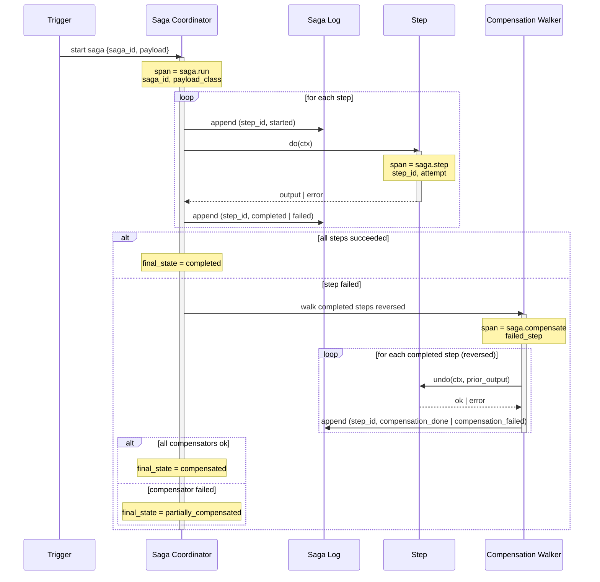

# Observability: Saga

What to instrument, what to log, and how to diagnose failures in a saga-orchestrated agent.

---

## Key Metrics

| Metric | Description | Alert if |
|--------|-------------|----------|
| `saga.duration_ms` | Wall time from saga start to terminal state, by `final_state` | P95 > 2× rolling mean for `completed` sagas |
| `saga.step.duration_ms` | Per-step latency by `step_id` and outcome | Step P95 > target SLO (typical 5s per step) |
| `saga.completed_total` | Sagas reaching `completed` | Drop to 0 over a 5-min window — completion broken |
| `saga.compensated_total` | Sagas reaching `compensated` (clean rollback) | > 10% of total — investigate which step is failing |
| `saga.partially_compensated_total` | Sagas stuck (compensator itself failed) | **Any non-zero** — page on every transition |
| `saga.compensation_rate` | Compensations / total sagas | > 1% over 1 hour — root-cause the failing step |
| `saga.in_flight` | Current sagas not yet terminal | Climbing while ingress is flat — coordinator capacity issue |
| `saga.stuck_age_seconds` | Age of the oldest `partially_compensated` saga | > 300 — page; this is the most important saga alert |
| `saga.step.error_rate` | Errors per step, segmented by `error_class` | New `error_class` never seen before — likely a deploy regression |
| `saga.lease.contention` | Times a coordinator lost the saga lease race | Sustained nonzero — split-brain risk; revisit lease TTL |

Page on `partially_compensated_total > 0` and on `stuck_age_seconds > 300` unconditionally. Notify on compensation_rate spikes and new step error_classes. The rest are informational unless they spike.

---

## Trace Structure

Each saga is a **root span**. Every step and every compensator is a child span. The compensation walker is itself a span so the time spent unwinding is visible.



---

## Span Reference

| Span name | Emitted | Key attributes |
|-----------|---------|----------------|
| `saga.run` | Once per saga (root span) | `saga_id`, `payload_class`, `tenant_id`, `final_state`, `duration_ms`, `steps_executed_count`, `compensations_run_count` |
| `saga.step` | Once per step attempt | `saga_id`, `step_id`, `attempt`, `idempotency_key`, `duration_ms`, `outcome` (completed / failed) |
| `saga.compensate` | Once per saga that compensates | `saga_id`, `failed_step`, `steps_to_undo_count`, `duration_ms`, `outcome` (compensated / partially_compensated) |
| `saga.step.compensation` | Once per compensator invocation | `saga_id`, `step_id`, `attempt`, `duration_ms`, `outcome` (compensation_done / compensation_failed) |
| `saga.log.append` | Once per log write | `saga_id`, `seq`, `event`, `duration_ms` |

Propagate `saga_id` through every child span so a stuck saga can be queried end-to-end (`saga_id = X` returns the coordinator's root span, every step attempt, every compensator attempt, every log write).

---

## What to Log

### On successful saga

```
INFO  saga.run.start         saga_id=sag_01HVY...  payload_class=rebook  tenant_id=rest_acme_123
INFO  saga.step.start        saga_id=sag_01HVY...  step_id=search        attempt=1
INFO  saga.step.done         saga_id=sag_01HVY...  step_id=search        duration_ms=412
INFO  saga.step.start        saga_id=sag_01HVY...  step_id=reserve       attempt=1
INFO  saga.step.done         saga_id=sag_01HVY...  step_id=reserve       duration_ms=288
INFO  saga.step.start        saga_id=sag_01HVY...  step_id=cancel_old    attempt=1
INFO  saga.step.done         saga_id=sag_01HVY...  step_id=cancel_old    duration_ms=190
INFO  saga.step.start        saga_id=sag_01HVY...  step_id=notify        attempt=1
INFO  saga.step.done         saga_id=sag_01HVY...  step_id=notify        duration_ms=602
INFO  saga.run.done          saga_id=sag_01HVY...  final_state=completed  duration_ms=1620
```

### On clean compensation

```
INFO  saga.step.start            saga_id=sag_01HVZ...  step_id=cancel_old   attempt=1
ERROR saga.step.fail             saga_id=sag_01HVZ...  step_id=cancel_old   error_class=ReservationPlatformError  error_message="resy: not found"
INFO  saga.compensate.start      saga_id=sag_01HVZ...  failed_step=cancel_old  steps_to_undo=2
INFO  saga.step.compensation     saga_id=sag_01HVZ...  step_id=reserve      duration_ms=240
INFO  saga.step.compensation     saga_id=sag_01HVZ...  step_id=search       duration_ms=18
INFO  saga.run.done              saga_id=sag_01HVZ...  final_state=compensated  duration_ms=2104
```

### On stuck saga (compensator failed)

```
ERROR saga.step.compensation.fail   saga_id=sag_01HW0...  step_id=reserve    error_class=ReservationPlatformError  error_message="resy: 503"
ERROR saga.run.stuck                 saga_id=sag_01HW0...  final_state=partially_compensated  failed_compensator=reserve  remaining_to_undo=1
```

The `saga.run.stuck` log line is what fires the page. Make sure the alerting rule keys on it (or on the `partially_compensated_total` counter increment).

---

## Common Failure Signatures

### Compensation rate climbing

- **Symptom**: `saga.compensation_rate` rising from steady-state ~0.5% to 5%+; clean compensations, not stuck ones.
- **Log pattern**: A specific `step_id` shows up disproportionately in `saga.step.fail` lines.
- **Diagnosis**: One downstream is degraded — the saga is correctly unwinding because the step is failing more often. The saga isn't broken; the downstream is.
- **Fix**: Same as the consumer-lag-climbing case for [event-driven](../event_driven/observability.md): check the downstream's metrics; add a circuit breaker per dependency; the failing step's compensation rate falls back to baseline when the downstream recovers.

### `partially_compensated` count nonzero

- **Symptom**: A few sagas land in `partially_compensated` per day; alert fires.
- **Log pattern**: `saga.step.compensation.fail` lines, often with the same `step_id` and `error_class`.
- **Diagnosis**: A compensator is failing. Most common cause: the compensator was written before a refactor changed the underlying API, and the test suite only covered the happy path.
- **Fix**: Inspect the saga log (`saga_id = X`); manually run the missing compensator via the operator CLI; commit a fix to the compensator + a test that exercises it. Replay any other stuck sagas of the same shape.

### Saga duration spikes for `completed` sagas

- **Symptom**: P95 saga duration jumps 3× without compensation rate changing.
- **Log pattern**: One step's `saga.step.done` duration spikes; the rest are flat.
- **Diagnosis**: A downstream slowed. Sagas still complete (no failures), but each step waits longer.
- **Fix**: Same as for any latency regression — chase the slow downstream. The saga itself isn't broken.

### Lease contention sustained nonzero

- **Symptom**: `saga.lease.contention` shows multiple coordinators racing for the same `saga_id`.
- **Log pattern**: "Lease acquisition failed" warnings clustered around the same saga_ids.
- **Diagnosis**: Two coordinator pods are alive and both trying to drive the same saga forward. Lease TTL is too short OR the lease isn't being honoured properly.
- **Fix**: Increase lease TTL to safely exceed the longest step's expected duration; ensure compactor / GC processes don't race the active coordinator. See `agent-deployments/docs/cross-cutting/distributed-locking.md`.

### Saga starts but never reaches a terminal state

- **Symptom**: `saga.in_flight` climbs and stays high; no matching `completed` or `compensated` counter increments.
- **Log pattern**: `saga.step.start` without a matching `saga.step.done` or `saga.step.fail` (the coordinator crashed mid-step, no resume happened).
- **Diagnosis**: Coordinator crashed and no other coordinator picked up the saga from its checkpoint. Either the checkpointer isn't writing, or the resume path isn't triggered on coordinator start.
- **Fix**: Verify checkpointer integrity (does the postgres saga-state table have rows?); ensure coordinator startup scans for in-flight sagas and resumes them; add an alert on `oldest_in_flight_saga_age_seconds > 600`.
