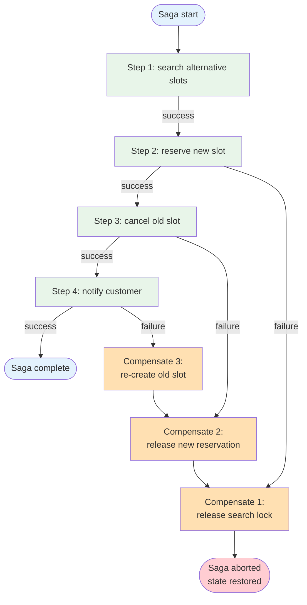

# Saga — Overview

A saga is a long-running, multi-step process where each step's side effect must succeed together with the others — or be undone together when one fails partway through. Each forward step is paired with a **compensating action** that reverses it. When the saga can't complete, the runtime walks the executed steps in reverse and invokes each compensator.

> **Note on the running example.** This page uses **restaurant rebooking** as the worked example throughout — it makes the four-step / four-compensator shape concrete. The pattern itself is domain-neutral; the same structure applies to refunds + restocking, multi-leg trip booking, order fulfillment, payouts + ledger updates, and any other multi-step business process that must succeed or unwind as a whole.

**Evolves from:** [Prompt Chaining](../../workflows/prompt-chaining/overview.md) + [Tool Use](../tool_use/overview.md) — adds explicit compensators per step and a state machine that knows how to unwind.

## Architecture



*Figure: A four-step rebooking saga. Each forward step has a paired compensator. If step 4 fails, the runtime walks the completed steps backward, invoking `C3 → C2 → C1` to restore the world to its pre-saga state.*

## How It Works

1. **Define steps + compensators** — Every step in the saga is a `(do, undo)` pair. The `do` advances the world; the `undo` reverses the change made by the matching `do`.
2. **Persist the saga log** — Before each step runs, append `(step_id, status=started, started_at)` to a durable store. After it succeeds, append `(step_id, status=completed, output)`. The log is what lets the runtime resume after a crash.
3. **Execute forward** — Run steps in order. Each step receives the prior steps' outputs as input.
4. **On failure: compensate** — When a forward step fails (or returns a "must abort" signal), iterate the completed steps in reverse and invoke each compensator. Persist `(step_id, compensation_status=done)` per compensator.
5. **Mark final state** — Saga ends in one of three states: `completed` (all steps did), `compensated` (all completed steps undid), `partially_compensated` (a compensator itself failed; needs human attention).

## Minimal Example

A four-step rebooking saga using orchestration style. The coordinator owns the saga log and walks the step list both directions.

```python
from patterns.saga.code.python.saga import Saga, Step

saga = Saga(
    name="rebook",
    steps=[
        Step(
            id="search",
            do=lambda ctx: search_alternative_slots(ctx.payload),
            undo=lambda ctx, out: release_search_lock(out.search_id),
        ),
        Step(
            id="reserve",
            do=lambda ctx: reserve_slot(ctx.outputs["search"].best_slot),
            undo=lambda ctx, out: cancel_reservation(out.reservation_id),
        ),
        Step(
            id="cancel_old",
            do=lambda ctx: cancel_original(ctx.payload.original_reservation_id),
            undo=lambda ctx, out: recreate_reservation(out.snapshot),
        ),
        Step(
            id="notify",
            do=lambda ctx: notify_customer(ctx.payload.customer_id, ctx.outputs["reserve"]),
            undo=lambda ctx, out: notify_failed_rebook(ctx.payload.customer_id),
        ),
    ],
)

result = saga.run(payload={"original_reservation_id": "res_42", "customer_id": "cust_7"})
# result.state                 → "completed" | "compensated" | "partially_compensated"
# result.steps_executed        → ["search", "reserve", "cancel_old", "notify"]
# result.compensations_run     → []  (empty when state == "completed")
# result.saga_log              → durable record of every transition
```

### Code variants

| Implementation | Language | Path |
|----------------|----------|------|
| Framework-agnostic coordinator with three scenarios | Python | [`code/python/saga.py`](code/python/saga.py) |
| Vercel AI SDK (plain TS saga; SDK used inside individual steps if needed) | TypeScript | [`code/typescript/vercel-ai-sdk/saga.ts`](code/typescript/vercel-ai-sdk/saga.ts) |
| Mastra (plain TS saga + optional `coordinatorAgent` for ambiguous-failure decisions) | TypeScript | [`code/typescript/mastra/saga.ts`](code/typescript/mastra/saga.ts) |

All three variants run the same three scenarios — happy path, mid-saga failure with clean compensation, and a compensator that itself fails leading to `partially_compensated`. The saga shape (do/undo step pairs, reverse compensation walk, three terminal states) is plain TS / Python in both languages; the agent framework's role is inside individual step bodies (e.g. an LLM call to choose a compensation strategy under uncertainty).

## Examples

- [Trip booking](examples/trip-booking.md) — concrete domain overlay for a three-leg itinerary saga (flight + hotel + car). Worked schemas for `Leg` / `Reservation` / `CompensationOutcome` / `TripResult`, mock booking adapters with `book` / `cancel` pairs, a coordinator prompt for the compensation-failure path, and an end-to-end walkthrough exercising all three terminal states (`completed`, `compensated`, `partially_compensated`) with offline tests in [`examples/trip_booking/`](examples/trip_booking/).

## Input / Output

- **Input:** A payload + an ordered list of `(do, undo)` step pairs
- **Output:** A `SagaResult` with final state, executed steps, compensations run, and the durable log
- **Per-step output:** Available to subsequent steps via `ctx.outputs[step_id]` and to the matching compensator as the `out` argument
- **Saga log:** Append-only record of every `started / completed / failed / compensation_started / compensation_done` event

## Key Tradeoffs

| Strength | Limitation |
|----------|-----------|
| Eventual consistency across services without distributed transactions | Intermediate states are user-visible — readers can see a partial saga in flight |
| Each step + compensator is local and testable in isolation | Compensators have to be designed: every irreversible side effect needs a careful workaround |
| Crash-resilient via the saga log — resume or compensate on restart | Adds storage + bookkeeping overhead on every step |
| Composes naturally with event-driven and human-in-the-loop | Compensators that themselves fail demand an out-of-band recovery path |
| Forward and backward semantics are explicit in the code | The "what cannot be undone" set (sent emails, charged cards) forces business decisions early |

## When to Use

- Multi-step processes that span multiple services, each of which is independently idempotent but where the **set** of changes must succeed or unwind together (rebooking, multi-leg trip booking, order fulfillment, refunds with restocking).
- Long-running flows whose total duration exceeds a single HTTP request or DB transaction.
- Any time you're tempted to write a distributed transaction or two-phase commit but the participants don't support it — saga is the alternative.
- When some steps are irreversible (sent SMS, charged card) and you need to design forward-recovery or business-level compensation explicitly rather than discovering the gap in production.

## When NOT to Use

- All steps live inside a single ACID transaction boundary — use the database's transaction. No saga overhead needed.
- Steps don't need to unwind on failure (e.g., everything is best-effort logging). A simple [Prompt Chain](../../workflows/prompt-chaining/overview.md) is lighter.
- The process is a single LLM-mediated tool call sequence with no durable side effects — use [Tool Use](../tool_use/overview.md) or [ReAct](../react/overview.md).
- The process is event-driven and each step is independent (no cross-step rollback) — use [Event-Driven](../event_driven/overview.md) without saga.

## Related Patterns

- **Evolves from:** [Prompt Chaining](../../workflows/prompt-chaining/overview.md) + [Tool Use](../tool_use/overview.md) — see [evolution.md](./evolution.md)
- **Hosted on:** [Event-Driven](../event_driven/overview.md) — sagas commonly run as consumers triggered by an inbound event; each step result becomes an event
- **Combines with:** Human-in-the-Loop (planned: `patterns/human_in_the_loop/`) for compensator-failure escalation; [Multi-Agent (Flat)](../multi_agent/overview.md) when individual steps delegate to specialized agents
- **Contrast with:** Distributed transactions — sagas trade ACID atomicity for availability + eventual consistency

## Deeper Dive

- **[Design](./design.md)** — Orchestration vs choreography, compensation semantics (backward / forward / partial), saga-log shape, failure modes, distinction from ACID transactions
- **[Implementation](./implementation.md)** — LangGraph orchestration example + Redis Streams choreography example, both running the rebooking flow
- **[Evolution](./evolution.md)** — How saga evolves from prompt chaining + tool use
- **[Observability](./observability.md)** — Saga duration, compensation rate, stuck-saga alerts, per-step P95
- **[Cost & Latency](./cost-and-latency.md)** — Compensation amplifies cost; log overhead is small

## When NOT to use this pattern

- All steps live in one database that supports transactions — use a transaction, not a saga.
- Steps are reversible by the system's normal undo (no new side effects required) — simpler patterns work.
- You don't have an answer for the partially-compensated state — sagas without operator escalation become silent inconsistency.

## Next steps

- Production version: see [Blueprints → Deployments](../../composition/blueprints-to-deployments.md) for the deployment agents that use this pattern.
- Generate a starter project: see [Blueprint → Spec → Scaffold](../../composition/blueprint-to-spec-to-scaffold.md).
- Combine with other patterns: see the [Composition guide](../../composition/README.md).
