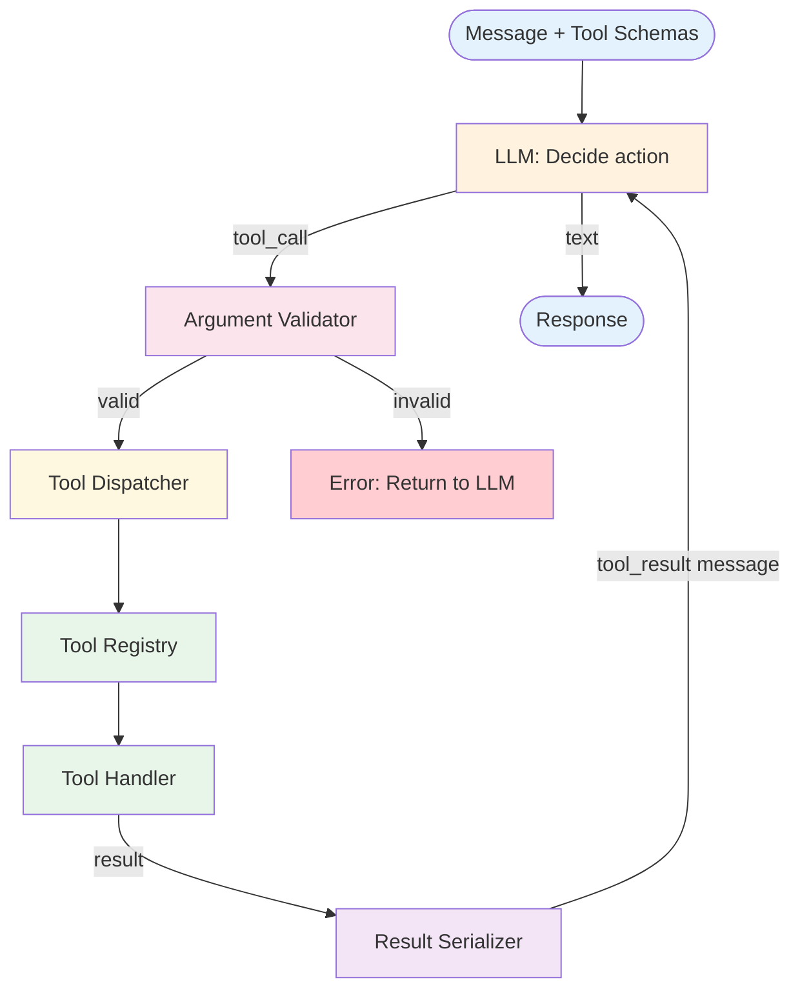

# Tool Use — Design

> Canonical Pydantic state schema: [`schemas/state.py`](schemas/state.py) — `ToolUseState` is the top-level shape; `ToolCall`, `ToolResult` are the auxiliary models. Recipes targeting Tool Use reference these names verbatim.
>
> Typed prompts: [`prompts/`](prompts/) — one file per LLM role with JSON-Schema I/O. See [`meta/style-guide.md`](../../meta/style-guide.md#typed-prompts) for the frontmatter contract.

## Component Breakdown



### Tool Registry
Maps tool names to schemas and handlers. Supports registration, lookup, and listing. The registry is the single source of truth for what tools are available.

### Argument Validator
Validates tool call arguments against the tool's JSON Schema. Catches type errors, missing required fields, and invalid values before execution.

### Tool Dispatcher
Routes validated tool calls to the correct handler function. Handles execution errors and timeouts.

### Result Serializer
Converts tool execution results into a standardized string format for injection into the message history.

## Data Flow

```
// Single tool call cycle:
response = llm(messages, tool_schemas)
if response.has_tool_call:
  errors = validate(response.tool_call.args, tool_schema)
  if errors:
    inject_error(messages, errors)
  else:
    result = registry[tool_call.name](tool_call.args)
    messages.append(tool_result_message(result))
```

## Error Handling
- **Hallucinated tool name:** Return "Tool not found" with available tool list
- **Invalid arguments:** Return validation errors with expected schema
- **Execution failure:** Return error message; let LLM adapt
- **Parallel tool calls:** Execute independently; collect all results

## Structured Output Mechanisms

Two API shapes for tool calls, with different reliability properties:

| Mechanism | Description | Reliability |
|---|---|---|
| **Function calling** (OpenAI, Anthropic, etc.) | The API returns a structured tool_call object with validated schema | High — type-checked at the protocol layer |
| **JSON mode** | The model returns a JSON blob you parse into a tool call | Medium — parsing failures still possible |

**Default:** Use function calling when available. JSON mode is a fallback for models that don't support function calling natively.

## Scaling

- **Cost:** 1 LLM call per tool decision. Tool execution cost (paid APIs) often exceeds LLM cost.
- **Latency:** LLM decision time + tool execution time per call. Tool latency dominates for fast LLM tiers.
- **Parallel tool calls** reduce latency when multiple tools are independent — most modern APIs support this. Falling back to sequential is a common implementation mistake.
- **At scale:** Per-tool rate limits, per-tool concurrency caps, request-level deduplication for idempotent tools.

## Observability Hooks

- Per-tool: invocation count, success rate, P50/P95 latency, argument-validation failure rate.
- Per-call: tool name, latency, status (success/validation_error/execution_error/timeout).
- Track **tool selection patterns** — which tools get chosen for which tasks; mis-selection rate is a signal that descriptions need work.
- Track **MCP server health** when MCP is in use — server reachability, version drift between client and server. See [observability.md](./observability.md).

## Composition
Tool Use is a foundation for all agent patterns. It provides the mechanism; other patterns provide the control flow (ReAct adds the loop, Plan & Execute adds the planning).

## MCP and tool registries

The Tool Registry component above is logical — it doesn't prescribe *where* the tools come from. The dominant standard for that "where" is **MCP (Model Context Protocol)**: a protocol for exposing tools, resources, and prompts from a separate process to any compatible LLM client. See [Frameworks & Integrations → MCP-specific guidance](../../foundations/frameworks-and-integrations.md) for the broader frame.

### Why MCP belongs in the Tool Use design surface

- **Centralized tool registry.** One MCP server can serve many agents — the registry component becomes an MCP client adapter instead of a per-agent function list.
- **Standardized invocation.** Tool calls follow the MCP JSON-RPC contract regardless of which agent or framework is calling. No bespoke serialization per integration.
- **Decoupled from the agent.** Tool authors ship MCP servers; agent authors consume them. Tool updates don't require agent redeploys.

### Security surface

MCP servers run outside the agent's direct control. That introduces concerns the in-process Tool Registry does not have:

- **Server allow-listing.** The agent should connect only to pre-approved servers per environment. A `connect_to_any_server` flag is a vulnerability.
- **Tool description spoofing.** A malicious server can embed prompt-injection payloads in tool descriptions or parameter docs. Validate descriptions out-of-band before enabling a server.
- **Destructive tools.** MCP makes it easy to expose `delete_user`, `transfer_funds`, etc. Run servers with least-privilege credentials and gate destructive calls behind out-of-band confirmation, not just the LLM's judgment.
- **Supply chain.** Pin MCP server versions in production. A silent server update can change tool semantics that the agent has been validated against.

### When to use MCP vs in-process tools

- **Prefer MCP** when a tool is reused across multiple agents or hosts (filesystem, vector DB, observability backend, ticketing system).
- **Prefer in-process tools** when latency matters per call, the tool is single-agent specialized, or state coupling makes MCP's process boundary awkward.
- An agent can mix both. The Tool Registry component above accommodates either by treating the MCP client adapter as just another handler source.

## Production concerns

Cognitive concerns this repo covers; operational concerns belong in [agent-deployments](https://github.com/jagguvarma15/agent-deployments).

| Concern | This pattern's surface | Where to read |
|---|---|---|
| Prompt injection | tool descriptions are LLM-readable; MCP server descriptions are a supply-chain surface | [foundations/security-and-safety.md](../../foundations/security-and-safety.md) |
| Hallucination & grounding | LLM may invent tool arguments — schema-bound calls and allow-listed function set catch this | [foundations/hallucination-and-grounding.md](../../foundations/hallucination-and-grounding.md) |
| Cost & model selection | 1 LLM call per tool decision; tool execution cost (paid APIs) often dominates | [foundations/cost-and-model-selection.md](../../foundations/cost-and-model-selection.md) |
| Rate limiting & retries | inherited | [agent-deployments cross-cutting](https://github.com/jagguvarma15/agent-deployments/tree/main/docs/cross-cutting) |
| Idempotency | each tool call must be idempotent; design tools accordingly | [agent-deployments cross-cutting](https://github.com/jagguvarma15/agent-deployments/blob/main/docs/cross-cutting/idempotency.md) |
| Observability hooks | see `observability.md` alongside this file | [foundations](../../foundations/README.md) |
