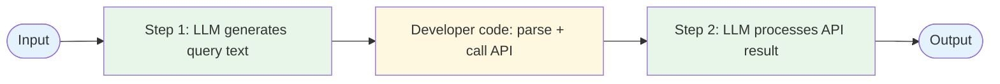

# Evolution: Prompt Chaining → Tool Use

This document traces how the [Tool Use pattern](./overview.md) evolves from the [Prompt Chaining workflow](../../workflows/prompt-chaining/overview.md).

## The Starting Point: Prompt Chaining

In a prompt chain, each step calls the LLM for text generation. When external data is needed, the developer manually integrates it:



The developer writes glue code to extract parameters from LLM output, call external functions, and inject results back into the chain.

## The Breaking Point

Manual tool integration breaks down when:

- **Output parsing is fragile.** Extracting function arguments from free-form text is unreliable. The LLM may format parameters differently each time.
- **Multiple tools are available.** The developer must write routing logic to determine which tool to call based on LLM output.
- **Tool calling becomes the focus.** If most of your chain is "generate text → parse → call function → inject result," you're fighting the framework.

## What Changes

| Aspect | Prompt Chaining + Manual Tools | Tool Use |
|--------|-------------------------------|----------|
| How tools are called | Parse LLM text output → extract args → call function | LLM produces structured tool_call → dispatch → execute |
| Argument extraction | Fragile text parsing | Structured JSON from the LLM |
| Tool selection | Developer if/else logic | LLM chooses from provided schemas |
| Result injection | Developer formats and injects | Standardized tool_result message |
| Validation | Custom parsing + validation per tool | Schema validation on structured output |

## The Evolution, Step by Step

### Step 1: Define tool schemas

Instead of hoping the LLM outputs parseable text, define explicit schemas for each tool:

```
BEFORE:
  prompt = "Generate a search query for: {input}"
  query_text = llm(prompt)
  // Hope the LLM outputs just the query...
  results = search_api(query_text.strip())

AFTER:
  tools = [{
    name: "search",
    description: "Search for information",
    parameters: {query: {type: "string"}}
  }]
```

### Step 2: Let the LLM produce structured tool calls

Instead of parsing free-form text, the LLM returns a structured tool call that your code can dispatch reliably:

```
BEFORE:
  text = llm("Search for: {input}")
  query = parse_query_from_text(text)  // Fragile!
  result = search(query)

AFTER:
  response = llm(message: input, tools: tool_schemas)
  if response.tool_call:
    result = dispatch(response.tool_call.name, response.tool_call.args)
```

### Step 3: Build a tool registry

Instead of scattered if/else routing, map tool names to implementations:

```
BEFORE:
  if "search" in llm_output:
    result = search(...)
  elif "calculate" in llm_output:
    result = calculate(...)

AFTER:
  registry = {
    "search": search_function,
    "calculate": calculate_function
  }
  result = registry[tool_call.name](tool_call.args)
```

### Step 4: Standardize result injection

Feed tool results back through a consistent message format:

```
messages.append({
  role: "tool",
  tool_call_id: response.tool_call.id,
  content: json.serialize(result)
})
```

## When to Make This Transition

**Stay with manual integration when:**
- You have exactly one tool and the output format is reliable
- The chain is simple and rarely changes
- You don't need the LLM to choose between tools

**Evolve to Tool Use when:**
- You have multiple tools and the LLM should choose which to use
- Parsing LLM text output for function arguments is unreliable
- You want a standardized, extensible interface for adding tools
- You're building toward an agent that needs tool calling as a foundation

## What You Gain and Lose

**Gain:** Reliable structured tool calls, easy addition of new tools, standardized interfaces, foundation for agent patterns.

**Lose:** Requires an LLM that supports function calling, slightly more setup (schemas, registry), tool schemas need maintenance.
