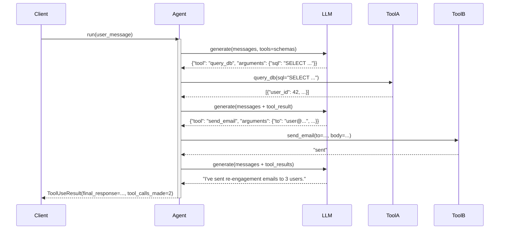

# Observability: Tool Use

What to instrument, what to log, and how to diagnose failures in structured function calling.

---

## Key Metrics

| Metric | Description | Alert if |
|--------|-------------|----------|
| `tool_use.calls_per_request` | Tool calls per user request | > 5 (may indicate runaway calling) |
| `tool_use.tool.{name}.error_rate` | Error rate per tool | > 3% for any tool |
| `tool_use.tool.{name}.latency_p99` | 99th percentile tool latency | > 2s for any tool |
| `tool_use.parse_error_rate` | LLM responses that fail tool call parsing | > 1% |
| `tool_use.unknown_tool_rate` | Tool calls referencing unregistered tools | > 0% |

---

## Trace Structure

An LLM call followed by one or more tool spans, then a final LLM call to produce the response.



---

## Span Reference

| Span name | Emitted | Key attributes |
|-----------|---------|----------------|
| `tool_use.run` | Once per call | `tool_calls_made`, `rounds`, `final_response_len`, `duration_ms` |
| `tool_use.llm.{round}` | Once per LLM call | `round`, `tokens_in`, `tokens_out`, `duration_ms`, `tool_call_parsed` |
| `tool_use.tool.{name}` | Once per tool call | `tool.name`, `args_keys`, `output_len`, `duration_ms`, `error` |

---

## What to Log

### On LLM call
```
INFO  tool_use.llm.start  round=1  tokens_in=480
INFO  tool_use.llm.done   round=1  tool_call=query_db  args_preview='{"sql":"SELECT..."}' ms=520
```

### On tool dispatch
```
INFO  tool_use.tool.start  name=query_db  args_keys=["sql"]
INFO  tool_use.tool.done   name=query_db  output_len=340  ms=180
WARN  tool_use.tool.error  name=query_db  error="timeout"  args_preview='{"sql":"SELECT..."}'
WARN  tool_use.tool.unknown  name=run_code  registered=["query_db","send_email"]
```

### On final response
```
INFO  tool_use.done  rounds=3  tool_calls=2  final_response_len=142  total_ms=1640
```

---

## Common Failure Signatures

### Tool argument validation fails silently
- **Symptom**: Tool is called but returns wrong results; no error in logs.
- **Log pattern**: `tool.done` fires but `output_len` is 0 or the output is clearly wrong.
- **Diagnosis**: The LLM passed invalid arguments (wrong type, missing required field) and the tool ran with defaults or no-op behavior.
- **Fix**: Add schema validation before calling the function; log the full validated arguments and any validation errors as `WARN tool_use.tool.validation_error`.

### LLM calls the same tool repeatedly with identical arguments
- **Symptom**: `tool_calls_per_request` spikes; same tool+args appear 3–5 times.
- **Log pattern**: Identical `tool_use.tool.start name=X args_preview=Y` entries in one run.
- **Diagnosis**: The tool result wasn't injected back into the conversation history, so the LLM doesn't see it.
- **Fix**: Verify that tool results are appended to `messages` before the next LLM call; log the full `messages` list at each round during debugging.

### Tool schema not respected (wrong argument types)
- **Symptom**: `tool_use.tool.error` fires with type errors; LLM passed a string where int was expected.
- **Log pattern**: `error="TypeError: expected int, got str"`.
- **Diagnosis**: LLM is ignoring the parameter schema, or the schema description is ambiguous.
- **Fix**: Add type coercion in the dispatcher; strengthen the schema `description` field with examples; log the raw tool call JSON before parsing.

### Max rounds hit without a final answer
- **Symptom**: Run ends with "Reached max tool call rounds" for complex tasks.
- **Log pattern**: `tool_use.done rounds=5 tool_calls=5` — all rounds used, no final text response.
- **Diagnosis**: The LLM is in a tool-calling loop and never produces a final text response.
- **Fix**: After N tool calls, inject a user message: `"You have made {N} tool calls. Please summarize your findings and provide a final response now."`.
