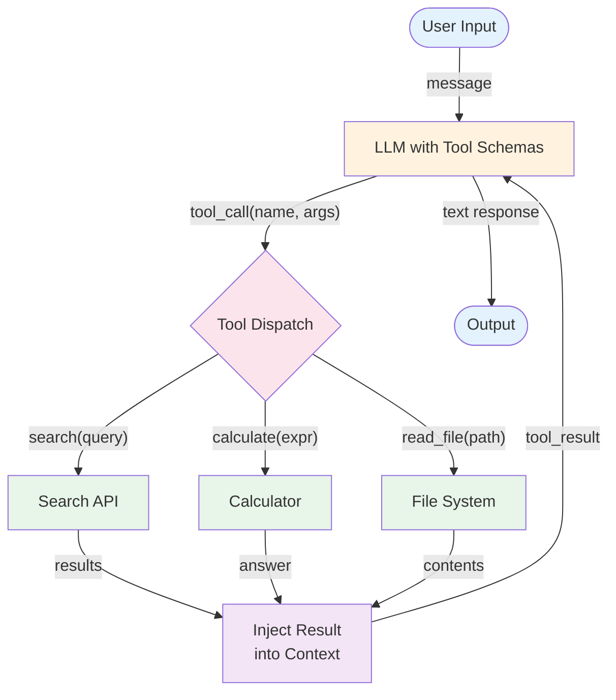

# Tool Use (Function Calling) — Overview

Tool use enables an LLM to interact with external systems by requesting structured function calls. The LLM produces a tool name and arguments; your code executes the function and returns the result. This is the foundational capability that makes agents possible.

**Evolves from:** [Prompt Chaining](../../workflows/prompt-chaining/overview.md) — adds structured function schemas, argument extraction, and result injection.

## Architecture



*Figure: The LLM receives tool schemas, generates structured tool calls, your code executes them, and results are injected back into context.*

## How It Works

1. **Define tools** — Provide the LLM with tool schemas: name, description, parameter definitions (JSON Schema). The LLM uses these to understand what's available and how to call it.
2. **LLM decides** — Based on the user's request and available tools, the LLM generates a structured tool call (or a direct text response if no tool is needed).
3. **Dispatch** — Your code routes the tool call to the appropriate function based on the tool name.
4. **Execute** — The function runs with the provided arguments and returns a result.
5. **Inject** — The tool result is added to the conversation context as a tool response.
6. **Continue** — The LLM can make additional tool calls or produce a final text response.

Tool use can be single-shot (one tool call, then respond) or multi-turn (multiple tool calls in sequence, as in the [ReAct](../react/overview.md) pattern).

## Minimal Example

Find inactive users and send them a re-engagement email — the LLM decides which tools to call and with what arguments.

```python
from patterns.tool_use.code.python.tool_use import ToolUseAgent, Tool

agent = ToolUseAgent(
    llm=your_llm,
    system="You are a data assistant with access to the user database and email system.",
    tools=[
        Tool(
            name="query_db",
            description="Run a read-only SQL query against the user database",
            parameters={
                "type": "object",
                "properties": {"sql": {"type": "string", "description": "SQL query to run"}},
                "required": ["sql"],
            },
            fn=lambda sql: db.execute(sql),
        ),
        Tool(
            name="send_email",
            description="Send an email to a user",
            parameters={
                "type": "object",
                "properties": {
                    "to": {"type": "string"},
                    "subject": {"type": "string"},
                    "body": {"type": "string"},
                },
                "required": ["to", "subject", "body"],
            },
            fn=lambda to, subject, body: email_client.send(to, subject, body),
        ),
    ],
)

result = agent.run(
    "Find all users who haven't logged in for 30+ days and send each a re-engagement email."
)
# result.tool_calls_made  → number of tool invocations (one query + N emails)
# result.turns            → full conversation and tool call history
# result.final_response   → the agent's summary of what it did
```

### Code variants

| Implementation | Language | Path |
|----------------|----------|------|
| Framework-agnostic dispatcher (MockLLM) | Python | [`code/python/tool_use.py`](code/python/tool_use.py) |
| Vercel AI SDK (`generateText` + `tools`) | TypeScript | [`code/typescript/vercel-ai-sdk/tool-use.ts`](code/typescript/vercel-ai-sdk/tool-use.ts) |

The framework-specific files share an identical task (look up the weather for a city and evaluate one arithmetic expression) so they're diff-friendly across stacks. The Python file rolls the dispatcher by hand to make the contract explicit; the TypeScript file lets the Vercel AI SDK own the dispatch under Zod-validated tool schemas.

## Input / Output

- **Input:** User message + tool schemas describing available functions
- **Output:** LLM response (text), potentially after one or more tool calls
- **Tool call:** Structured request: `{name: string, arguments: object}`
- **Tool result:** Return value from function execution, injected as context

## Key Tradeoffs

| Strength | Limitation |
|----------|-----------|
| Bridges LLM reasoning with real-world actions | Tool schema quality directly affects call accuracy |
| Structured, typed interface (not free-form text) | LLM may hallucinate tool names or invalid arguments |
| Modular — add/remove tools without changing core logic | Each tool call adds latency (LLM call + execution) |
| Works with any LLM that supports function calling | Limited by the LLM's ability to understand complex schemas |
| Clear contract between LLM and code | Parallel tool calls require explicit support |

## When to Use

- When the LLM needs to interact with external APIs, databases, or file systems
- When you want structured, validated function calls (not free-form text parsing)
- As a building block for any agent pattern (ReAct, Plan & Execute, etc.)
- When the LLM needs to compute, search, or retrieve information it doesn't have

## When NOT to Use

- When the task is purely text-to-text with no external actions needed
- When actions are predetermined — just call the functions directly from code
- When you need complex multi-step reasoning — compose with [ReAct](../react/overview.md) or [Plan & Execute](../plan_and_execute/overview.md)

## Related Patterns

- **Evolves from:** [Prompt Chaining](../../workflows/prompt-chaining/overview.md) — see [evolution.md](./evolution.md)
- **Foundation for:** [ReAct](../react/overview.md) (tool use + reasoning loop), all other agent patterns
- **Combines with:** Every agent pattern — tool use is a component, not a standalone system

## Deeper Dive

- **[Design](./design.md)** — Schema design, dispatch patterns, error handling, parallel tool calls
- **[Implementation](./implementation.md)** — Pseudocode, registry patterns, validation, testing tool calls
- **[Evolution](./evolution.md)** — How tool use evolves from prompt chaining

## When NOT to use this pattern

- The task is text-in, text-out with no external actions — Tool Use adds unnecessary structure.
- The tools you'd expose are destructive without good guardrails — defer to a [HITL](../human_in_the_loop/overview.md) pattern.
- You only have one tool that's always called — direct function-calling without the registry abstraction is simpler.

## Next steps

- Production version: see [Blueprints → Deployments](../../composition/blueprints-to-deployments.md) for the deployment agents that use this pattern.
- Generate a starter project: see [Blueprint → Spec → Scaffold](../../composition/blueprint-to-spec-to-scaffold.md).
- Combine with other patterns: see the [Composition guide](../../composition/README.md).
