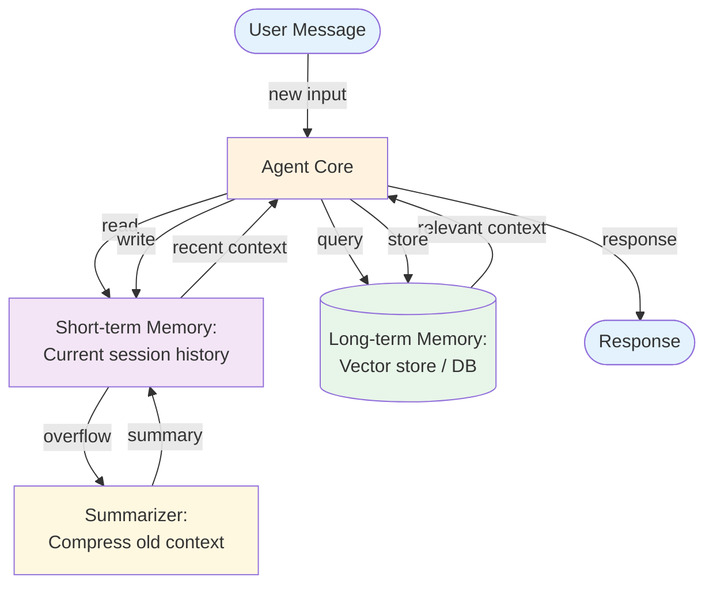

# Memory — Overview

The memory pattern enables an agent to persist information across conversations, building context over time. Short-term memory maintains state within a session; long-term memory stores and retrieves information across sessions using external storage.

Memory is the **storage** primitive — the durable tier of the broader [Context Engineering](../../foundations/context-engineering.md) frame. Read that foundation doc first if you're trying to decide what *belongs* in long-term memory vs. what should be summarized, pruned, or persisted to a scratchpad; this doc covers the storage mechanics once that decision is made.

**Evolves from:** [Prompt Chaining](../../patterns/prompt-chaining/overview.md) — adds conversation state management, summarization, and persistent retrieval.

## Architecture



*Figure: The agent reads from both short-term (session) and long-term (persistent) memory. When short-term memory overflows the context window, a summarizer compresses it. Important information is stored in long-term memory for future sessions.*

## How It Works

1. **Receive input** — A new user message arrives.
2. **Retrieve context** — The agent queries long-term memory for relevant past information and reads recent short-term memory (conversation history).
3. **Reason and respond** — The agent processes the input with the retrieved context and generates a response.
4. **Update short-term memory** — The new exchange (input + response) is added to the session history.
5. **Store to long-term memory** — Important information, decisions, or facts are extracted and stored persistently.
6. **Compress if needed** — When the session history exceeds the context window, a summarizer compresses older messages into a summary.

## Minimal Example

A coding assistant that remembers language preferences and project context across sessions.

```python
from patterns.memory.code.python.memory_agent import MemoryAgent

agent = MemoryAgent(
    llm=your_llm,
    system="You are a personal coding assistant that adapts to each developer's preferences.",
)

# Session 1 — user provides context
agent.chat("I mostly work in TypeScript and I'm building a SaaS dashboard.")
agent.chat("I prefer React Query for data fetching and Zod for validation.")

print(agent.memory_snapshot)
# {'user_language': 'TypeScript', 'project_type': 'SaaS dashboard',
#  'prefers_react_query': 'true', 'prefers_zod': 'true'}

# Session 2 (new MemoryAgent instance, same LongTermStore) — memory is recalled
response = agent.chat("How should I handle form validation in my project?")
# Agent recalls TypeScript + Zod preference without being told again
# and tailors the response accordingly
```

### Code variants

| Implementation | Language | Path |
|----------------|----------|------|
| Framework-agnostic agent (MockLLM, working + long-term + semantic interfaces) | Python | [`code/python/memory_agent.py`](code/python/memory_agent.py) |
| Vercel AI SDK (`generateText` answer + `generateObject` fact extraction) | TypeScript | [`code/typescript/vercel-ai-sdk/memory.ts`](code/typescript/vercel-ai-sdk/memory.ts) |

Both variants run the same two-turn smoke (user shares Python + agent project, asks a follow-up question, recalled facts shape the answer). The TypeScript variant uses the SDK's structured-output mode for the extract-and-store turn so the fact dictionary comes back typed.

## Input / Output

- **Input:** User message + retrieved context from both memory types
- **Output:** Response informed by current and past interactions
- **Short-term store:** Recent conversation turns (message list)
- **Long-term store:** Persistent facts, preferences, decisions (vector store, database, or file)

## Key Tradeoffs

| Strength | Limitation |
|----------|-----------|
| Enables multi-session continuity | Storage and retrieval add complexity |
| Personalizes responses over time | Memory retrieval quality affects response quality |
| Handles conversations exceeding context window | Summarization can lose important details |
| Agents can learn from past interactions | Stale or incorrect memories can mislead the agent |
| More natural, human-like interaction | Memory management (what to store, what to forget) is hard |

## When to Use

- Multi-turn conversations that span sessions
- Personal assistants that should remember user preferences
- Agents that need to learn from past interactions
- When conversation history exceeds the context window
- Tasks that build on previous work (iterative document editing, ongoing research)

## When NOT to Use

- Single-turn interactions — no memory needed
- When all context fits in one prompt — don't add overhead
- When privacy requirements prevent storing conversation data
- Stateless processing tasks (classification, extraction)

## Related Patterns

- **Evolves from:** [Prompt Chaining](../../patterns/prompt-chaining/overview.md) — see [evolution.md](./evolution.md)
- **Combines with:** [ReAct](../../patterns/react/overview.md) (agent loop + memory), [RAG](../../patterns/rag/overview.md) (long-term memory can use the same vector store), [Multi-Agent](../../patterns/multi_agent/overview.md) (shared memory between agents)
- **Related to:** [RAG](../../patterns/rag/overview.md) — RAG retrieves from a document store; Memory retrieves from interaction history. The retrieval mechanism is similar but the data source is different.

## Deeper Dive

- **[Design](./design.md)** — Memory types, storage strategies, retrieval patterns, summarization, forgetting policies
- **[Implementation](./implementation.md)** — Pseudocode, context window management, vector store integration, testing
- **[Evolution](./evolution.md)** — How memory evolves from prompt chaining

## When NOT to use this pattern

- The interaction is single-turn — memory is a forgetting tax with no benefit.
- The user hasn't consented to long-term storage — privacy regression.
- You don't have a story for memory decay, invalidation, or auditing — stored memories fossilize and contradict reality.

## Next steps

- Production version: see [Blueprints → Deployments](../../composition/blueprints-to-deployments.md) for the deployment agents that use this pattern.
- Generate a starter project: see [Blueprint → Spec → Scaffold](../../composition/blueprint-to-spec-to-scaffold.md).
- Combine with other patterns: see the [Composition guide](../../composition/README.md).
