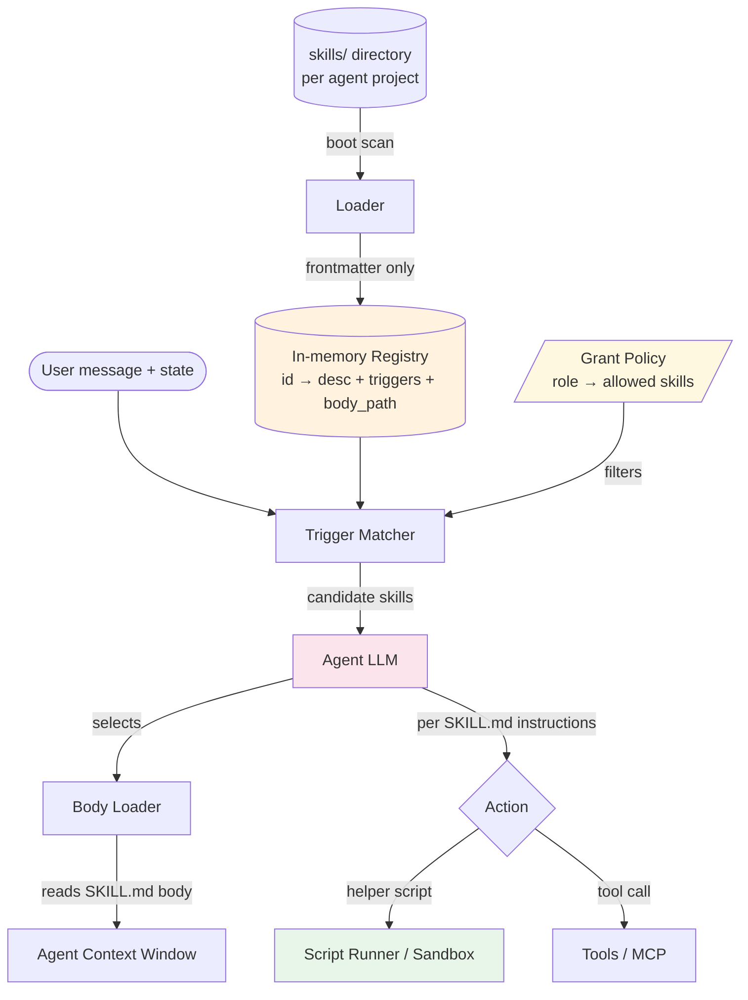

# Skills — Design

> **Tier 2 — Design.** Components, data flow, failure modes, scaling. For the headline concept, see [`overview.md`](./overview.md). For the runnable shape, see [`implementation.md`](./implementation.md).

## Components

A skill-aware agent runtime has four parts. None of them is large; the design is about how they interlock.



### 1. Loader

Reads every `skills/<id>/SKILL.md` at boot, parses just the YAML frontmatter, and produces typed registry entries. **Critical:** the body is NOT loaded yet — only the frontmatter. This is what keeps the registry cheap to ship many skills.

The loader is responsible for:

- Schema validation (frontmatter shape matches the contract).
- Duplicate detection (two skills with the same `id` is a startup error).
- Trigger normalization (lowercase, whitespace-collapsed, deduped).
- Surfacing parse errors with file paths so authors can fix them.

### 2. Registry

A typed in-memory dictionary keyed by skill `id`. Each entry carries:

- `id` — kebab-case identifier.
- `name` — human-readable label (for traces).
- `description` — one-line purpose summary; the LLM reads this when picking.
- `when_to_use` — one-line activation hint; complements description.
- `triggers[]` — lowercase keywords / phrases that hint when the skill applies.
- `body_path` — filesystem path to the full `SKILL.md` (loaded on demand).
- `scripts_dir` — path to helper scripts the skill references.
- `metadata` — author, version, tags.

Total cost in the LLM's working context: ~30-50 tokens per entry (just the registry surface; body stays on disk).

### 3. Trigger Matcher

Given a user message + accumulated state, returns a ranked list of candidate skills.

Two-stage matching is the standard shape:

- **Stage 1 — keyword scan.** Cheap substring / regex / fuzzy match against the trigger list. Produces a top-K candidate set (typically K = 3-5). This is deterministic and runs in microseconds.
- **Stage 2 — LLM scoring.** The agent's LLM (or a small cheap classifier) reads the candidate set's descriptions plus the user message and picks 0-3 skills. This adds judgment on top of pure pattern matching ("user said 'review' but they're actually asking about a code review, not a PR review").

The matcher can short-circuit Stage 2 when Stage 1 returns 0 or 1 candidates — no LLM call needed.

### 4. Body Loader

Once a skill is picked, the body loader reads the full `SKILL.md`, strips the frontmatter (already in the registry), and appends the markdown body to the agent's context window. The body is loaded *fresh per invocation* — no caching of bodies across turns. This is what gives skills their ephemeral cost model.

### 5. Grant Policy (production-only)

In single-user dev environments, every skill is available to the agent. In production multi-tenant or multi-role systems, you need a grant policy:

- Per-role allowlists ("classifier role gets no skills; researcher role gets `web-search-loop` and `citation-formatting`; supervisor gets none — supervisor delegates").
- Per-user or per-tenant grants ("enterprise tier has access to the `internal-knowledge-base-query` skill").
- Audit logging ("user X invoked skill Y at time Z").

Grant policy sits in front of the matcher: skills the active role doesn't have access to are filtered out before keyword matching runs.

## Data flow per turn

```
1. User message arrives.
2. Matcher runs:
   a. Keyword scan against trigger list → top-K candidates.
   b. LLM-judgment scoring → 0-3 selected skills.
3. Grant filter removes ungranted skills.
4. Body loader reads each selected SKILL.md body.
5. Bodies appended to agent context (with a marker like
   "<!-- ===== skill: <id> ===== -->" for trace clarity).
6. Agent LLM reasons with the augmented context.
7. Helper scripts execute per the skill's instructions
   (in process, in sandbox, or as MCP tool calls).
8. Skill invocations recorded to trace.
```

## Failure modes

Skills are deceptively simple at small scale and have several distinctive failure modes at scale.

### Trigger collision

Two skills have overlapping triggers and both fire. The agent may attempt both procedures in series, producing inconsistent output. **Mitigations:**

- Strict trigger discipline — phrase triggers as full phrases, not bare keywords (`"code review"` beats `"review"`).
- Stage 2 LLM scoring with a "pick AT MOST 2 of these candidates" instruction.
- Routing layer in front for large registries (use a [`Routing`](../../patterns/routing/overview.md) classifier to pick the skill domain before the matcher picks the skill).

### Missed activation

The user's intent matches a skill but the triggers don't fire — usually because the user's phrasing differs from what the author anticipated. **Mitigations:**

- Add `when_to_use` lines that the LLM reads during Stage 2; this lets the LLM activate skills even when keyword match fails.
- Periodically review trace logs for "no skill matched but should have" cases; expand trigger lists from real misses.

### Skill drift

A skill that worked when written becomes stale — the linked MCP server's tool name changed, the helper script's CLI flags changed, the underlying API moved. The skill's body says one thing; reality says another. **Mitigations:**

- Version the skill (`version: 0.3.1` in frontmatter); CI tests run each skill against a canned input on dependency changes.
- Have skills explicitly declare their `requires:` (which MCP servers, which tools) so a missing dependency is caught at boot.

### Hostile skills

In multi-tenant environments, a tenant might upload a malicious skill (scripts that exfil data, instructions that prompt-inject). **Mitigations:**

- Grant policy must explicitly opt in to per-tenant authored skills.
- Helper scripts run in a [sandbox](../../foundations/sandboxed-execution.md), not in the agent's host process.
- Static lint of SKILL.md bodies for known prompt-injection markers ("ignore previous instructions", role-spoofing patterns).

### Registry bloat

100 skills → fine. 1,000 → context cost of the registry surface starts to matter. 10,000 → LLM judgment in Stage 2 starts choking. **Mitigations:**

- Domain routing in front of the matcher (see Trigger collision).
- Lazy registry — register skills per agent / per role rather than globally.
- Skill folding — periodically audit for near-duplicates and consolidate.

## Scaling considerations

- **Read scalability.** Registry is in-memory and lookups are microseconds. No issue until you're loading thousands of skills.
- **Write scalability.** Skill authoring is a folder commit. Scales to many authors but coordinate to avoid trigger collisions.
- **Context budget.** The selected skill's body counts against the agent's prompt budget. Skills that pull in 5-10K tokens of instructions limit how many other things can fit in the context window. Keep skill bodies focused — aim for <2K tokens of markdown, push details into the scripts.
- **Latency.** Stage 1 matching is microseconds. Stage 2 (LLM scoring) adds one LLM call per turn — usually with a small/fast model (Haiku-class). Per-skill body load is filesystem read, ms-scale.

## Where the design varies by deployment

| Deployment shape | Skill home | Grant model | Stage 2 model |
|---|---|---|---|
| Single-user CLI agent | Local `skills/` dir | All-allowed | None (Stage 1 only, small registry) |
| Single-tenant SaaS agent | Server `skills/` dir | Per-user role | Haiku-class |
| Multi-tenant agent | Server `skills/` + per-tenant uploads | Per-tenant policy + per-role | Sonnet-class for judgment |
| Multi-agent system | Per-role `skills/` slices | Per-role allowlists | Per-role; supervisor uses none |

See [`implementation.md`](./implementation.md) for the loader and matcher pseudocode, the `SKILL.md` schema, and the grant model in detail.

## See also

- [`primitives/tool_use/design.md`](../tool_use/design.md) — skills typically *call* tools; the tool catalog and skill registry are complementary.
- [`patterns/routing/design.md`](../../patterns/routing/design.md) — the routing layer for large skill registries.
- [`foundations/agent-protocols.md`](../../foundations/agent-protocols.md) — skills vs MCP vs A2A.
- [`foundations/sandboxed-execution.md`](../../foundations/sandboxed-execution.md) — when skill helper scripts need a sandbox.
