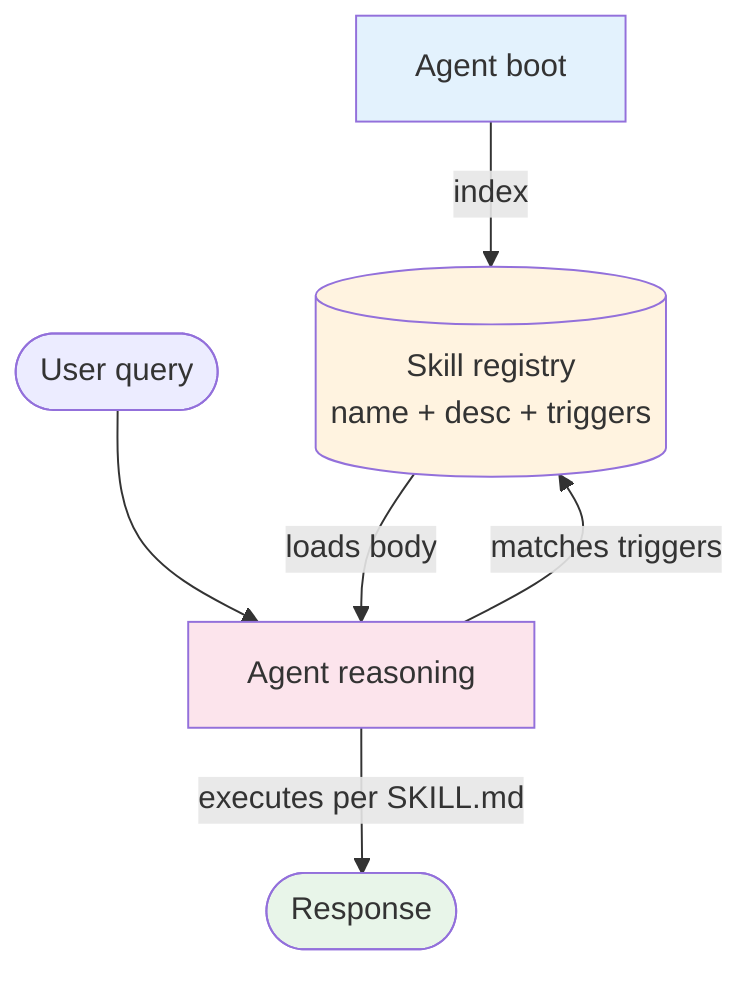

# Skills

> **Tier 1 — Overview.** Diagram, when-to-use, when-not-to-use, headline tradeoffs. Two-page read.

## What it is

A **skill** is a file-based, agent-discovered procedural module that teaches the agent *how* to do something in your codebase or domain. Each skill is a folder containing a `SKILL.md` (the instructions) plus optional helper scripts. The agent indexes all available skills at boot, picks the relevant one(s) at runtime based on trigger keywords or the LLM's own judgment, and loads the skill content into its working context for that turn.

Skills cost almost nothing until invoked — typically 30-50 tokens of context (the skill's name, description, and triggers) sit in the agent's lookup table; the full body only lands in the context window when the agent decides to use it. That asymmetry is the unlock: you can ship hundreds of skills and the agent stays performant.



## When to use it

Skills are the right shape when:

- You have **repeatable in-context procedures** that the agent should perform consistently across runs ("when the user asks for a code review, follow this 5-step checklist").
- The procedure includes **executable scripts** the agent should run as part of the work (a search wrapper, a formatter, a test runner) — skills can bundle these alongside the instructions.
- The procedure is **stable enough** to write down but **dynamic enough** that prompting per-task is impractical (citation formatting, conventional commit messages, the way your org reviews PRs).
- You want **discoverable extensibility** — adding a new skill should be a folder-drop, not a prompt-engineering session.

## When not to use it

- **You just need a tool, not a procedure.** If the agent needs access to a system it can't reach, that's [`MCP`](../../foundations/agent-protocols.md) (Model Context Protocol), not a skill.
- **You need cross-session state.** Skills are stateless lookups. Persistence belongs in [`Memory`](../memory/overview.md).
- **The procedure is a one-off.** A skill is a registered, discoverable artifact. For a one-off, just prompt it.
- **The procedure changes every run.** Skills are immutable per invocation. If the steps depend heavily on dynamic context, you want a [`Plan & Execute`](../../patterns/plan_and_execute/overview.md) loop.

## How skills differ from MCP

| Question | Skill | MCP server |
|---|---|---|
| What does the agent gain? | Procedural knowledge — *how* to do something. | Access — *what* to do it on. |
| Where does it live? | A folder in the agent's project tree. | A server (local stdio or remote HTTP). |
| What's the context cost? | ~30-50 tokens per skill in the registry; full body only when invoked. | Tool descriptions cost ~100-1000 tokens up front; loaded for the whole session. |
| Who runs the body? | The agent (interprets `SKILL.md` instructions); helper scripts run on the agent's host. | The server. |
| Versioning? | Git, alongside the agent's code. | The server's own deploy lifecycle. |

The two compose naturally: an MCP server provides the access; a skill provides the procedure for using it ("when the user asks about a PR, use the `mcp.github` server's `get_pull_request` tool, then format the output as a review checklist").

## Headline tradeoffs

| Pro | Con |
|---|---|
| Procedural knowledge stays close to code, version-controlled like everything else. | Discoverability depends on the agent's reasoning — a poorly-triggered skill won't fire. |
| Adding a skill is a folder drop; no prompt rewrite. | Skills can fragment knowledge — same procedure ending up in 3 near-duplicate skills. |
| Cheap to register many; only the chosen ones cost context. | The registry itself grows; very large registries need pre-filtering by domain. |
| Helper scripts can do real work (run a search, parse a file, format output). | Scripts run on the agent's host, so they inherit any sandboxing concerns. |
| Skills compose with every pattern (ReAct, Multi-Agent, RAG, Plan & Execute). | Cross-skill coordination is up to the agent's reasoning; no built-in flow control. |

## Skill anatomy

A skill is a folder:

```
skills/web-search-loop/
├── SKILL.md                    # the instructions the agent reads
├── scripts/
│   ├── search.py               # helper the SKILL.md tells the agent to run
│   └── extract.py
└── README.md                   # human-readable docs (optional)
```

`SKILL.md` carries YAML frontmatter with the registry metadata (name, description, when-to-use, triggers) plus markdown body describing the procedure. See [`implementation.md`](./implementation.md) for the full frontmatter spec.

## Composes with

- [`ReAct`](../../patterns/react/overview.md) — the most common pairing. The ReAct loop is the control flow; skills are the procedures the loop invokes for specific task shapes.
- [`Tool Use`](../tool_use/overview.md) — skills typically *call* tools (in-process or MCP). The skill is the procedural knowledge; the tool is the access.
- [`Plan & Execute`](../../patterns/plan_and_execute/overview.md) — the plan can name skills as steps. The executor invokes them in sequence.
- [`Multi-Agent`](../../patterns/multi_agent/overview.md) — different roles in a multi-agent system can have different skill grants. A worker agent gets skills relevant to its specialty; a router agent gets none.

## Evolves from

[`Tool Use`](../tool_use/overview.md) — once your tool catalog stops being "things the agent has" and starts being "things the agent uses *in particular ways*," you're really shipping procedures, not tools. Skills are the natural representation. See [`evolution.md`](./evolution.md) for the longer arc.

## When to escalate

| Symptom | Probable next pattern |
|---|---|
| Your skill registry has hundreds of entries and trigger collisions are common | Add a routing layer ([`Routing`](../../patterns/routing/overview.md)) that picks the skill domain before the agent picks the skill. |
| Skills are starting to call each other for sub-procedures | Move the shared sub-procedures into MCP servers; let A2A discover specialist agents that own them ([`Multi-Agent`](../../patterns/multi_agent/overview.md)). |
| You need to pause mid-skill for human review | The skill should become a step in a [`Human in the Loop`](../../modifiers/human_in_the_loop/overview.md) workflow. |

## See also

- [`design.md`](./design.md) — components (registry, loader, trigger matcher, grants); failure modes; scaling.
- [`implementation.md`](./implementation.md) — `SKILL.md` schema; loader pseudocode; trigger matching; security boundaries.
- [`evolution.md`](./evolution.md) — how skills grew out of inline prompt instructions.
- [`observability.md`](./observability.md) — what to trace per skill invocation.
- [`cost-and-latency.md`](./cost-and-latency.md) — registry cost vs. per-invocation cost; latency budget.
- [`foundations/agent-protocols.md`](../../foundations/agent-protocols.md) — how skills relate to MCP and A2A.
