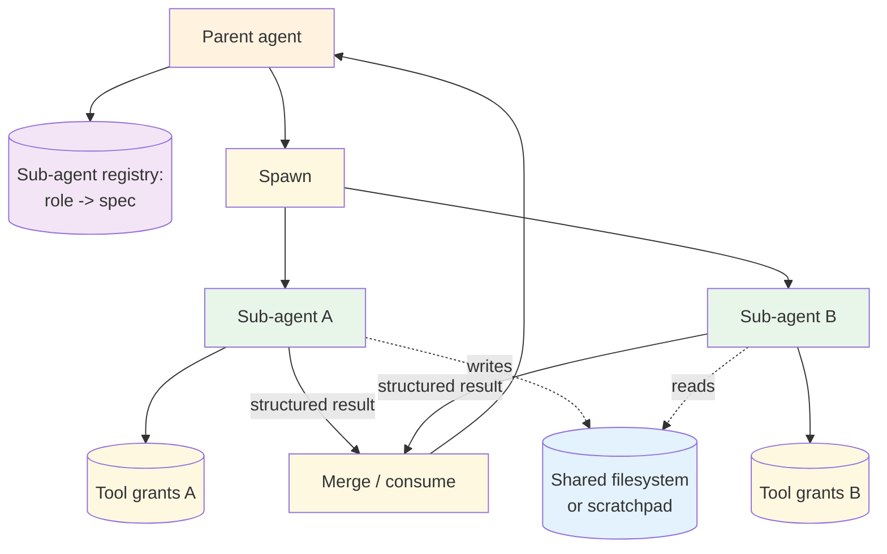

# Sub-agents — Design

> Canonical Pydantic state schema: [`schemas/state.py`](schemas/state.py) — `SubAgentsState` is the top-level shape; `SubAgentSpec`, `SubAgentResult`, `SubAgentInvocation` are the auxiliary models.
>
> Typed prompts: [`prompts/`](prompts/) — `delegator.md` (the parent's prompt that decides what to delegate) + `sub-agent-base.md` (the base system prompt every sub-agent inherits).

## Component breakdown



### Sub-agent registry

Built at boot from each role's `ROLE.md` + `tools.yaml` + `result-schema.json`. The registry indexes by role id and exposes:

- `get(role_id) -> SubAgentSpec` — fetch the spec for a known role.
- `roles_for(capability) -> list[role_id]` — discovery for parents that don't know roles in advance.

Keep the registry small. A registry of > 30 sub-agents is usually a sign that the parent is using the registry where it should be using a [Routing](../../patterns/routing/overview.md) pattern.

### Spawn

The parent's call to instantiate a sub-agent. Takes a role id and a task envelope; returns a future (or awaits inline). The spawn:

1. Loads the role's `ROLE.md` into the new sub-agent's system prompt.
2. Filters the parent's tool registry to the role's allow-list.
3. Allocates a fresh context window (no inheritance from the parent's transcript).
4. Sets the model per the role's preference (or falls back to the parent's default).
5. Applies the role's limits (max steps, max tokens, max tool calls).

### Sub-agent loop

The sub-agent runs its own loop (typically ReAct or Plan & Execute). It uses only the granted tools. Its termination condition is "produce a result matching `result-schema.json`."

### Result handoff

The sub-agent must produce a structured result. The handoff is a typed object — never raw text. This is what lets the parent treat the result as data (not as instructions) and what lets the parent's eval surface check sub-agent outputs in isolation.

### Shared filesystem (optional)

For parallel sub-agents that need to share large artifacts (a research agent that wrote 30k tokens of notes the coder agent then reads), a shared filesystem is the standard channel. The parent enforces the convention (file paths per role, never overlapping); the sub-agents don't coordinate directly.

## Isolation boundary

Each sub-agent is isolated along five axes. The parent's job is to be explicit about each:

| Axis | Default | When to relax |
|---|---|---|
| Context window | Empty (fresh) | Pass a small "context envelope" the parent prepared — never the parent's raw transcript |
| Tool grants | None (must be in allow-list) | Every tool the role legitimately needs; nothing speculative |
| Model | Parent default | Per-role override (Opus planner, Haiku formatter) |
| Filesystem | Read-only scratchpad | Write access to a per-role dir; never to shared mutable state |
| Network | Granted via tools | Network access is a tool, not an axis — only via granted tools |

A sub-agent that needs to see the parent's transcript usually doesn't want a sub-agent — it wants a continuation of the parent's loop. The isolation is the point.

## Spawn strategies

### Synchronous one-at-a-time

The parent spawns, awaits, merges, then spawns the next. Simplest; latency floor is sum of sub-agents.

```
result_a = spawn("researcher", task_a)
result_b = spawn("coder", task_b)   # uses result_a
return summarize(result_a, result_b)
```

### Parallel fan-out

The parent spawns all sub-agents at once and merges results. Latency floor is max of sub-agents.

```
futures = [spawn(role, task) for role, task in plan]
results = await all(futures)
return merge(results)
```

The parallel form requires sub-tasks be independent. If sub-agent B needs A's output, you're back to sequential.

### Pipeline

Sub-agents form a graph: A's output feeds B's input. Useful when each step has a distinct role.

```
research = spawn("researcher", topic)
draft = spawn("writer", research.summary)
review = spawn("reviewer", draft)
return review
```

This shape often graduates to a [Plan & Execute](../../patterns/plan_and_execute/overview.md) pattern when the steps become data-driven instead of hand-wired.

### Round-trip with the parent

The parent re-enters its own loop between sub-agent calls, possibly deciding to spawn more based on what the sub-agent returned. This is the most flexible and most expensive shape.

## Result schemas

The sub-agent's `result-schema.json` is a hard contract. The parent eval surface checks results against the schema before merging.

```json
{
  "$schema": "https://json-schema.org/draft/2020-12/schema",
  "type": "object",
  "required": ["summary", "findings", "confidence"],
  "properties": {
    "summary": { "type": "string", "maxLength": 2000 },
    "findings": {
      "type": "array",
      "items": {
        "type": "object",
        "required": ["claim", "source"],
        "properties": {
          "claim": { "type": "string" },
          "source": { "type": "string", "format": "uri" }
        }
      },
      "maxItems": 20
    },
    "confidence": { "type": "number", "minimum": 0, "maximum": 1 }
  }
}
```

Schemas should be lossy on purpose. The sub-agent might have produced 10k tokens of reasoning; the parent gets the 2k-token summary plus structured findings. The full transcript stays in the sub-agent's trace for debugging.

## Parent → child contract

| What the parent provides | What the child returns |
|---|---|
| Role id | Result matching `result-schema.json` |
| Task description (free text or structured) | Tool-call log (for observability) |
| Optional context envelope (curated, not raw transcript) | Token counts (input / output) |
| Optional limits (max steps, max tokens) | Termination reason (`completed` / `cap_hit` / `error`) |

Termination reason is load-bearing: a `cap_hit` result is a degraded answer the parent must decide how to handle (retry with bigger cap, accept the partial, escalate). Failing silently on `cap_hit` is the most common sub-agent bug.

## When to use a sub-agent vs. a tool

The line is fuzzy. Use the table.

| Property | Use a tool | Use a sub-agent |
|---|---|---|
| Single call, single response | ✓ | |
| Multi-step reasoning required | | ✓ |
| Needs its own tool budget | | ✓ |
| Output fits in one structured envelope | ✓ | ✓ |
| Output is a transcript + decision | | ✓ |
| Cost is predictable per call | ✓ | |
| Cost depends on task complexity | | ✓ |

If you find yourself building a "tool" whose body is "spawn an agent, give it these tools, run for up to N steps, return the result" — that's a sub-agent, just disguised. Lift it.

## Composition

- **+ [Multi-Agent](../../patterns/multi_agent/overview.md)** — sub-agents are the unit of work in a Multi-Agent topology. The Multi-Agent pattern adds the supervisor's reasoning over which sub-agents to spawn and how to merge.
- **+ [Plan & Execute](../../patterns/plan_and_execute/overview.md)** — each plan step's executor is a sub-agent. The plan declares the role per step.
- **+ [Skills](../skills/overview.md)** — a sub-agent's role can be implemented as a skill; the registry overlay is the same.
- **+ [Guardrails](../../modifiers/guardrails/overview.md)** — guardrails wrap each sub-agent independently. The parent's guardrails don't transitively apply.
- **+ [Memory](../memory/overview.md)** — long-term memory can be granted per role (the researcher reads from the knowledge base; the coder doesn't).

## Production concerns

| Concern | This primitive's surface | Where to read |
|---|---|---|
| Prompt injection | each sub-agent has its own input surface; per-role guardrails apply | [foundations/security-and-safety.md](../../foundations/security-and-safety.md) |
| Tool poisoning | sub-agent tool grants must be allow-listed; un-granted tools must not be reachable | [foundations/security-and-safety.md](../../foundations/security-and-safety.md) |
| Cost & model selection | per-role model selection is the main lever; track per-role token consumption | [foundations/cost-and-model-selection.md](../../foundations/cost-and-model-selection.md) |
| Context engineering | sub-agents are a *context* lever — the parent's window stays small because the sub-agent's window absorbs the sub-task | [foundations/context-engineering.md](../../foundations/context-engineering.md) |
| Idempotency | sub-agent results must be deterministic-enough to be replay-safe in the parent | [agent-deployments cross-cutting](https://github.com/jagguvarma15/agent-deployments/blob/main/docs/cross-cutting/idempotency.md) |
| Observability hooks | see `observability.md` | [foundations](../../foundations/README.md) |
