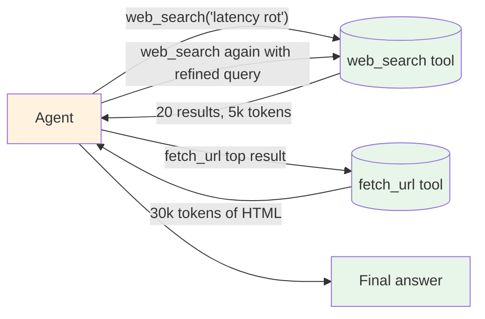

# Evolution: Tool Use → Sub-agents

This document traces how sub-agents emerge from [Tool Use](../tool_use/overview.md) once a single tool starts to need its own reasoning loop.

## The starting point: Tool Use with chunky tools

A team building a research agent ships a `web_search` tool. The tool returns a JSON blob of 20 results with snippets. The agent calls the tool, reads the blob, and reasons about which links to follow. After a few weeks:



The agent's context is now 80% tool output. Token spend per request is climbing. The agent's reasoning is getting worse, not better, as the context grows — classic context rot.

## The breaking point

The team realises the search-and-distill loop deserves its own context:

- **Context pollution.** The main agent's transcript is now 90% tool output. Its planning quality drops as the window fills.
- **Wasted reasoning.** The main agent's expensive (Sonnet/Opus) calls are being spent reading raw HTML. A cheaper model could do the distillation.
- **Tool grant sprawl.** The main agent has `search`, `fetch_url`, `summarize`, `cite_check` — but it only uses them for one phase of the work. The rest of the time those tools are dead weight in the registry, biasing tool selection.
- **No parallelism.** Each search-and-distill round is sequential. Three independent research threads can't fan out.
- **Hard to test.** "Did the agent find good sources?" is buried inside the main agent's transcript. There's no isolated checkpoint to assert on.

## What changes

| Aspect | Tool Use (one big tool) | Sub-agent |
|---|---|---|
| Context window | Shared with the main agent (pollution) | Isolated per sub-agent |
| Tool grants | Main agent gets everything | Sub-agent gets only its allow-list |
| Model selection | One model for everything | Per-role model (cheap distillation, expensive reasoning) |
| Parallelism | Sequential by default | Natural fan-out |
| Result shape | Whatever the tool returned | Schema-bound structured result |
| Termination | Main agent decides | Sub-agent's own termination + limits |
| Observability | Bundled into main agent's trace | Per-sub-agent trace + role-level metrics |

## The evolution, step by step

### Step 1: Wrap the noisy tool in a smaller agent loop

The first move is structural: the main agent stops calling `web_search` directly. Instead it calls a new tool, `research(topic)`. Inside `research`, a small loop runs `web_search` + `fetch_url` + summarize:

```
BEFORE:
  results = web_search(query)
  for top in results[:3]:
      html = fetch_url(top.url)
      ...

AFTER:
  findings = research_tool(topic="context engineering")
  # Internally: a small ReAct loop using web_search and fetch_url,
  # ending with a structured `findings` object.
```

The main agent doesn't see the search transcript any more. It sees a clean `findings` object.

### Step 2: Give the inner loop its own system prompt

The inner loop deserves a prompt that says "you are a researcher". It doesn't inherit the main agent's identity. The system prompt becomes a `ROLE.md`.

### Step 3: Explicit tool allow-list

The researcher gets exactly `web_search`, `fetch_url`, and `notes.write`. Nothing else. The main agent's other tools (e.g., `edit_file`, `git_commit`) aren't visible. Now the researcher can't accidentally do something out of scope.

### Step 4: Schema-bound result

The researcher's output isn't free text. It's a `findings` object that conforms to `result-schema.json`. The main agent treats it as data, not as instructions. The schema becomes the eval surface: "did the researcher produce ≥ 3 findings with valid sources?"

### Step 5: Per-role model

The researcher doesn't need Opus. Drop it to Sonnet (or Haiku for distillation-only roles). The main agent keeps Opus for planning.

### Step 6: Make it parallel

Multiple independent research threads fan out. The main agent spawns three researchers on three topics simultaneously and merges the results. Wall-clock latency drops from 3× research time to ~1× research time.

### Step 7: Compose

Once sub-agents are first-class:

- **+ [Multi-Agent](../../patterns/multi_agent/overview.md)** — the main agent IS a supervisor. The pattern becomes explicit.
- **+ [Plan & Execute](../../patterns/plan_and_execute/overview.md)** — the planner emits a step description + role; the executor spawns the right sub-agent.
- **+ [Guardrails](../../modifiers/guardrails/overview.md)** — each sub-agent's input/output is independently guarded.

## When to make this transition

**Stay with plain Tool Use when:**

- The tool returns small, structured data the agent reads in one glance.
- There's no multi-step reasoning inside the tool's work.
- One model for everything is fine economically.
- The tool's behavior is deterministic.

**Evolve to sub-agents when:**

- A single tool call's result blows up the main agent's context.
- The tool's work has internal multi-step reasoning ("search, then fetch the best, then extract").
- Different phases of the work want different models.
- You want to fan out independent sub-tasks in parallel.
- You need to test the sub-task's output in isolation.

## What you gain and lose

**Gain:** Clean main-agent context; per-role tool isolation; per-role model selection; natural parallelism; schema-bound eval surface per role; per-sub-agent observability without main-agent transcript spelunking.

**Lose:** Spawn overhead (one prompt + one model load per sub-agent); coordination errors (two sub-agents writing the same file) become possible; observability shifts from one trace to many; the parent must learn to merge degraded results.

## Evolves into

When sub-agents themselves grow into more:

- **[Multi-Agent pattern](../../patterns/multi_agent/overview.md)** — sub-agents stop being one-shot tool replacements and start having durable identities, peer-to-peer messaging, or independent triggers. The topology becomes the design surface.
- **[Plan & Execute pattern](../../patterns/plan_and_execute/overview.md)** — when sub-agent invocation becomes plan-driven, the parent is doing plan-then-execute. Make it explicit.
- **Persistent sub-agents** — a sub-agent that survives across requests (a "researcher" with its own long-term memory) becomes a service the parent calls. That's [Multi-Agent](../../patterns/multi_agent/overview.md) with strong identity, not a transient sub-agent.
