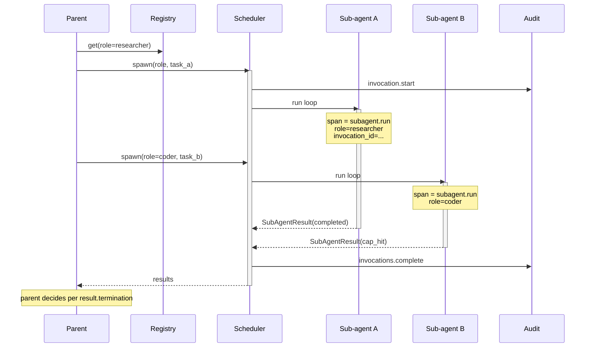

# Observability: Sub-agents

What to instrument, what to log, and how to diagnose failures across parent + sub-agent boundaries.

---

## Key Metrics

| Metric | Description | Alert if |
|---|---|---|
| `subagent.invocations_total{role}` | Sub-agent spawns per role | Drop to 0 unexpectedly — a code path stopped delegating |
| `subagent.completed_total{role,termination}` | Completions broken down by termination reason | `cap_hit` or `deadline` rate > 5% — limits too tight or task too big |
| `subagent.schema_error_rate{role}` | Result schema validation failures / completions | > 2% — schema drift or prompt regression |
| `subagent.duration_seconds{role}` | End-to-end wall-clock per role (P50/P95) | P95 > role's deadline / 2 — running close to the wall |
| `subagent.tool_calls_total{role,tool}` | Tool usage by role | A role calling a tool it shouldn't — security or grant misconfig |
| `subagent.tool_denied_total{role,tool}` | Tool calls denied by the harness allow-list | **Any nonzero** — the role tried a tool it doesn't have; investigate |
| `subagent.parallel_concurrency{parent}` | Max concurrent sub-agents per parent | Sustained > parent's rate budget — risk of throttling |
| `subagent.tokens_in_total{role}` / `tokens_out_total{role}` | Token consumption per role | Trending up faster than throughput — context bloat |
| `subagent.recursion_depth_max` | Maximum nesting depth observed | > 3 — likely runaway recursion |
| `subagent.partial_merge_rate{parent}` | Sub-agent results merged despite degraded termination | High — parent silently accepting cap_hit; check if intentional |

Page on `tool_denied_total > 0` and `recursion_depth_max > 3`. Notify on schema-error spikes and cap-hit-rate trends.

---

## Trace Structure

Each sub-agent spawn is a child span of the parent's agent span. The handoff timing (parent's wait) is the dominant wall-clock for sequential parents; the slowest sub-agent's duration dominates for parallel parents.



---

## Span Reference

| Span name | Emitted | Key attributes |
|---|---|---|
| `subagent.spawn` | Once per spawn call from the parent | `parent_id`, `role`, `invocation_id`, `model`, `expected_schema_version` |
| `subagent.run` | Once per sub-agent lifetime | `invocation_id`, `role`, `model`, `steps_taken`, `tool_calls`, `tokens_in`, `tokens_out`, `termination`, `duration_ms` |
| `subagent.tool_call` | Once per tool call inside a sub-agent | `invocation_id`, `tool_name`, `granted`, `duration_ms` |
| `subagent.result_validate` | Once per result schema validation | `invocation_id`, `schema_version`, `valid`, `errors` |
| `subagent.parent_merge` | Once per parent's merge of sub-agent results | `parent_id`, `n_sub_agents`, `n_degraded`, `merge_strategy` |

Propagate `invocation_id` through every child span and `parent_id` from the parent's span so the full delegation tree is queryable. A trace UI that doesn't show the parent → child → tool-call chain isn't useful for sub-agent debugging.

---

## What to Log

### On spawn

```
INFO  subagent.spawn        parent_id=agt_01HV...  role=researcher  invocation_id=inv_01HV...
                            model=sonnet  schema_version=1.2.0  expected_steps_max=12
```

### On completion (clean)

```
INFO  subagent.run.done     invocation_id=inv_01HV...  role=researcher  termination=completed
                            steps_taken=8  tool_calls=6  tokens_in=42120  tokens_out=2840  duration_ms=24180
```

### On cap_hit

```
WARN  subagent.run.done     invocation_id=...  role=researcher  termination=cap_hit
                            steps_taken=12  tool_calls=12  tokens_in=80000  tokens_out=2200
                            note="step cap reached without emitting result"
```

### On tool denied

```
ERROR subagent.tool_denied  invocation_id=...  role=researcher  tool_name=edit_file
                            note="tool not in role's allow-list"
```

This is a high-signal log. It means the sub-agent's prompt suggested using a tool that wasn't granted. Either the prompt is over-broad, or the grants are too tight.

### On schema error

```
WARN  subagent.result_validate.fail invocation_id=...  role=researcher
                                    errors=["findings/2/source: must be uri"]
                                    retry_attempt=1
```

### On parent merge

```
INFO  subagent.parent_merge parent_id=agt_01HV...  n_sub_agents=3  n_completed=2  n_degraded=1
                            merge_strategy=accept_completed_only
```

---

## Common Failure Signatures

### Sub-agent hitting cap repeatedly for one role

- **Symptom**: `subagent.completed_total{role=R,termination=cap_hit}` rises; same role consistently.
- **Log pattern**: `subagent.run.done termination=cap_hit` for role R; the `steps_taken` consistently equals `max_steps`.
- **Diagnosis**: Either the role's task is harder than the limits assume, or the role's prompt has the sub-agent wandering. Sample 5 transcripts.
- **Fix**: If task is genuinely bigger, raise `max_steps` for that role in `limits.yaml`. If the sub-agent is wandering, tighten the prompt's "stop when..." section.

### Tool-denied events firing

- **Symptom**: Any `subagent.tool_denied_total > 0`.
- **Log pattern**: `subagent.tool_denied tool_name=X role=Y`.
- **Diagnosis**: The role's prompt is suggesting tools it doesn't have. Either a stale prompt referencing a removed tool, or genuine grant misconfig.
- **Fix**: Reconcile the role's `ROLE.md` with `tools.yaml`. The prompt should only mention granted tools.

### Schema validation failing repeatedly

- **Symptom**: `subagent.schema_error_rate{role=R} > 2%`.
- **Log pattern**: Multiple `subagent.result_validate.fail` per invocation for the same role.
- **Diagnosis**: Either the schema is too strict for the role's actual output, or the role's prompt isn't clear on the result format.
- **Fix**: Sample 10 failures. Common causes: schema requires `format: uri` but the source field is a phrase; schema requires `confidence` but the prompt doesn't tell the sub-agent to emit it. Fix the schema OR the prompt — not both.

### Parent silently merging degraded results

- **Symptom**: `subagent.partial_merge_rate{parent=P}` is high but no operator has acknowledged the degraded sub-agents.
- **Diagnosis**: The parent is dropping the `termination` field on merge and accepting whatever payload came back. This will eventually produce a wrong final answer with no audit trail.
- **Fix**: Update the parent's merge to branch on `termination`. At minimum, log it; at best, fail or retry per-role.

### Recursion depth alarm

- **Symptom**: `subagent.recursion_depth_max > 3`.
- **Log pattern**: A chain of `subagent.spawn` spans nested without bound.
- **Diagnosis**: A sub-agent role is recursively spawning the same role.
- **Fix**: Cap recursion at the harness. Most sub-agent designs should hard-cap at depth 2; depth 3 is exceptional and should be reviewed.

### One parallel sub-agent is the latency tail

- **Symptom**: Parent's wall-clock is dominated by one sub-agent's `duration_seconds`.
- **Diagnosis**: Parallel fan-out's latency floor is the slowest sub-agent. One role is consistently slow.
- **Fix**: Either tighten the slow role's deadline (and accept more partials), split its task into smaller pieces (more parallelism inside the role), or use a faster model for that role.

---

## What ends up in the operator UI

Most teams build a trace viewer that surfaces:

- The parent → sub-agent tree for one request.
- Per-sub-agent transcript + tool calls (the parent's view, NOT a separate trace silo).
- Termination reasons highlighted in color (green: completed; yellow: cap_hit; red: tool_denied/schema_error).
- Per-role aggregate dashboards: invocations/day, cap-hit rate, P95 duration.

Without per-sub-agent traces visible from the parent's view, debugging Multi-Agent or sub-agent-heavy systems is intractable.
