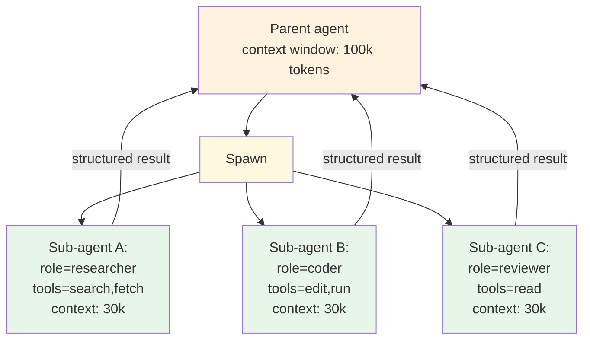

# Sub-agents

> **Tier 1 — Overview.** Diagram, when-to-use, when-not-to-use, headline tradeoffs. Two-page read.

## What it is

A **sub-agent** is a named, role-scoped agent instance that a parent agent can spawn for a delimited task. Each sub-agent runs in its **own context window**, with its **own system prompt**, its **own tool grants**, and (optionally) its **own model**. The parent hands the sub-agent a task, the sub-agent works in isolation, and the sub-agent returns a structured result that re-enters the parent's context.

Sub-agents are a building block — they aren't a pattern. They show up inside [Multi-Agent](../../patterns/multi_agent/overview.md) (supervisor delegates to specialized sub-agents), inside [Plan & Execute](../../patterns/plan_and_execute/overview.md) (each plan step runs as a sub-agent), and inside [ReAct](../../patterns/react/overview.md) (a tool that "spawns a researcher" is a sub-agent in disguise). Picking sub-agents as the building block is the second of three decisions (pattern → primitive → modifier) when designing an agent.



## When to use it

Sub-agents are the right shape when:

- The work decomposes into **bounded sub-tasks** with clear inputs and outputs ("research X and return findings", "implement Y and return the diff", "review Z and return issues").
- The sub-tasks need **scoped context** — the parent's transcript would distract or pollute the sub-task's reasoning.
- The sub-tasks need **scoped tools** — the researcher gets `search`, the coder gets `edit` + `run`, the reviewer gets read-only.
- The sub-tasks could **run in parallel** — three sub-agents working on three branches simultaneously beats one agent doing them serially.
- You need to **specialize the model** — the planner is Opus, the workers are Sonnet, the formatter is Haiku.

## When not to use it

- **The sub-task is one tool call.** Just call the tool; spawning a whole agent to wrap one tool call wastes the spawn overhead.
- **The work is genuinely sequential and each step needs the prior step's full reasoning.** That's [Plan & Execute](../../patterns/plan_and_execute/overview.md) with a single executor, or a single ReAct loop. Sub-agents are for *delegation*, not *continuation*.
- **The sub-agent's result is a small string the parent ignores.** If the parent re-derives the answer anyway, the sub-agent isn't earning its keep.
- **You need shared session state across the sub-agents.** Sub-agents are isolated by construction. Cross-coordination either goes through the parent or through a shared external store (filesystem, queue). If the cross-coordination is constant, you want a real [Multi-Agent](../../patterns/multi_agent/overview.md) topology with explicit messaging.

## How sub-agents differ from related concepts

| Question | Sub-agent | Tool call | Multi-agent pattern |
|---|---|---|---|
| Has its own context window? | **Yes** | No | Yes |
| Has its own system prompt? | **Yes** | No | Yes |
| Has its own tool grants? | **Yes** | N/A | Yes |
| Lifetime | One task | One call | Long-running |
| Coordination model | Parent → child handoff | Synchronous return | Peer-to-peer or supervisor |
| Result shape | Structured (schema) | Whatever the tool returns | Streaming messages |

Sub-agents and the Multi-Agent pattern compose: a Multi-Agent topology *uses* sub-agents as its workers. Multi-Agent is the topology; sub-agents are the unit of work.

## Headline tradeoffs

| Pro | Con |
|---|---|
| Each sub-agent has a clean, scoped context — no pollution from the parent's transcript. | Spawn overhead: one prompt, one model load, one result-merge per sub-agent. |
| Tool grants are explicit per role — the researcher cannot accidentally write to the filesystem. | The parent must define what each sub-agent does — getting the role boundaries wrong is expensive. |
| Parallel execution: fan out sub-agents on independent sub-tasks. | Coordination errors (two sub-agents writing the same file) are hard to detect mid-flight. |
| Per-role model selection — Opus for the planner, Haiku for the formatter. | Latency floor = slowest sub-agent's wall-clock. |
| The structured handoff (result schema) is a natural eval surface. | Long sub-agent transcripts vanish from the parent's view — observability burden moves to per-sub-agent traces. |

## Sub-agent anatomy

A sub-agent is defined by:

```
sub-agents/researcher/
├── ROLE.md                  # system prompt + role description
├── tools.yaml               # scoped tool grants (allow-list)
├── result-schema.json       # the structured result the parent expects
└── (optional) limits.yaml   # max-steps, max-tokens, max-tool-calls
```

`ROLE.md` carries YAML frontmatter with the registry metadata (name, role description, model preference, context budget) plus a markdown body that becomes the sub-agent's system prompt. The parent reads `result-schema.json` to know what to expect back. See [`implementation.md`](./implementation.md) for the full spec.

## Composes with

- [`Multi-Agent`](../../patterns/multi_agent/overview.md) — the canonical pairing. The supervisor is the parent; the workers are sub-agents. The Multi-Agent pattern doc covers the *topology*; this doc covers the *building block*.
- [`Plan & Execute`](../../patterns/plan_and_execute/overview.md) — each plan step is naturally a sub-agent invocation. The planner emits a step description and a role; the executor spawns the right sub-agent.
- [`ReAct`](../../patterns/react/overview.md) — a sub-agent can be "another ReAct loop" with different tools. A top-level ReAct can spawn a research sub-agent (with web tools) without giving its own loop those tools.
- [`Skills`](../skills/overview.md) — a sub-agent's role can be defined as a skill the parent loads; the skill *is* the role description plus the tool grants.

## Evolves from

[`Tool Use`](../tool_use/overview.md) — the natural starting point. A team adds a `web_search` tool, then realizes the tool returns hundreds of links the agent has to wade through. The first refactor is "wrap the search in a small sub-loop that distills the top results". That sub-loop is the proto-sub-agent. Once it earns its own context window, tool grants, and result schema, it's a sub-agent.

## When to escalate

| Symptom | Probable next pattern |
|---|---|
| Sub-agents need to message each other directly, not via the parent | Multi-Agent with peer-to-peer messaging (a real topology) |
| The parent's tool-selection logic is "which sub-agent should run" | Lift the routing into a [Routing](../../patterns/routing/overview.md) pattern |
| Each sub-task needs to be checkpointed and resumable | Long-horizon / event-driven patterns with persistent state |
| The parent is doing nothing but routing → spawn → merge | The parent IS the supervisor in a Multi-Agent topology — make it explicit |

## See also

- [`design.md`](./design.md) — spawn / handoff mechanics, result schemas, filesystem coordination, isolation boundaries
- [`implementation.md`](./implementation.md) — role file format, registry, parent → child contract, parallel spawn
- [`evolution.md`](./evolution.md) — Tool Use → wrapped sub-loop → sub-agent
- [`observability.md`](./observability.md) — per-sub-agent traces, role-level metrics, handoff latency
- [`cost-and-latency.md`](./cost-and-latency.md) — spawn overhead, parallel speedup math, per-role model selection
- [`foundations/anatomy-of-an-agent.md`](../../foundations/anatomy-of-an-agent.md) — where sub-agents sit in the agent component model
