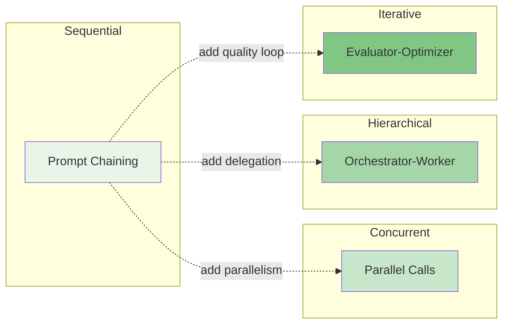

# LLM Workflow Patterns

Workflows are orchestrated patterns of LLM calls where **the code controls the flow**. The developer defines the structure — which calls happen, in what order, under what conditions — and the LLM fills in the content at each step.

Workflows are the foundation that [agent patterns](../patterns/README.md) build on. Before reaching for an agent, consider whether a workflow gives you the predictability and testability you need.

## Why Workflows Matter

Most production LLM systems don't need autonomous agents. They need reliable, testable pipelines that process inputs through a series of well-defined steps. Workflows give you:

- **Predictable behavior** — Same input, same execution path
- **Easy debugging** — Follow the code, inspect intermediate outputs
- **Standard testing** — Unit test each step independently
- **Cost control** — Fixed number of LLM calls per execution
- **Latency bounds** — Deterministic call count means predictable response times

## The Four Workflow Patterns

| Pattern | Shape | Best For | LLM Calls |
|---------|-------|----------|-----------|
| [Prompt Chaining](./prompt-chaining/overview.md) | Sequential pipeline | Multi-step text transformations with validation gates | N (one per step) |
| [Parallel Calls](./parallel-calls/overview.md) | Fan-out / fan-in | Independent subtasks that can run concurrently | 1 round + 1 aggregation |
| [Orchestrator-Worker](./orchestrator-worker/overview.md) | Hub and spoke | Complex tasks requiring decomposition and delegation | 1 + N + 1 |
| [Evaluator-Optimizer](./evaluator-optimizer/overview.md) | Generate-evaluate loop | Output that needs iterative refinement | 2 × K iterations |

## How Workflows Evolve Into Agents

Each workflow pattern has a natural evolutionary path to one or more agent patterns. When a workflow's conditional logic becomes too complex — too many branches, too many edge cases — that's the signal to let the LLM make those decisions and promote to an agent.

| Workflow | Evolves Into | The Bridge |
|----------|-------------|------------|
| Prompt Chaining | [ReAct](../patterns/react/overview.md), [Tool Use](../patterns/tool_use/overview.md), [Memory](../patterns/memory/overview.md) | Add dynamic tool selection and LLM-controlled looping |
| Parallel Calls | [RAG](../patterns/rag/overview.md), [Routing](../patterns/routing/overview.md) | Add retrieval-based context or LLM-driven classification |
| Orchestrator-Worker | [Plan & Execute](../patterns/plan_and_execute/overview.md), [Multi-Agent](../patterns/multi_agent/overview.md) | Add LLM-generated plans and autonomous worker agents |
| Evaluator-Optimizer | [Reflection](../patterns/reflection/overview.md) | Add self-generated critique and adaptive refinement |

Each agent pattern includes an `evolution.md` document that traces this bridge in detail.

## Reading Order

Read the overview (Tier 1) of each pattern first to understand the landscape. Then dive into design (Tier 2) and implementation (Tier 3) for the patterns you plan to use.

Each pattern has three tiers of documentation:
- **overview.md** — What it does, when to use it, architecture diagram (1–2 pages)
- **design.md** — Component breakdown, data flow, error handling, scaling (3–5 pages)
- **implementation.md** — Pseudocode, interfaces, state management, testing strategy (5–10 pages)
