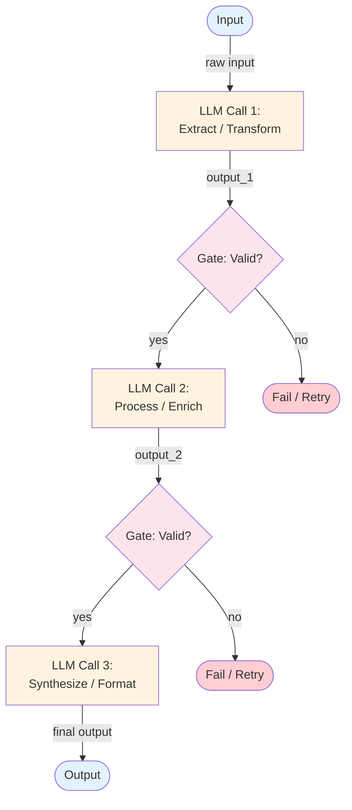

# Prompt Chaining — Overview

Prompt chaining is the simplest workflow pattern: a sequence of LLM calls where each call's output becomes the next call's input, with optional validation gates between steps.

## Architecture



*Figure: A 3-step prompt chain with validation gates between steps. Each LLM call has a focused task. Gates check output quality before proceeding.*

## How It Works

1. **Decompose** the task into discrete, sequential steps
2. **Each step** gets its own prompt, optimized for that specific subtask
3. **Gates** between steps validate output format, quality, or content before passing it forward
4. **The chain** runs to completion or fails at a gate

Each LLM call has a narrow, well-defined job. This makes prompts simpler, outputs more reliable, and debugging straightforward — you know exactly which step produced a given output.

## Minimal Example

Extract key requirements from a spec, prioritize by complexity, then format as an engineer checklist — three focused LLM calls in sequence.

```python
from workflows.prompt_chaining.code.python.prompt_chaining import PromptChain, ChainStep

chain = PromptChain(
    llm=your_llm,
    steps=[
        ChainStep(
            name="extract",
            prompt_template="Extract the key technical requirements from:\n\n{input}",
            validate=lambda out: len(out) > 20,   # Gate: reject empty/trivial output
        ),
        ChainStep(
            name="prioritize",
            prompt_template="Rank these requirements by implementation complexity:\n\n{input}",
        ),
        ChainStep(
            name="format",
            prompt_template="Format this as a numbered checklist for engineers:\n\n{input}",
        ),
    ],
)

result = chain.run(raw_spec_document)
# result.success    → True/False
# result.failed_at  → name of the step that failed its gate, or None
# result.output     → final formatted checklist
```

> Full implementation: [`code/python/prompt_chaining.py`](code/python/prompt_chaining.py)

## Input / Output

- **Input:** Any data that needs multi-step LLM processing
- **Output:** Transformed result after passing through all steps
- **Intermediate:** Each step produces an output consumed by the next step

## Key Tradeoffs

| Strength | Limitation |
|----------|-----------|
| Simple to understand and debug | Rigid — steps are fixed at design time |
| Each step has a focused prompt | Latency scales linearly with step count |
| Gates catch errors early | No ability to adapt based on intermediate results |
| Easy to test step-by-step | Information can be lost between steps |
| Predictable cost (fixed call count) | Adding new steps requires code changes |

## When to Use

- Tasks with a clear, fixed sequence of transformations
- When each step's output can be validated before proceeding
- When you need deterministic behavior and easy debugging
- Multi-step content generation (draft → edit → format)
- ETL-style processing (extract → transform → load)

## When NOT to Use

- When the number of steps depends on the input or intermediate results — use [ReAct](../../patterns/react/overview.md) instead
- When steps are independent and can run concurrently — use [Parallel Calls](../parallel-calls/overview.md) instead
- When output needs iterative quality improvement — use [Evaluator-Optimizer](../evaluator-optimizer/overview.md) instead
- When the LLM needs to decide which operations to perform — use an [agent pattern](../../patterns/README.md)

## Related Patterns

- **Evolves into:** [ReAct](../../patterns/react/overview.md) (add dynamic tool selection and LLM-controlled looping), [Tool Use](../../patterns/tool_use/overview.md) (add structured function calling), [Memory](../../patterns/memory/overview.md) (add persistent state between runs)
- **Combines with:** [Evaluator-Optimizer](../evaluator-optimizer/overview.md) (add quality gates that loop), [Parallel Calls](../parallel-calls/overview.md) (parallelize independent steps)
- **Simpler alternative to:** [Orchestrator-Worker](../orchestrator-worker/overview.md) (when you don't need dynamic task decomposition)

## Deeper Dive

- **[Design](./design.md)** — Component breakdown, data flow, gate strategies, error handling
- **[Implementation](./implementation.md)** — Pseudocode, interfaces, testing strategy, common pitfalls

## When NOT to use this pattern

- The steps depend on dynamic decisions only an LLM can make — promote to an agent pattern (ReAct or Tool Use).
- The task is a single transformation — skip the chain and use a single LLM call.
- Steps run independently and don't pass data — use [parallel calls](../parallel-calls/overview.md) instead.

## Next steps

- Production version: see [Blueprints → Deployments](../../composition/blueprints-to-deployments.md) for the deployment agents that use this pattern.
- Generate a starter project: see [Blueprint → Spec → Scaffold](../../composition/blueprint-to-spec-to-scaffold.md).
- Combine with other patterns: see the [Composition guide](../../composition/README.md).
